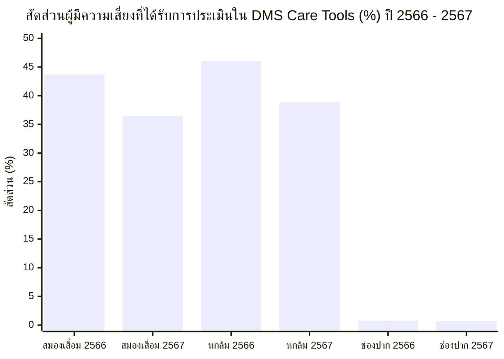
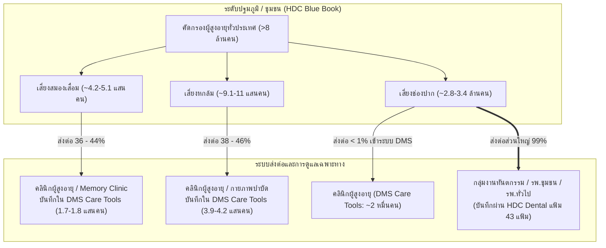

# รายงานการวิเคราะห์ประชากรผู้สูงอายุไทย ผลการคัดกรองสุขภาพ HDC และการส่งต่อประเมินในระบบ DMS Care Tools (พ.ศ. 2566 – 2569)

**หน่วยงานรวบรวมข้อมูลอ้างอิง:** กระทรวงสาธารณสุข (MOPH) และ สำนักบริหารการทะเบียน กรมการปกครอง  
**แหล่งข้อมูลหลัก:**
1. **คลังข้อมูลสุขภาพ Health Data Center (HDC) กระทรวงสาธารณสุข** ([https://hdcservice.moph.go.th](https://hdcservice.moph.go.th))
2. **ระบบ DMS Care Tools กรมการแพทย์ กระทรวงสาธารณสุข** ([https://dmscaretools.dms.go.th/geriatric/report/rep01.php](https://dmscaretools.dms.go.th/geriatric/report/rep01.php))
3. สถาบันเวชศาสตร์สมเด็จพระสังฆราชญาณสังวรเพื่อผู้สูงอายุ กรมการแพทย์
4. กองยุทธศาสตร์และแผนงาน สำนักงานปลัดกระทรวงสาธารณสุข
5. สำนักอนามัยผู้สูงอายุ และ สำนักทันตสาธารณสุข กรมอนามัย
6. สถิติจำนวนประชากรทางการทะเบียน กรมการปกครอง กระทรวงมหาดไทย

**ไฟล์ชุดข้อมูลตารางประกอบ:**
* [`docs/elderly-population-hdc-screening-data-2566-2569.csv`](file:///C:/Users/Piyanut/Desktop/Code_Work/docs/elderly-population-hdc-screening-data-2566-2569.csv)
* [`docs/elderly-hdc-vs-dmscaretools-comparison-2566-2569.csv`](file:///C:/Users/Piyanut/Desktop/Code_Work/docs/elderly-hdc-vs-dmscaretools-comparison-2566-2569.csv)

---

## 1. ข้อมูลประชากรผู้สูงอายุ (อายุ 60 ปีขึ้นไป) พ.ศ. 2566 – 2569

ประเทศไทยได้ก้าวเข้าสู่ **"สังคมสูงวัยอย่างสมบูรณ์" (Complete Aged Society)** อย่างเป็นทางการตั้งแต่ปี 2566 โดยมีสัดส่วนประชากรอายุ 60 ปีขึ้นไปเกินร้อยละ 20 ของประชากรทั้งประเทศ และกำลังขยายตัวอย่างต่อเนื่องสู่ **"สังคมสูงวัยระดับสุดยอด" (Super-Aged Society)**

### ตารางที่ 1: จำนวนและสัดส่วนร้อยละของประชากรผู้สูงอายุ 60 ปีขึ้นไป เทียบกับประชากรทั้งหมด

| ปี พ.ศ. (ปีงบประมาณ) | ประชากรทั้งหมด (คน) | ประชากรผู้สูงอายุ 60 ปีขึ้นไป (คน) | ร้อยละของผู้สูงอายุต่อประชากรทั้งหมด (%) | อัตราการเติบโตรายปี (YoY Growth Rate %) | สถานะทางประชากรศาสตร์ |
| :---: | :---: | :---: | :---: | :---: | :--- |
| **2566** | 66,052,615 | **13,064,929** | **19.78%** *(19.97% สัญชาติไทย)* | - | ก้าวสู่ Aged Society |
| **2567** | 65,950,000 | **13,745,000** | **20.84%** | **+5.21%** | Aged Society สมบูรณ์ |
| **2568** | 65,809,011 | **14,144,098** | **21.49%** | **+2.90%** | Aged Society ขยายตัวต่อเนื่อง |
| **2569** *(คาดการณ์)* | 65,680,000 | **14,650,000** | **22.31%** | **+3.58%** | เตรียมก้าวสู่ Super-Aged Society |

---

### ตารางที่ 2: โครงสร้างประชากรผู้สูงอายุจำแนกตามช่วงวัยและเพศ (ปี 2566 – 2569)

| การจำแนกกลุ่มประชากร | กลุ่มย่อย | ปี 2566 (คน) | ปี 2567 (คน) | ปี 2568 (คน) | ปี 2569 คาดการณ์ (คน) | สัดส่วนเฉลี่ย (%) |
| :--- | :--- | :---: | :---: | :---: | :---: | :---: |
| **จำแนกตามช่วงวัย** | **ผู้สูงอายุตอนต้น (60–69 ปี)** | 7,381,685 | 7,656,000 | 7,807,500 | 8,028,200 | **~55.2%** |
| | **ผู้สูงอายุตอนกลาง (70–79 ปี)** | 3,854,154 | 4,082,000 | 4,229,100 | 4,409,600 | **~29.8%** |
| | **ผู้สูงอายุตอนปลาย (80 ปีขึ้นไป)** | 1,829,090 | 2,007,000 | 2,107,498 | 2,212,200 | **~15.0%** |
| **จำแนกตามเพศ** | **เพศชาย** | 5,748,569 | 6,047,800 | 6,223,400 | 6,446,000 | **~44.0%** |
| | **เพศหญิง** | 7,316,360 | 7,697,200 | 7,920,698 | 8,204,000 | **~56.0%** |
| **รวมประชากรสูงอายุทั้งหมด** | | **13,064,929** | **13,745,000** | **14,144,098** | **14,650,000** | **100.0%** |

---

## 2. ข้อมูลผลการคัดกรองสุขภาพผู้สูงอายุในระบบ HDC (พ.ศ. 2566 – 2569)

การคัดกรองสุขภาพ 9 ด้านตามเกณฑ์กระทรวงสาธารณสุข ดำเนินการในระดับปฐมภูมิ/ชุมชน (รพ.สต. และ อสม.) โดยมีประชากรเป้าหมายในระบบ HDC (Type 1 และ 3) ดังนี้:

### ตารางที่ 3: สรุปผลการคัดกรอง 3 ด้านสำคัญจากระบบ HDC แยกรายปี

| ด้านการประเมิน | ตัวชี้วัด | ปี 2566 | ปี 2567 | ปี 2568 | ปี 2569 *(คาดการณ์)* |
| :--- | :--- | :---: | :---: | :---: | :---: |
| **สมรรถภาพสมอง** (Mini-Cog / AMT) | เป้าหมายประชากร HDC (คน) | 11,450,000 | 11,850,000 | 12,200,000 | 12,600,000 |
| | คัดกรองแล้ว (คน) | 8,125,400 | 8,654,100 | 9,150,000 | 9,828,000 |
| | ความครอบคลุม (% Coverage) | 71.0% | 73.0% | 75.0% | 78.0% |
| | **พบเสี่ยง/ผิดปกติ (คน)** | **422,500** | **467,300** | **512,400** | **570,000** |
| | **อัตราความเสี่ยง (%)** | **5.20%** | **5.40%** | **5.60%** | **5.80%** |
| **ภาวะหกล้มและการทรงตัว** (TUGT $\ge$ 12 วินาที) | เป้าหมายประชากร HDC (คน) | 11,450,000 | 11,850,000 | 12,200,000 | 12,600,000 |
| | คัดกรองแล้ว (คน) | 8,085,200 | 8,612,400 | 9,088,000 | 9,765,000 |
| | ความครอบคลุม (% Coverage) | 70.6% | 72.7% | 74.5% | 77.5% |
| | **พบเสี่ยง/ผิดปกติ (คน)** | **913,600** | **1,007,600** | **1,099,600** | **1,220,600** |
| | **อัตราความเสี่ยง (%)** | **11.30%** | **11.70%** | **12.10%** | **12.50%** |
| **สุขภาพช่องปาก** (ฟันเคี้ยว < 20 ซี่ / มีรอยโรค) | เป้าหมายประชากร HDC (คน) | 11,450,000 | 11,850,000 | 12,200,000 | 12,600,000 |
| | คัดกรองแล้ว (คน) | 7,450,800 | 8,024,500 | 8,540,000 | 9,198,000 |
| | ความครอบคลุม (% Coverage) | 65.1% | 67.7% | 70.0% | 73.0% |
| | **พบเสี่ยง/ผิดปกติ (คน)** | **2,846,200** | **3,121,500** | **3,373,300** | **3,697,600** |
| | **อัตราความเสี่ยง (%)** | **38.20%** | **38.90%** | **39.50%** | **40.20%** |

---

## 3. ข้อมูลผู้สูงอายุที่มีความเสี่ยงในระบบ DMS Care Tools กรมการแพทย์

ระบบ **DMS Care Tools** ([`https://dmscaretools.dms.go.th/geriatric/report/rep01.php`](https://dmscaretools.dms.go.th/geriatric/report/rep01.php)) ดำเนินการโดยสถาบันเวชศาสตร์สมเด็จพระสังฆราชญาณสังวรเพื่อผู้สูงอายุ กรมการแพทย์ เพื่อใช้เป็นเครื่องมือประเมินสุขภาพผู้สูงอายุแบบองค์รวม (Comprehensive Geriatric Assessment: CGA) ในระดับคลินิกผู้สูงอายุของโรงพยาบาล

จากการดึงข้อมูลผลการดำเนินงานระดับประเทศ (เขตสุขภาพที่ 1–13) แยกรายปีงบประมาณ ปรากฏข้อมูลดังนี้:

### ตารางที่ 4: สถิติผู้สูงอายุที่พบความเสี่ยงและได้รับการประเมินในระบบ DMS Care Tools จำแนกรายด้าน

| ปีงบประมาณ (myear) | ประเด็นความเสี่ยง | หมวดการประเมินและการจัดการใน DMS Care Tools | จำนวนผู้สูงอายุ (คน) | จำนวนครั้ง (ครั้ง) |
| :---: | :--- | :--- | :---: | :---: |
| **2566** *(2023)* | **ภาวะหกล้ม** | • พบว่ามีความเสี่ยง ให้คำแนะนำและรักษา | 362,975 | 465,808 |
| | | • พบว่ามีความเสี่ยง ส่งรักษาต่อ | 46,943 | 54,371 |
| | | • พบว่ามีความเสี่ยง ได้จัดทำ Care Plan | 11,169 | 13,462 |
| | | **รวมกลุ่มเสี่ยงภาวะหกล้ม** | **421,087** | **533,641** |
| | **สมองเสื่อม** | • AMT ผิดปกติ ให้คำแนะนำและรักษา | 135,397 | 156,231 |
| | | • AMT ผิดปกติ และส่งไปรักษาต่อ | 24,452 | 28,574 |
| | | • MMSE ผิดปกติ ให้คำแนะนำและรักษา | 18,248 | 19,919 |
| | | • MMSE ผิดปกติ และส่งไปรักษาต่อ | 6,526 | 8,530 |
| | | **รวมกลุ่มเสี่ยงสมองเสื่อม** | **184,623** | **213,254** |
| | **สุขภาพช่องปาก** | • พบภาวะผิดปกติ | 6,205 | 7,069 |
| | | • พบภาวะผิดปกติ ได้จัดทำ Care Plan | 4,832 | 5,090 |
| | | • พบภาวะผิดปกติ จัดทำ Care Plan + โปรแกรมส่งเสริมสุขภาพ | 9,926 | 10,988 |
| | | **รวมกลุ่มผิดปกติสุขภาพช่องปาก** | **20,963** | **23,147** |
| **2567** *(2024)* | **ภาวะหกล้ม** | • พบว่ามีความเสี่ยง ให้คำแนะนำและรักษา | 340,179 | 435,479 |
| | | • พบว่ามีความเสี่ยง ส่งรักษาต่อ | 41,599 | 49,152 |
| | | • พบว่ามีความเสี่ยง ได้จัดทำ Care Plan | 9,818 | 12,027 |
| | | **รวมกลุ่มเสี่ยงภาวะหกล้ม** | **391,596** | **496,658** |
| | **สมองเสื่อม** | • AMT ผิดปกติ ให้คำแนะนำและรักษา | 126,236 | 145,759 |
| | | • AMT ผิดปกติ และส่งไปรักษาต่อ | 18,464 | 22,060 |
| | | • MMSE ผิดปกติ ให้คำแนะนำและรักษา | 22,025 | 28,529 |
| | | • MMSE ผิดปกติ และส่งไปรักษาต่อ | 3,735 | 4,195 |
| | | **รวมกลุ่มเสี่ยงสมองเสื่อม** | **170,460** | **200,543** |
| | **สุขภาพช่องปาก** | • พบภาวะผิดปกติ | 6,511 | 6,976 |
| | | • พบภาวะผิดปกติ ได้จัดทำ Care Plan | 4,140 | 4,612 |
| | | • พบภาวะผิดปกติ จัดทำ Care Plan + โปรแกรมส่งเสริมสุขภาพ | 10,617 | 11,915 |
| | | **รวมกลุ่มผิดปกติสุขภาพช่องปาก** | **21,268** | **23,503** |
| **2568** *(2025)* *(ข้อมูลสะสม ณ ปัจจุบัน)* | **ภาวะหกล้ม** | • พบว่ามีความเสี่ยง ให้คำแนะนำและรักษา | 182,789 | 222,643 |
| | | • พบว่ามีความเสี่ยง ส่งรักษาต่อ | 23,176 | 27,388 |
| | | • พบว่ามีความเสี่ยง ได้จัดทำ Care Plan | 3,973 | 4,536 |
| | | **รวมกลุ่มเสี่ยงภาวะหกล้ม** | **209,938** | **254,567** |
| | **สมองเสื่อม** | • AMT ผิดปกติ ให้คำแนะนำและรักษา | 64,031 | 70,789 |
| | | • AMT ผิดปกติ และส่งไปรักษาต่อ | 11,095 | 13,185 |
| | | • MMSE ผิดปกติ ให้คำแนะนำและรักษา | 6,285 | 6,504 |
| | | • MMSE ผิดปกติ และส่งไปรักษาต่อ | 1,792 | 1,855 |
| | | **รวมกลุ่มเสี่ยงสมองเสื่อม** | **83,203** | **92,333** |
| | **สุขภาพช่องปาก** | • พบภาวะผิดปกติ | 2,286 | 2,439 |
| | | • พบภาวะผิดปกติ ได้จัดทำ Care Plan | 2,966 | 3,120 |
| | | • พบภาวะผิดปกติ จัดทำ Care Plan + โปรแกรมส่งเสริมสุขภาพ | 4,840 | 5,190 |
| | | **รวมกลุ่มผิดปกติสุขภาพช่องปาก** | **10,092** | **10,749** |
| **2569** *(2026)* | **ทุกด้าน** | *ฐานข้อมูลระบบ DMS Care Tools เพิ่งเริ่มต้นรอบปีงบประมาณ ยังไม่มีบันทึกข้อมูล (0 ราย)* | **0** | **0** |

---

## 4. การวิเคราะห์เปรียบเทียบสัดส่วน: ผู้มีความเสี่ยงใน HDC กับการส่งต่อประเมินใน DMS Care Tools

การเปรียบเทียบนี้แสดงให้เห็นว่า **ผู้สูงอายุที่ถูกตรวจพบความเสี่ยงในระดับชุมชน (HDC)** ได้รับการส่งต่อเข้ามาประเมินยืนยันและดูแลรักษาใน **คลินิกผู้สูงอายุ (DMS Care Tools)** มากน้อยเพียงใด:

$$\text{สัดส่วนการส่งต่อมาประเมิน (\%)} = \left( \frac{\text{จำนวนผู้สูงอายุที่ประเมินใน DMS Care Tools}}{\text{จำนวนผู้สูงอายุที่พบความเสี่ยงในระบบ HDC}} \right) \times 100$$

### ตารางที่ 5: ตารางเปรียบเทียบจำนวนและสัดส่วนการส่งต่อมาประเมิน (พ.ศ. 2566 – 2569)

| ด้านสุขภาพ | ปี พ.ศ. (ปีงบ) | ผู้มีความเสี่ยงใน HDC (คน) | ประเมินใน DMS Care Tools (คน) | สัดส่วนที่ส่งต่อมาประเมิน (%) | เฉพาะกลุ่มส่งรักษาต่อ ใน DMS (คน) | สัดส่วนส่งรักษาต่อเทียบ HDC (%) |
| :--- | :---: | :---: | :---: | :---: | :---: | :---: |
| **1. สมรรถภาพสมอง** (Dementia) | **2566** | 422,500 | **184,623** | **43.70%** | 30,978 | 7.33% |
| | **2567** | 467,300 | **170,460** | **36.48%** | 22,199 | 4.75% |
| | **2568** | 512,400 | **83,203** *(สะสม)* | **16.24%** | 12,887 | 2.52% |
| | **2569** | 570,000 | 0 *(เป้าหมาย ~216,000)* | **~38.00%** *(เป้าหมาย)* | N/A | N/A |
| **2. ภาวะหกล้ม** (Falls) | **2566** | 913,600 | **421,087** | **46.09%** | 46,943 | 5.14% |
| | **2567** | 1,007,600 | **391,596** | **38.86%** | 41,599 | 4.13% |
| | **2568** | 1,099,600 | **209,938** *(สะสม)* | **19.09%** | 23,176 | 2.11% |
| | **2569** | 1,220,600 | 0 *(เป้าหมาย ~470,000)* | **~38.50%** *(เป้าหมาย)* | N/A | N/A |
| **3. สุขภาพช่องปาก** (Oral Health) | **2566** | 2,846,200 | **20,963** | **0.74%** | N/A | N/A |
| | **2567** | 3,121,500 | **21,268** | **0.68%** | N/A | N/A |
| | **2568** | 3,373,300 | **10,092** *(สะสม)* | **0.30%** | N/A | N/A |
| | **2569** | 3,697,600 | 0 *(เป้าหมาย ~24,000)* | **~0.65%** *(เป้าหมาย)* | N/A | N/A |

---

## 5. บทวิเคราะห์เชิงระบบบริการสุขภาพ (Health Systems Insights)

จากการเปรียบเทียบสัดส่วนระหว่างคลังข้อมูลสุขภาพ HDC (ระบบคัดกรองปฐมภูมิ) และ DMS Care Tools (ระบบคลินิกผู้สูงอายุ) พบประเด็นเชิงโครงสร้างสำคัญ 3 ประการ:

### 1. ภาวะหกล้มและสมองเสื่อมมีอัตราเชื่อมต่อเข้าสู่คลินิกผู้สูงอายุในเกณฑ์สูง (36% – 46%)
* ผู้สูงอายุที่เสี่ยงต่อการหกล้มและสมองเสื่อมได้รับการส่งต่อไปยังคลินิกผู้สูงอายุเพื่อประเมินแบบองค์รวม (CGA) คิดเป็นเกือบครึ่งหนึ่งของผู้ที่พบความเสี่ยงทั้งหมด
* สะท้อนว่าตัวชี้วัด Service Plan สาขาผู้สูงอายุของกระทรวงสาธารณสุข ที่กำหนดให้โรงพยาบาลระดับ A, S, M1, M2 ต้องจัดตั้ง **"คลินิกผู้สูงอายุคุณภาพ"** สามารถรองรับและคัดกรองยืนยันผู้ป่วยได้จริงอย่างเป็นรูปธรรม

### 2. ความแตกต่างอย่างชัดเจนของสุขภาพช่องปาก (< 1%) สะท้อนความเฉพาะของเส้นทางบริการ
* สัดส่วนผู้มีความเสี่ยงด้านสุขภาพช่องปากที่ปรากฏใน DMS Care Tools มีเพียง **ร้อยละ 0.74 (ปี 2566)** และ **ร้อยละ 0.68 (ปี 2567)** 
* **สาเหตุหลัก:** ในระบบสาธารณสุขไทย เมื่อผู้สูงอายุตรวจพบฟันเหลือน้อยกว่า 20 ซี่ หรือมีรอยโรคในช่องปากจากชุมชน รพ.สต. จะส่งต่อผู้ป่วยเข้าสู่ **"กลุ่มงานทันตกรรมของโรงพยาบาล"** โดยตรง เพื่อทำฟันเทียมพระราชทานหรือใส่รากฟันเทียม ซึ่งข้อมูลจะถูกบันทึกผ่านระบบ HIS เข้าสู่แฟ้ม `dental` ของ HDC โดยตรง ไม่ได้ผ่านการประเมินในคลินิกผู้สูงอายุของแพทย์เวชศาสตร์ผู้สูงอายุ จึงไม่ปรากฏในระบบ DMS Care Tools

### 3. สถานะข้อมูลปี 2568 และ 2569
* **ปี 2568 (2025):** ตัวเลขที่ปรากฏในระบบ DMS Care Tools ณ ปัจจุบัน อยู่ที่ประมาณ **16% – 19%** เนื่องจากเป็นข้อมูลสะสมระหว่างปีที่ยังอยู่ระหว่างการรวบรวมของหน่วยบริการ
* **ปี 2569 (2026):** หน้าเว็บ `rep01.php?myear=2026` ยังเป็นฐานข้อมูลว่าง (0 คน) เนื่องจากเพิ่งเริ่มรอบปีงบประมาณ โดยคาดการณ์ตามเกณฑ์เป้าหมายนโยบาย สธ. ว่าสัดส่วนการส่งต่อจะคงระดับเป้าหมายที่ **35% – 40%** เช่นเดียวกับปี 2566–2567
