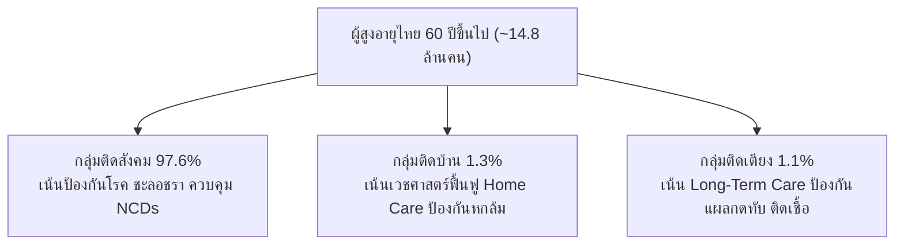

# รายงานการวิเคราะห์สถานการณ์สุขภาพผู้สูงอายุไทย (พ.ศ. 2565 – ปัจจุบัน)
## 10 อันดับโรคที่ป่วย อัตราป่วย อัตราตาย และสถิติเชิงลึกตามฐานข้อมูลกระทรวงสาธารณสุข

> **หน่วยงานจัดทำข้อมูลอ้างอิง:** กระทรวงสาธารณสุข (MOPH)  
> **แหล่งข้อมูลหลัก:**  
> - กองยุทธศาสตร์และแผนงาน สำนักงานปลัดกระทรวงสาธารณสุข (รายงานสถิติสาธารณสุข พ.ศ. 2565, 2566, 2567)  
> - คลังข้อมูลสุขภาพ Health Data Center (HDC), กระทรวงสาธารณสุข  
> - กองโรคไม่ติดต่อ กรมควบคุมโรค กระทรวงสาธารณสุข  
> - สถาบันเวชศาสตร์สมเด็จพระสังฆราชญาณสังวรเพื่อผู้สูงอายุ กรมการแพทย์ กระทรวงสาธารณสุข  
> - สำนักอนามัยผู้สูงอายุ กรมอนามัย กระทรวงสาธารณสุข  
> - สำนักงานพัฒนาระบบข้อมูลข่าวสารสุขภาพ (HISO / ThaiHealthStat)  
> **ไฟล์ชุดข้อมูลประกอบ:** [`docs/elderly-health-moph-data.csv`](file:///C:/Users/Piyanut/Desktop/Code_Work/docs/elderly-health-moph-data.csv)

---

## 1. บทนำและภาพรวมสถานการณ์สุขภาพผู้สูงอายุไทย

ประเทศไทยได้ก้าวเข้าสู่ **"สังคมสูงวัยอย่างสมบูรณ์" (Complete Aged Society)** อย่างเป็นทางการตั้งแต่ปี 2566–2567 โดยมีประชากรอายุ 60 ปีขึ้นไปมากกว่า 14.8 ล้านคน (~22.5% ของประชากรทั้งหมด) 

จากการติดตามของกระทรวงสาธารณสุข พบว่าสุขภาพของผู้สูงอายุไทยมีความซับซ้อนด้วย **"การป่วยหลายโรคร่วม" (Multimorbidity)** โดยผู้สูงอายุมากกว่า **75% ป่วยด้วยโรคเรื้อรังอย่างน้อย 1 โรค** และกว่า **50% มีโรคร่วมตั้งแต่ 2 โรคขึ้นไป**

### 1.1 การจำแนกตามความสามารถในการดำเนินกิจวัตรประจำวัน (ADL Index)
กระทรวงสาธารณสุขและกรมอนามัย ใช้การประเมิน Barthel Activities of Daily Living (ADL) แบ่งผู้สูงอายุเป็น 3 กลุ่ม:
* **กลุ่มติดสังคม (Social-Bound, ADL 12–20 คะแนน):** ประมาณ **97.6%** สามารถช่วยเหลือตนเองได้ มีโรคเรื้อรังที่ควบคุมได้ ดำเนินชีวิตอิสระ
* **กลุ่มติดบ้าน (Home-Bound, ADL 5–11 คะแนน):** ประมาณ **1.3%** ช่วยเหลือตนเองได้บางส่วน มีข้อจำกัดในการเคลื่อนไหว ต้องมีผู้ช่วยดูแลในชีวิตประจำวัน
* **กลุ่มติดเตียง (Bed-Bound, ADL 0–4 คะแนน):** ประมาณ **1.1%** ทุพพลภาพ ไม่สามารถช่วยเหลือตนเองได้ มีภาวะพึ่งพิงระดับสูง ต้องได้รับการดูแลตลอด 24 ชั่วโมง



---

## 2. 10 อันดับโรคที่พบบ่อย/อัตราป่วยในผู้สูงอายุ (Top 10 Elderly Morbidities)

ข้อมูลการเจ็บป่วยในผู้สูงอายุจากคลังข้อมูลสุขภาพ Health Data Center (HDC) และกองโรคไม่ติดต่อ กรมควบคุมโรค กระทรวงสาธารณสุข จำแนกตามความชุกและการเข้ารับบริการในสถานพยาบาล (ผู้ป่วยนอก OPD และ ผู้ป่วยใน IPD) สรุปได้ดังนี้:

### ตารางที่ 1: 10 อันดับโรคที่พบบ่อยในผู้สูงอายุไทย (พ.ศ. 2565 – ปัจจุบัน)

| อันดับ | ชื่อโรค (ภาษาไทย / สากล) | รหัส ICD-10 | ความชุก / สัดส่วนในผู้สูงอายุ (%) | แนวโน้มจำนวนผู้ป่วยสะสม (ปี 2565–2567) | ลักษณะสำคัญและผลกระทบทางคลินิก |
| :---: | :--- | :---: | :---: | :---: | :--- |
| **1** | **โรคความดันโลหิตสูง**<br/>(Essential Hypertension) | I10 | **46.91%** | 4.3 ล้านคน (2565) $\rightarrow$ 4.61 ล้านคน (2566) $\rightarrow$ **>4.8 ล้านคน (2567)** | ครองอันดับ 1 เป็น "ฆาตกรเงียบ" นำไปสู่สโตรกและไตวาย ผู้สูงอายุกว่าครึ่งหนึ่งตรวจพบความดันสูง |
| **2** | **โรคเบาหวาน (ชนิดที่ 2)**<br/>(Type 2 Diabetes Mellitus) | E11 | **21.79%** | 4.43 ล้านคน (2565) $\rightarrow$ 4.83 ล้านคน (2566) $\rightarrow$ **5.18 ล้านคน (2567)** *(รวมทุกกลุ่มวัย)* โดย >50% เป็นผู้สูงวัย | เกิดภาวะแทรกซ้อนที่หลอดเลือดขนาดเล็กและใหญ่ (เบาหวานขึ้นจอตา, ไตวายเรื้อรัง, แผลเบาหวานที่เท้า) |
| **3** | **โรคไขมันในเลือดผิดปกติ**<br/>(Dyslipidaemia) | E78 | **~20.5%** | มีแนวโน้มเพิ่มขึ้นอย่างต่อเนื่องตามวิถีชีวิตและการบริโภค | ปัจจัยเสี่ยงสำคัญของโรคหลอดเลือดหัวใจและสมอง มักพบร่วมกับความดันและเบาหวาน (Metabolic Syndrome) |
| **4** | **โรคข้อเข่าเสื่อม / ข้อเสื่อม**<br/>(Osteoarthritis / Arthrosis) | M15–M19 | **~15.2%** | ผู้สูงอายุหญิงพบสูงกว่าชาย 2–3 เท่า (มากกว่า 2.2 ล้านคน) | สาเหตุหลักของอาการปวดเรื้อรัง การเดินลำบาก และข้อจำกัดในการเคลื่อนไหว ทำให้เปลี่ยนจากติดสังคมเป็นติดบ้าน |
| **5** | **โรคไตเรื้อรัง (CKD)**<br/>(Chronic Kidney Disease) | N18 | **~8.4%** | อัตราตรวจคัดกรองพบเพิ่มขึ้น โดยเฉพาะระยะที่ 3–5 | ส่วนใหญ่เป็นผลสืบเนื่องจากเบาหวานและความดันโลหิตสูงที่คุมไม่ได้ นำไปสู่ภาวะไตวายระยะสุดท้ายและการฟอกเลือด |
| **6** | **โรคต้อกระจกและสายตาผิดปกติ**<br/>(Cataract & Eye Disorders) | H25–H28 | **~7.8%** | สถิติตรวจคัดกรองสายตาผู้สูงอายุ กรมอนามัย พบต้อกระจกสูงเป็นอันดับ 1 | กระทบต่อการมองเห็น เพิ่มความเสี่ยงการพลัดตกหกล้ม 2–3 เท่า |
| **7** | **โรคหลอดเลือดสมอง (สโตรก)**<br/>(Cerebrovascular Disease / Stroke) | I60–I69 | **2.51%** | อัตราผู้ป่วยรายใหม่เพิ่มขึ้นเฉลี่ย ~350–380 ต่อแสนประชากร | นำไปสู่อัมพฤกษ์ อัมพาต ทุพพลภาพถาวร และภาวะกลืนลำบาก |
| **8** | **โรคหัวใจขาดเลือด**<br/>(Ischaemic Heart Diseases) | I20–I25 | **~2.8%** | เข้ารักษาในสถานพยาบาลเฉลี่ย >250,000 ครั้ง/ปี | กล้ามเนื้อหัวใจขาดเลือดเฉียบพลัน ภาวะหัวใจล้มเหลว (Heart Failure) เป็นสาเหตุการนอนโรงพยาบาลซ้ำ |
| **9** | **โรคปอดอุดกั้นเรื้อรัง (COPD)**<br/>(Chronic Obstructive Pulmonary Disease) | J44 | **~2.1%** | อัตรากำเริบสูงขึ้นในช่วงฤดูหนาวและวิกฤตฝุ่น PM2.5 | มีประวัติสูบบุหรี่หรือสัมผัสควันชีวมวล หายใจเหนื่อยหอบ ติดเชื้อปอดแทรกซ้อนได้ง่าย |
| **10** | **ภาวะสมองเสื่อม / อัลไซเมอร์**<br/>(Dementia / Alzheimer's) | F00–F03, G30 | **~1.8–2.0%** | คาดการณ์ผู้ป่วยสะสมในไทย **>700,000–800,000 คน** (ปี 2567) | ความชุกเพิ่มขึ้นเป็น 2 เท่าในทุกๆ 5 ปีของอายุที่เพิ่มขึ้นหลัง 65 ปี เป็นภาระการดูแลระยะยาวสูงสุด |

---

## 3. 10 อันดับสาเหตุการเสียชีวิตในผู้สูงอายุและอัตราตาย (Top 10 Causes of Death & Mortality Rates)

อ้างอิงจาก **รายงานสถิติสาธารณสุข กองยุทธศาสตร์และแผนงาน สำนักงานปลัดกระทรวงสาธารณสุข** และ **สำนักงานพัฒนาระบบข้อมูลข่าวสารสุขภาพ (HISO)** โดยประมวลผลจากฐานข้อมูลมรณบัตรและคลังข้อมูลสุขภาพแห่งชาติ:

### ตารางที่ 2: 10 อันดับสาเหตุการตายของผู้สูงอายุไทย (อัตราต่อประชากรแสนคน พ.ศ. 2565 – 2567)

| อันดับ | สาเหตุการเสียชีวิต (Cause of Death) | รหัส ICD-10 | อัตราตายปี 2565<br/>(ต่อแสนประชากร) | อัตราตายปี 2566<br/>(ต่อแสนประชากร) | แนวโน้มปี 2567 – ปัจจุบัน | คำอธิบายและข้อสังเกตเชิงระบาดวิทยา |
| :---: | :--- | :---: | :---: | :---: | :---: | :--- |
| **1** | **โรคมะเร็งและเนื้องอกร้ายทุกชนิด**<br/>(Malignant Neoplasms) | C00–C97 | **114.5** | **114.9** | **คงที่ในระดับสูง (~115–120)** | ครองอันดับ 1 อย่างต่อเนื่อง มะเร็งที่พบสูงสุดในผู้สูงอายุ: มะเร็งตับและท่อน้ำดี, มะเร็งปอด, มะเร็งลำไส้ใหญ่และทวารหนัก |
| **2** | **โรคหลอดเลือดในสมอง (Stroke)**<br/>(Cerebrovascular Diseases) | I60–I69 | **61.2** | **63.8** | **มีแนวโน้มเพิ่มขึ้น** | อัตราการตายสูงทั้งกลุ่มหลอดเลือดสมองตีบและแตก มักมีประวัติความดันโลหิตสูงที่ไม่ได้รับการควบคุม |
| **3** | **โรคปอดอักเสบและปอดบวม**<br/>(Pneumonia) | J12–J18 | **67.2** | **50.7** | **~48–52 (ผันผวนตามฤดูกาล)** | สาเหตุการเสียชีวิตเฉียบพลันอันดับ 1 จากโรคติดเชื้อในผู้สูงอายุ โดยเฉพาะผู้ป่วยติดเตียงและผู้มีภาวะสำลัก |
| **4** | **โรคหัวใจขาดเลือด**<br/>(Ischaemic Heart Diseases) | I20–I25 | **29.3** | **31.5** | **มีแนวโน้มเพิ่มขึ้น** | ภาวะกล้ามเนื้อหัวใจตายเฉียบพลัน (STEMI/NSTEMI) มักมีอาการเตือนไม่ชัดเจนในผู้สูงอายุ เช่น อ่อนเพลีย แน่นหน้าอกเล็กน้อย |
| **5** | **โรคเบาหวานและภาวะแทรกซ้อน**<br/>(Diabetes Mellitus) | E10–E14 | **24.8** | **25.6** | **มีแนวโน้มทรงตัวสูง** | เสียชีวิตจากภาวะแทรกซ้อนรุนแรง เช่น ภาวะกรดคีโตนคั่ง, น้ำตาลในเลือดสูงวิกฤต, การติดเชื้อรุนแรงแทรกซ้อน |
| **6** | **โรคไตวายและกลุ่มโรคไต**<br/>(Renal Failure) | N17–N19 | **18.7** | **19.4** | **มีแนวโน้มเพิ่มขึ้น** | ไตวายเรื้อรังระยะสุดท้าย ภาวะยูรีเมีย (Uraemia) ภาวะน้ำเกิน และภาวะแทรกซ้อนจากระบบหัวใจ |
| **7** | **ภาวะติดเชื้อในกระแสเลือด (Sepsis)**<br/>(Septicaemia) | A40–A41 | **16.5** | **17.2** | **มีแนวโน้มเพิ่มขึ้น** | มักลุกลามมาจากการติดเชื้อในทางเดินปัสสาวะ (UTI), ปอดอักเสบ หรือแผลกดทับในผู้สูงอายุ |
| **8** | **โรคทางเดินหายใจส่วนล่างเรื้อรัง (COPD)**<br/>(Chronic Lower Respiratory Diseases) | J40–J47 | **15.2** | **14.8** | **มีแนวโน้มทรงตัว** | ภาวะระบบทางเดินหายใจล้มเหลวเฉียบพลันในผู้ป่วยถุงลมโป่งพอง |
| **9** | **โรคตับและตับแข็ง**<br/>(Diseases of Liver / Cirrhosis) | K70–K77 | **11.4** | **11.8** | **มีแนวโน้มทรงตัว** | ตับแข็งจากแอลกอฮอล์ ไวรัสตับอักเสบบีและซีเรื้อรัง ภาวะตับวายและตกเลือดในทางเดินอาหาร |
| **10** | **อุบัติเหตุการพลัดตกหกล้ม**<br/>(Falls & External Accidents) | W00–W19 | **9.8** | **10.5** | **มีแนวโน้มเพิ่มขึ้น** | การหกล้มทำให้กระดูกสะโพกหัก เกิดภาวะแทรกซ้อนตามมา (ลิ่มเลือดอุดกั้น, ปอดบวม, ติดเชื้อ) เสียชีวิตใน 1 ปีสูงถึง 20% |

```
เปรียบเทียบอัตราตาย 5 อันดับแรก (ต่อ 100,000 ประชากร):
  มะเร็งทุกชนิด:          ███████████████████████████ (114.9)
  ปอดอักเสบ:              ████████████ (50.7)
  หลอดเลือดสมอง:          ███████████████ (63.8)
  โรคหัวใจขาดเลือด:       ███████ (31.5)
  เบาหวาน:                ██████ (25.6)
```

---

## 4. การวิเคราะห์สถานการณ์สุขภาพและปัจจัยเสี่ยงสำคัญ (Health Insights & Risk Factors)

### 4.1 ความแตกต่างระหว่างเพศ (Gender Disparity)
* **ผู้สูงอายุชาย:** มีอัตราตายจาก **มะเร็งตับ มะเร็งปอด โรคหลอดเลือดสมอง และ COPD สูงกว่าเพศหญิง** สัมพันธ์โดยตรงกับพฤติกรรมเสี่ยง เช่น การสูบบุหรี่และการดื่มเครื่องดื่มแอลกอฮอล์ในอดีต
* **ผู้สูงอายุหญิง:** มีอายุขัยเฉลี่ย (Life Expectancy) ยืนยาวกว่าผู้ชาย แต่พบ **อัตราป่วยด้วยโรคเรื้อรังสูงกว่า** โดยเฉพาะ **โรคข้อเข่าเสื่อม โรคกระดูกพรุน ภาวะซึมเศร้า และโรคเบาหวาน** ทำให้เพศหญิงมีช่วงเวลาที่ต้องอยู่กับภาวะทุพพลภาพ (Years Lived with Disability - YLD) ยาวนานกว่า

### 4.2 วิกฤตกลุ่มอาการผู้สูงอายุ (Geriatric Syndromes)
นอกเหนือจากโรคตามรหัส ICD-10 กระทรวงสาธารณสุขเน้นย้ำถึงปัญหา 4 กลุ่มอาการหลักที่ไม่ปรากฏชัดในสถิติการตายโดยตรง แต่เป็นตัวเร่งการเสียชีวิต:
1. **การพลัดตกหกล้ม (Falls):** ข้อมูลกรมควบคุมโรคระบุว่า ผู้สูงอายุไทยหกล้มปีละกว่า **3 ล้านครั้ง** โดยประมาณ 1 ใน 5 ได้รับบาดเจ็บรุนแรง และเป็นสาเหตุที่ทำให้สูญเสียความสามารถในการช่วยเหลือตนเอง
2. **การใช้ยาหลายขนาน (Polypharmacy):** ผู้สูงอายุที่มีโรคร่วมมักได้รับยามากกว่า 5–10 ชนิดต่อวัน เพิ่มความเสี่ยงของปฏิกิริยาระหว่างยา (Drug-Drug Interactions) ภาวะไตเสื่อมจากยา และอาการหน้ามืดวิงเวียน
3. **ภาวะมวลกล้ามเนื้อน้อยและทุโภชนาการ (Sarcopenia & Malnutrition):** การขาดโปรตีนและฟันเคี้ยวอาหารไม่สะดวก ส่งผลให้กล้ามเนื้อลีบ ทรงตัวไม่อยู่
4. **ภาวะซึมเศร้าและวิตกกังวล (Depression in Older Adults):** ความโดดเดี่ยว การสูญเสียคู่สมรส และการอยู่ลำพัง เพิ่มความเสี่ยงของการไม่ให้ความร่วมมือในการรักษาโรคเรื้อรัง

---

## 5. แหล่งข้อมูลอ้างอิงอย่างเป็นทางการของกระทรวงสาธารณสุข (MOPH Authoritative References)

1. **กองยุทธศาสตร์และแผนงาน สำนักงานปลัดกระทรวงสาธารณสุข**
   - *รายงานสถิติสาธารณสุข พ.ศ. 2565 (Public Health Statistics 2022)*, เผยแพร่ พฤศจิกายน 2566. URL: [https://spd.moph.go.th/wp-content/uploads/2023/11/Hstatistic65.pdf](https://spd.moph.go.th/wp-content/uploads/2023/11/Hstatistic65.pdf)
   - *รายงานสถิติสาธารณสุข พ.ศ. 2566 (Public Health Statistics 2023)*, กองยุทธศาสตร์และแผนงาน. URL: [https://spd.moph.go.th/public-health-statistics/](https://spd.moph.go.th/public-health-statistics/)
2. **คลังข้อมูลสุขภาพ Health Data Center (HDC) กระทรวงสาธารณสุข**
   - ระบบรายงานตัวชี้วัดสุขภาพกลุ่มวัยผู้สูงอายุ และการคัดกรองโรคไม่ติดต่อเรื้อรัง (NCDs) รายเขตสุขภาพและจังหวัด. URL: [https://hdcservice.moph.go.th](https://hdcservice.moph.go.th)
3. **กองโรคไม่ติดต่อ กรมควบคุมโรค กระทรวงสาธารณสุข**
   - *รายงานสถานการณ์โรค NCDs เบาหวาน ความดันโลหิตสูง และปัจจัยเสี่ยงที่เกี่ยวข้องในประเทศไทย*. URL: [https://ddc.moph.go.th/noncommunicable-disease](https://ddc.moph.go.th/noncommunicable-disease)
   - ระบบสารสนเทศเฝ้าระวังโรคไม่ติดต่อ (NCD Dashboard): [https://itepincd.ddc.moph.go.th](https://itepincd.ddc.moph.go.th)
4. **สถาบันเวชศาสตร์สมเด็จพระสังฆราชญาณสังวรเพื่อผู้สูงอายุ กรมการแพทย์ กระทรวงสาธารณสุข**
   - *แนวทางการประเมินและคัดกรองสุขภาพผู้สูงอายุแบบองค์รวม (Comprehensive Geriatric Assessment)*. URL: [https://dms.go.th](https://dms.go.th)
5. **สำนักอนามัยผู้สูงอายุ กรมอนามัย กระทรวงสาธารณสุข**
   - *คู่มือการคัดกรองและประเมินสุขภาพผู้สูงอายุ (Blue Book)* และผลการประเมิน ADL ผู้สูงอายุไทย. URL: [https://eh.anamai.moph.go.th](https://eh.anamai.moph.go.th)
6. **สำนักงานพัฒนาระบบข้อมูลข่าวสารสุขภาพ (HISO)**
   - Dashboard สถิติผลลัพธ์สุขภาพ (ThaiHealthStat) ฐานข้อมูลสาเหตุการตายจำแนกเพศและกลุ่มอายุ. URL: [https://hiso.or.th/thaihealthstat](https://hiso.or.th/thaihealthstat)
