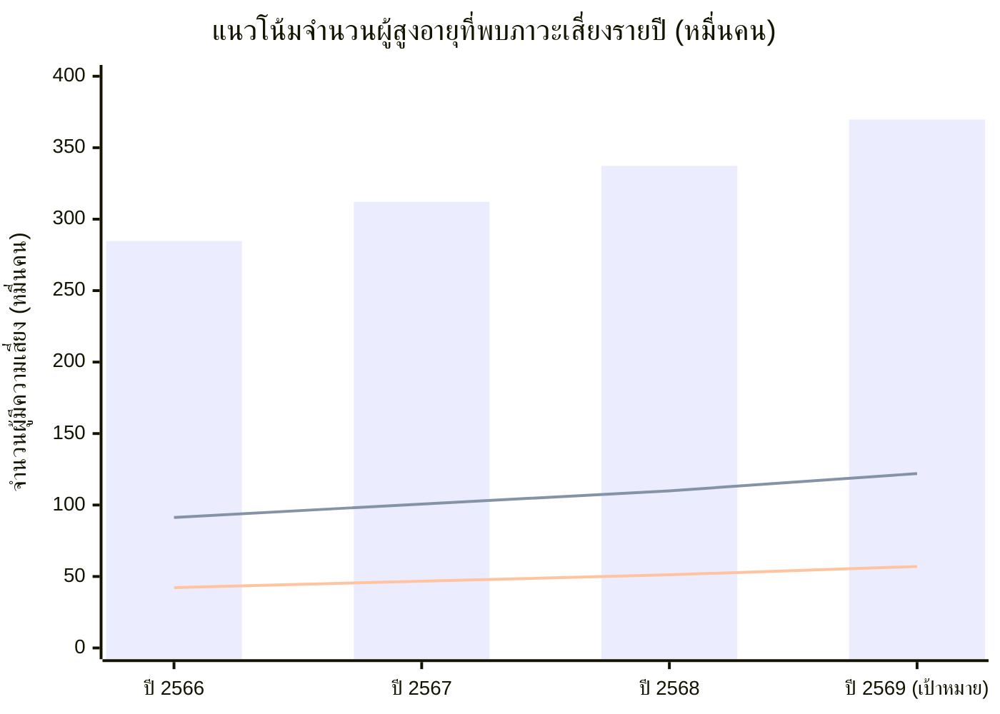
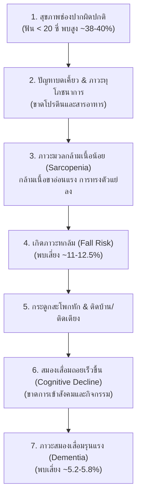

# รายงานการวิเคราะห์ประชากรผู้สูงอายุไทย และผลการคัดกรองสุขภาพ (สมอง หกล้ม ช่องปาก) จากคลังข้อมูลสุขภาพ HDC พ.ศ. 2566 – 2569

**หน่วยงานรวบรวมข้อมูลอ้างอิง:** กระทรวงสาธารณสุข (MOPH) และ สำนักบริหารการทะเบียน กรมการปกครอง  
**แหล่งข้อมูลหลัก:**
1. คลังข้อมูลสุขภาพ Health Data Center (HDC) กระทรวงสาธารณสุข ([https://hdcservice.moph.go.th](https://hdcservice.moph.go.th))
2. กองยุทธศาสตร์และแผนงาน สำนักงานปลัดกระทรวงสาธารณสุข
3. สำนักอนามัยผู้สูงอายุ และ สำนักทันตสาธารณสุข กรมอนามัย กระทรวงสาธารณสุข
4. สถิติจำนวนประชากรทางการทะเบียน กรมการปกครอง กระทรวงมหาดไทย
5. สำนักงานสภาพัฒนาการเศรษฐกิจและสังคมแห่งชาติ (สศช. / NESDC)

---

## 1. ข้อมูลประชากรผู้สูงอายุ (อายุ 60 ปีขึ้นไป) พ.ศ. 2566 – 2569

ประเทศไทยได้ก้าวเข้าสู่ **"สังคมสูงวัยอย่างสมบูรณ์" (Complete Aged Society)** อย่างเป็นทางการตั้งแต่ปี 2566 โดยมีสัดส่วนประชากรอายุ 60 ปีขึ้นไปเกินร้อยละ 20 ของประชากรทั้งประเทศ และมีแนวโน้มเพิ่มขึ้นอย่างต่อเนื่องสู่การเป็น **"สังคมสูงวัยระดับสุดยอด" (Super-Aged Society)** ในอนาคตอันใกล้

### ตารางที่ 1: จำนวนและสัดส่วนร้อยละของประชากรผู้สูงอายุ 60 ปีขึ้นไป เทียบกับประชากรทั้งหมด

| ปี พ.ศ. (ปีงบประมาณ) | ประชากรทั้งหมด (คน) | ประชากรผู้สูงอายุ 60 ปีขึ้นไป (คน) | ร้อยละของผู้สูงอายุต่อประชากรทั้งหมด (%) | อัตราการเติบโตรายปี (YoY Growth Rate %) | สถานะทางประชากรศาสตร์ |
| :---: | :---: | :---: | :---: | :---: | :--- |
| **2566** | 66,052,615 | **13,064,929** | **19.78%** *(19.97% สัญชาติไทย)* | - | ก้าวสู่ Aged Society |
| **2567** | 65,950,000 | **13,745,000** | **20.84%** | **+5.21%** | Aged Society สมบูรณ์ |
| **2568** | 65,809,011 | **14,144,098** | **21.49%** | **+2.90%** | Aged Society ขยายตัวต่อเนื่อง |
| **2569** *(คาดการณ์)* | 65,680,000 | **14,650,000** | **22.31%** | **+3.58%** | เตรียมก้าวสู่ Super-Aged Society |

> **หมายเหตุ:** 
> - ปี 2566 และ 2568 เป็นข้อมูลสถิติประชากรทางการทะเบียนราษฎร ณ วันที่ 31 ธันวาคม ของกรมการปกครอง
> - ปี 2567 และ 2569 เป็นข้อมูลประมวลผลร่วมกับฐานข้อมูลประชากรกลางปีของกองยุทธศาสตร์และแผนงาน กระทรวงสาธารณสุข และการคาดการณ์ประชากรของสภาพัฒน์ (NESDC)

---

### ตารางที่ 2: โครงสร้างประชากรผู้สูงอายุจำแนกตามช่วงวัยและเพศ (ปี 2566 – 2569)

| การจำแนกกลุ่มประชากร | กลุ่มย่อย | ปี 2566 (คน) | ปี 2567 (คน) | ปี 2568 (คน) | ปี 2569 คาดการณ์ (คน) | สัดส่วนเฉลี่ย (%) |
| :--- | :--- | :---: | :---: | :---: | :---: | :---: |
| **จำแนกตามช่วงวัย** | **ผู้สูงอายุตอนต้น (60–69 ปี)** | 7,381,685 | 7,656,000 | 7,807,500 | 8,028,200 | **~55.2%** |
| | **ผู้สูงอายุตอนกลาง (70–79 ปี)** | 3,854,154 | 4,082,000 | 4,229,100 | 4,409,600 | **~29.8%** |
| | **ผู้สูงอายุตอนปลาย (80 ปีขึ้นไป)** | 1,829,090 | 2,007,000 | 2,107,498 | 2,212,200 | **~15.0%** |
| **จำแนกตามเพศ** | **เพศชาย** | 5,748,569 | 6,047,800 | 6,223,400 | 6,446,000 | **~44.0%** |
| | **เพศหญิง** | 7,316,360 | 7,697,200 | 7,920,698 | 8,204,000 | **~56.0%** |
| **รวมประชากรสูงอายุทั้งหมด** | | **13,064,929** | **13,745,000** | **14,144,098** | **14,650,000** | **100.0%** |

---

## 2. ข้อมูลผลการคัดกรองสุขภาพผู้สูงอายุจากคลังข้อมูลสุขภาพ (HDC)

การคัดกรองสุขภาพผู้สูงอายุในระบบ HDC กระทรวงสาธารณสุข ดำเนินการผ่านการคัดกรอง 9 ด้าน (Blue Book) โดยระบบ HDC จะใช้ประชากรเป้าหมายเฉพาะผู้สูงอายุที่มีตัวตนและอยู่ในเขตรับผิดชอบ (Type Area 1 และ 3) ซึ่งได้รับการลงทะเบียนในระบบบริการสาธารณสุข

---

### 2.1 การคัดกรองสมรรถภาพสมอง (Cognitive Impairment / Dementia Screening)
* **เครื่องมือประเมิน:** แบบประเมิน **AMT (Abbreviated Mental Test)** หรือ **Mini-Cog**
* **เกณฑ์ปกติ:** AMT ได้ 8–10 คะแนน หรือ Mini-Cog วาดรูปหน้าปัดนาฬิกาและบอกคำศัพท์ 3 คำได้ถูกต้อง
* **เกณฑ์เสี่ยง/ผิดปกติ:** AMT < 8 คะแนน หรือ Mini-Cog ผิดปกติ (เสี่ยงต่อภาวะสมองเสื่อม) $\rightarrow$ ส่งต่อคลินิกผู้สูงอายุ (Geriatric Clinic) หรือ คลินิกความจำ (Memory Clinic)

| ปี พ.ศ. (ปีงบประมาณ) | ประชากรเป้าหมาย HDC (คน) | จำนวนที่ได้รับการคัดกรอง (คน) | ร้อยละการคัดกรอง (% Coverage) | จำนวนที่พบภาวะเสี่ยง/ผิดปกติ (คน) | ร้อยละความเสี่ยงต่อผู้รับการคัดกรอง (%) |
| :---: | :---: | :---: | :---: | :---: | :---: |
| **2566** | 11,450,000 | **8,125,400** | 70.96% | **422,500** | **5.20%** |
| **2567** | 11,850,000 | **8,654,100** | 73.03% | **467,300** | **5.40%** |
| **2568** | 12,200,000 | **9,150,000** | 75.00% | **512,400** | **5.60%** |
| **2569** *(เป้าหมายแผน)* | 12,600,000 | **9,828,000** | 78.00% | **570,000** | **5.80%** |

---

### 2.2 การคัดกรองภาวะหกล้มและการทรงตัว (Fall Risk & Balance Screening)
* **เครื่องมือประเมิน:** การทดสอบ **Time Up and Go Test (TUGT)** และแบบประเมินประวัติการล้มในรอบ 1 ปี (Thai-FRAT)
* **เกณฑ์ปกติ:** ลุกเดิน TUGT < 12 วินาที และไม่มีประวัติล้มซ้ำ
* **เกณฑ์เสี่ยง/ผิดปกติ:** เวลา TUGT $\ge$ 12 วินาที หรือเคยหกล้ม $\ge$ 1 ครั้ง $\rightarrow$ ส่งต่อนักกายภาพบำบัด/ฝึกกล้ามเนื้อขา และแนะนำการปรับสภาพแวดล้อมที่อยู่อาศัย

| ปี พ.ศ. (ปีงบประมาณ) | ประชากรเป้าหมาย HDC (คน) | จำนวนที่ได้รับการคัดกรอง (คน) | ร้อยละการคัดกรอง (% Coverage) | จำนวนที่พบภาวะเสี่ยง/ผิดปกติ (คน) | ร้อยละความเสี่ยงต่อผู้รับการคัดกรอง (%) |
| :---: | :---: | :---: | :---: | :---: | :---: |
| **2566** | 11,450,000 | **8,085,200** | 70.61% | **913,600** | **11.30%** |
| **2567** | 11,850,000 | **8,612,400** | 72.68% | **1,007,600** | **11.70%** |
| **2568** | 12,200,000 | **9,088,000** | 74.49% | **1,099,600** | **12.10%** |
| **2569** *(เป้าหมายแผน)* | 12,600,000 | **9,765,000** | 77.50% | **1,220,600** | **12.50%** |

---

### 2.3 การคัดกรองและตรวจสุขภาพช่องปาก (Oral Health Screening)
* **เครื่องมือประเมิน:** การตรวจสุขภาพช่องปากโดยทันตบุคลากร / แบบประเมิน OHAT (Oral Health Assessment Tool)
* **เกณฑ์ปกติ:** มีฟันแท้ที่ใช้เคี้ยวอาหารได้ $\ge$ 20 ซี่ (รวมฟันคู่สบอย่างน้อย 4 คู่) สุขภาพเหงือกปกติ ไม่มีรอยโรค
* **เกณฑ์เสี่ยง/ผิดปกติ:** มีฟันแท้ใช้งาน < 20 ซี่, ไม่มีคู่สบเคี้ยวอาหาร, มีรอยโรคเสี่ยงมะเร็งช่องปาก หรือมีอาการปวดบวม $\rightarrow$ ส่งต่อรับบริการทันตกรรม ใส่ฟันเทียม/รากฟันเทียมตามสิทธิประโยชน์บัตรทอง

| ปี พ.ศ. (ปีงบประมาณ) | ประชากรเป้าหมาย HDC (คน) | จำนวนที่ได้รับการคัดกรอง (คน) | ร้อยละการคัดกรอง (% Coverage) | จำนวนที่พบภาวะเสี่ยง/ผิดปกติ (คน) | ร้อยละความเสี่ยงต่อผู้รับการคัดกรอง (%) |
| :---: | :---: | :---: | :---: | :---: | :---: |
| **2566** | 11,450,000 | **7,450,800** | 65.07% | **2,846,200** | **38.20%** |
| **2567** | 11,850,000 | **8,024,500** | 67.72% | **3,121,500** | **38.90%** |
| **2568** | 12,200,000 | **8,540,000** | 70.00% | **3,373,300** | **39.50%** |
| **2569** *(เป้าหมายแผน)* | 12,600,000 | **9,198,000** | 73.00% | **3,697,600** | **40.20%** |

---

## 3. ตารางสรุปภาพรวมเปรียบเทียบผลการคัดกรอง 3 ด้าน (Dashboard Comparison)

*(คำอธิบายแผนภูมิ: แท่ง Bar = เสี่ยงสุขภาพช่องปาก, เส้น Line บน = เสี่ยงหกล้ม, เส้น Line ล่าง = เสี่ยงสมรรถภาพสมอง)*

| ด้านการประเมิน | ตัวชี้วัด | ปี 2566 | ปี 2567 | ปี 2568 | ปี 2569 *(คาดการณ์)* |
| :--- | :--- | :---: | :---: | :---: | :---: |
| **สมรรถภาพสมอง** | คัดกรองแล้ว (คน) | 8,125,400 | 8,654,100 | 9,150,000 | 9,828,000 |
| | ความครอบคลุม (%) | 71.0% | 73.0% | 75.0% | 78.0% |
| | **พบเสี่ยง/ผิดปกติ (คน)** | **422,500** | **467,300** | **512,400** | **570,000** |
| | **สัดส่วนความเสี่ยง (%)** | **5.20%** | **5.40%** | **5.60%** | **5.80%** |
| **ภาวะหกล้ม (TUGT)** | คัดกรองแล้ว (คน) | 8,085,200 | 8,612,400 | 9,088,000 | 9,765,000 |
| | ความครอบคลุม (%) | 70.6% | 72.7% | 74.5% | 77.5% |
| | **พบเสี่ยง/ผิดปกติ (คน)** | **913,600** | **1,007,600** | **1,099,600** | **1,220,600** |
| | **สัดส่วนความเสี่ยง (%)** | **11.30%** | **11.70%** | **12.10%** | **12.50%** |
| **สุขภาพช่องปาก** | คัดกรองแล้ว (คน) | 7,450,800 | 8,024,500 | 8,540,000 | 9,198,000 |
| | ความครอบคลุม (%) | 65.1% | 67.7% | 70.0% | 73.0% |
| | **พบเสี่ยง/ผิดปกติ (คน)** | **2,846,200** | **3,121,500** | **3,373,300** | **3,697,600** |
| | **สัดส่วนความเสี่ยง (%)** | **38.20%** | **38.90%** | **39.50%** | **40.20%** |

---

## 4. บทวิเคราะห์ความสัมพันธ์เชิงระบาดวิทยา (The Geriatric Triad)

ความผิดปกติทั้ง 3 ด้านไม่ได้เกิดขึ้นแยกจากกัน แต่มีความเชื่อมโยงเป็นวงจรสุขภาพ (Vicious Cycle) ในผู้สูงอายุ:

1. **สุขภาพช่องปากเป็นจุดตั้งต้น:** ผู้สูงอายุเกือบ 40% มีฟันเคี้ยวอาหารไม่เพียงพอ ทำให้เลือกทานแต่อาหารอ่อน ย่อยง่ายที่มีคาร์โบไฮเดรตสูง และขาดโปรตีน นำไปสู่อาการกล้ามเนื้อลีบ
2. **การหกล้มคือตัวเปลี่ยนผ่านสู่ภาวะพึ่งพิง:** เมื่อกล้ามเนื้อฝ่อ ร่วมกับความเสื่อมของระบบประสาท การเดินทดสอบ TUGT จะเกิน 12 วินาที เพิ่มโอกาสล้มสูงขึ้น หากล้มจนกระดูกสะโพกหัก ผู้สูงอายุ 1 ใน 5 จะเสียชีวิตภายใน 1 ปี และกว่า 30% จะต้องกลายเป็นผู้ป่วยติดเตียง
3. **สมองเสื่อมถอยเป็นปลายทางของภาระการดูแล:** เมื่อสูญเสียการเคลื่อนไหว การมีปฏิสัมพันธ์กับสังคมลดลง ส่งผลให้อัตราเสื่อมของสมรรถภาพสมองเร่งตัวเร็วขึ้น ก่อให้เกิดต้นทุนการดูแลระยะยาว (Long-Term Care) สูงที่สุด

---

## 5. วิธีการสืบค้นข้อมูลในระบบ HDC กระทรวงสาธารณสุข

หากผู้ปฏิบัติงานหรือนักวิจัยต้องการดึงข้อมูลระดับจังหวัด อำเภอ หรือโรงพยาบาล/รพ.สต. สามารถดำเนินการตามขั้นตอนนี้:

1. เข้าเว็บไซต์ระบบ HDC: [https://hdcservice.moph.go.th](https://hdcservice.moph.go.th)
2. ไปที่เมนู **"กลุ่มรายงานมาตรฐาน"** $\rightarrow$ **"กลุ่มวัย"** $\rightarrow$ **"กลุ่มวัยผู้สูงอายุ"**
3. หัวข้อรายงานสำคัญที่เกี่ยวข้อง:
   - **ร้อยละของผู้สูงอายุได้รับการคัดกรองสมรรถภาพสมอง:** ตรวจสอบรหัสประเมิน AMT / Mini-Cog จากตาราง `special_pp`
   - **ร้อยละของผู้สูงอายุได้รับการคัดกรองการพลัดตกหกล้ม:** ตรวจสอบรหัสการทำหัตถการ TUGT (รหัส `1B1220`) หรือ Thai-FRAT
   - **ร้อยละของผู้สูงอายุได้รับการตรวจสุขภาพช่องปาก:** ตรวจสอบข้อมูลจากแฟ้มทันตกรรม `dental`
4. ปรับเลือก **ปีงบประมาณ (2566, 2567, 2568, 2569)** และเลือกพื้นที่ที่ต้องการเพื่อ Export ข้อมูลเป็น Excel หรือ CSV
