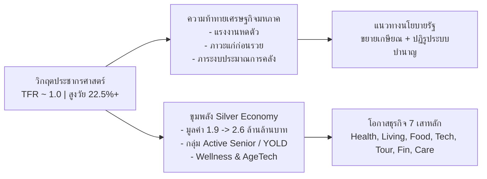
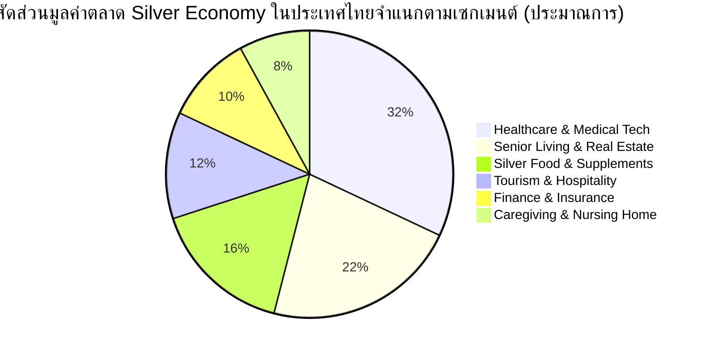

# รายงานการวิเคราะห์เศรษฐกิจผู้สูงอายุ (Silver Economy Thailand & Global Analysis)

> **จัดทำโดย:** ฝ่ายวิเคราะห์ข้อมูลเศรษฐกิจและกลยุทธ์  
> **สถานะข้อมูล:** ปรับปรุงล่าสุดปี 2026 (อ้างอิงข้อมูลสถิติ สภาพัฒน์ (NESDC), สำนักงานสถิติแห่งชาติ (สสช.), ธนาคารแห่งประเทศไทย (BOT), SCB EIC, World Bank และ WHO)  
> **ไฟล์ข้อมูลดิบประกอบ:** [`docs/silver-economy-indicators.csv`](file:///C:/Users/Piyanut/Desktop/Code_Work/docs/silver-economy-indicators.csv)

---

## 1. บทสรุปสำหรับผู้บริหาร (Executive Summary)

ประเทศไทยได้ก้าวเข้าสู่ **"สังคมสูงวัยอย่างสมบูรณ์" (Complete Aged Society)** อย่างเป็นทางการตั้งแต่ปี 2566–2567 โดยมีสัดส่วนประชากรอายุ 60 ปีขึ้นไปมากกว่าร้อยละ 20 ของประชากรทั้งประเทศ และกำลังเคลื่อนตัวอย่างรวดเร็วเข้าสู่ **"สังคมสูงวัยระดับสุดยอด" (Super-Aged Society)** ภายในปี 2573–2576 (สัดส่วนประชากรสูงอายุเกินร้อยละ 28)

การเปลี่ยนแปลงโครงสร้างประชากรแบบก้าวกระโดดนี้ก่อให้เกิดผลกระทบสองด้านหลักทางเศรษฐกิจ:
1. **แรงกดดันและวิกฤตเชิงโครงสร้าง (The Pressure & Challenges):** 
   - ภาวะ **"แก่ก่อนรวย" (Getting Old Before Getting Rich)** เนื่องจากรายได้เฉลี่ยต่อหัว (GDP per capita) ของไทยยังอยู่ในระดับปานกลาง (~7,200–7,500 USD) เทียบกับประเทศพัฒนาแล้วที่เข้าสู่ Super-Aged Society ด้วยรายได้ต่อหัวสูงกว่า 25,000–35,000 USD
   - อัตราการเจริญพันธุ์รวม (TFR) ลดต่ำลงแตะระดับ **~1.0** (ต่ำกว่าระดับทดแทน 2.1 อย่างมีนัยสำคัญ) ทำให้วัยแรงงานลดลงอย่างรวดเร็ว
   - ภาระการคลังด้านสาธารณสุขและเบี้ยยังชีพเพิ่มขึ้นอย่างก้าวกระโดด รวมถึงความเสี่ยงด้านความยั่งยืนของกองทุนประกันสังคม (Social Security Fund)
2. **โอกาสเชิงพาณิชย์และเศรษฐกิจสูงวัย (The Silver Economy Opportunity):**
   - ตลาดสินค้าและบริการเพื่อผู้สูงอายุในไทยปัจจุบันมีมูลค่าราว **1.9 ล้านล้านบาท** และมีอัตราการเติบโตเฉลี่ย 4.4% ต่อปี คาดว่าจะแตะ **2.6 ล้านล้านบาทในปี 2573** (คิดเป็น ~12% ของ GDP)
   - การบริโภคของผู้สูงอายุมีแนวโน้มขยายตัวจาก 2.18 ล้านล้านบาท ไปแตะ 3.50 ล้านล้านบาทภายในปี 2576
   - เกิดกลุ่มผู้บริโภคใหม่ทรงอิทธิพล คือ **"Active Aging" หรือ YOLD (Young Old: อายุ 60–69 ปี)** ซึ่งมีทั้งเงินออม ทรัพย์สิน เวลา และความพร้อมในการเปิดรับเทคโนโลยีและไลฟ์สไตล์ใหม่



---

## 2. ข้อมูลสถิติและโครงสร้างประชากรศาสตร์ (Demographic Transition)

### 2.1 เกณฑ์ชี้วัดและสถานะของประเทศไทย

| ระดับขั้นสังคมสูงวัย | นิยาม (เกณฑ์อายุ 60 ปีขึ้นไป) | นิยาม (เกณฑ์อายุ 65 ปีขึ้นไป) | ประเทศไทยก้าวเข้าสู่ระดับนี้ |
| :--- | :--- | :--- | :--- |
| **Aging Society** (สังคมเริ่มสูงวัย) | เกิน 10% ของประชากร | เกิน 7% ของประชากร | **ปี 2548 (2005)** |
| **Aged Society** (สังคมสูงวัยอย่างสมบูรณ์) | เกิน 20% ของประชากร | เกิน 14% ของประชากร | **ปี 2566–2567 (2023–2024)** |
| **Super-Aged Society** (สังคมสูงวัยระดับสุดยอด) | เกิน 28% ของประชากร | เกิน 20% ของประชากร | **คาดการณ์ปี 2573–2576 (2030–2033)** |

### 2.2 ตัวเลขสถิติสำคัญของไทย (ณ ปี 2567–2569)

- **จำนวนผู้สูงอายุ (60 ปีขึ้นไป):** ประมาณ **14.8 ล้านคน** (คิดเป็น ~22.5% ของประชากรทั้งหมด 66.05 ล้านคน)
- **อัตราการเกิดใหม่ (Births):** ต่ำกว่า 500,000 คนต่อปี โดยในปี 2566 มีเด็กเกิดใหม่เพียง ~480,000 คน และลดลงต่อเนื่อง
- **อัตราการเจริญพันธุ์รวม (Total Fertility Rate - TFR):** อยู่ที่ประมาณ **1.0 – 1.1** บุตรต่อสตรีวัยเจริญพันธุ์ (เทียบกับเกณฑ์ทดแทน 2.1)
- **ดัชนีการสูงอายุ (Aging Index):** อยู่ที่ประมาณ **127.4** (หมายถึง มีผู้สูงอายุ 127 คน ต่อเด็กอายุต่ำกว่า 15 ปี 100 คน)
- **อัตราส่วนการพึ่งพิงวัยสูงอายุ (Old-Age Dependency Ratio):**
  - ปี 2537: วัยทำงาน 100 คน เลี้ยงดูผู้สูงอายุ ~9 คน (อัตราส่วน 11:1)
  - ปี 2567: วัยทำงาน 100 คน เลี้ยงดูผู้สูงอายุ **~31.1 คน** (อัตราส่วน ~3.2:1)
  - ปี 2583 (คาดการณ์): วัยทำงาน 100 คน เลี้ยงดูผู้สูงอายุ **~56–60 คน** (อัตราส่วน ~1.7:1)

```
อัตราส่วนวัยทำงานต่อผู้สูงอายุ 1 คน:
  ปี 1994:  ███████████ (11 คน)
  ปี 2010:  ██████ (6 คน)
  ปี 2024:  ███ (3.2 คน)
  ปี 2040:  █▌ (1.7 คน - คาดการณ์)
```

### 2.3 การจัดกลุ่มตามช่วงวัยและศักยภาพ (Segmentation by Cohort)

1. **Young-Old (YOLD: อายุ 60–69 ปี) — ~55% ของผู้สูงอายุทั้งหมด:**
   - สุขภาพ: แข็งแรง ช่วยเหลือตนเองได้สมบูรณ์ (Active Aging)
   - สถานะการเงิน: ยังมีรายได้จากการทำงาน ธุรกิจส่วนตัว หรือเงินออมก้อนใหญ่
   - พฤติกรรม: สนใจการท่องเที่ยว การพัฒนาตนเอง สังสรรค์ ช้อปปิ้งออนไลน์ และดูแลสุขภาพเชิงป้องกัน
2. **Middle-Old (อายุ 70–79 ปี) — ~30% ของผู้สูงอายุทั้งหมด:**
   - สุขภาพ: เริ่มมีโรคไม่ติดต่อเรื้อรัง (NCDs) เช่น ความดัน เบาหวาน ข้อเสื่อม มีภาวะกึ่งพึ่งพิง (Pre-frail)
   - สถานะการเงิน: พึ่งพาเงินออม สวัสดิการ และบุตรหลาน
   - พฤติกรรม: ใช้ชีวิตติดบ้านมากขึ้น ให้ความสำคัญกับความปลอดภัย ความสะดวกในการเดินทาง และการเข้าถึงโรงพยาบาล
3. **Old-Old (อายุ 80 ปีขึ้นไป) — ~15% ของผู้สูงอายุทั้งหมด:**
   - สุขภาพ: มีภาวะพึ่งพิงสูง (Dependent / Frail) อาจมีภาวะติดบ้านหรือติดเตียง สมองเสื่อม (Dementia)
   - ความต้องการหลัก: การบริบาลระยะยาว (Long-Term Care), บุคลากรดูแลมืออาชีพ (Caregiver), Nursing Home

---

## 3. มิติเศรษฐกิจมหภาคและความท้าทายทางการคลัง (Macroeconomic & Fiscal Risks)

### 3.1 วิกฤต "แก่ก่อนรวย" (Getting Old Before Getting Rich)

ในขณะที่กลุ่มประเทศพัฒนาแล้ว (เช่น ญี่ปุ่น สวีเดน เยอรมนี) ก้าวเข้าสู่สังคมสูงวัยเมื่อมีฐานะร่ำรวยและระบบสวัสดิการพร้อมมูล แต่ประเทศไทยเผชิญปัญหาโครงสร้างกลับทิศ:

| มิติเปรียบเทียบ | ประเทศพัฒนาแล้ว (เช่น ญี่ปุ่น) ตอนเข้าสู่ Super-Aged | ประเทศไทย ณ ปัจจุบันที่กำลังเข้าสู่ Super-Aged |
| :--- | :--- | :--- |
| **GDP per Capita** | > $30,000 – $40,000 USD | **~$7,200 – $7,500 USD** |
| **โครงสร้างแรงงานนอกระบบ** | ต่ำ (< 10%) มีระบบบำนาญครอบคลุม | **สูง (> 51%)** ขาดระบบบำนาญประจำ |
| **การออมเฉลี่ยหลังเกษียณ** | มีกองทุนสำรองเลี้ยงชีพและประกันสังคมครอบคลุม | **ผู้สูงอายุไทย ~40% มีเงินออมน้อยกว่า 50,000 บาท** |
| **ภาระหนี้ครัวเรือน** | อยู่ในระดับต่ำถึงปานกลาง | **หนี้ครัวเรือนไทยสูงกว่า ~88–90% ของ GDP** |

### 3.2 แหล่งที่มาของรายได้ผู้สูงอายุไทย (ข้อมูล สสช.)

ผลการสำรวจประชากรสูงอายุของสำนักงานสถิติแห่งชาติ สะท้อนโครงสร้างรายได้ดังนี้:
1. **รายได้จากการทำงานของตนเอง (32–34%):** ผู้สูงอายุประมาณ 1 ใน 3 ยังคงต้องทำงานเพื่อยังชีพ โดยส่วนใหญ่อยู่ในภาคเกษตรกรรม ค้าขายรายย่อย และรับจ้างทั่วไป
2. **รายได้จากการเกื้อหนุนของบุตรหลาน (30–32%):** มีแนวโน้มลดลงอย่างต่อเนื่องเนื่องจากคนรุ่นใหม่มีบุตรน้อยลงและมีภาระค่าครองชีพสูง
3. **เบี้ยยังชีพผู้สูงอายุและสวัสดิการรัฐ (15–18%):**
   - อัตราเบี้ยยังชีพปัจจุบัน: อายุ 60-69 ปี (600 บาท/เดือน), 70-79 ปี (700 บาท/เดือน), 80-89 ปี (800 บาท/เดือน), 90 ปีขึ้นไป (1,000 บาท/เดือน)
   - ตัวเลขดังกล่าวต่ำกว่าเส้นความยากจนของไทย (Poverty Line ~2,800–3,000 บาท/เดือน)
4. **เงินบำนาญข้าราชการ / ประกันสังคม (8–10%):** เข้าถึงเฉพาะอดีตข้าราชการและแรงงานในระบบประกันสังคม (ม.33)
5. **ดอกเบี้ย เงินปันผล และทรัพย์สิน (3–5%):** กระจุกตัวอยู่ในกลุ่มผู้มีฐานะสูง (Top 10%)

### 3.3 ภาระงบประมาณการคลังและการคุกคามกองทุนชราภาพ

- **ค่าใช้จ่ายสาธารณสุข (Healthcare Expenditure):** คาดการณ์ว่าจะเพิ่มขึ้นจาก ~3.8% ของ GDP ไปแตะ **> 5.5% ของ GDP ภายในปี 2575** โดยเฉพาะงบประมาณในระบบหลักประกันสุขภาพถ้วนหน้า (บัตรทอง) และสิทธิข้าราชการ
- **ความยั่งยืนของกองทุนประกันสังคม (SSO Fund Depletion Risk):**
  - ด้วยโครงสร้างที่ผู้จ่ายเงินสมทบลดลง (วัยแรงงานลด) และผู้รับผลประโยชน์กรณีชราภาพเพิ่มขึ้นก้าวกระโดด
  - รายงานการวิเคราะห์ระบุว่า หากไม่มีการปฏิรูปเกณฑ์อายุรับสิทธิ (เช่น ขยายจาก 55 ปี เป็น 60–65 ปี) และปรับเพดานเงินสมทบ กองทุนประกันสังคมกรณีชราภาพอาจเข้าสู่ภาวะ **กระแสเงินสดติดลบภายในปี 2588–2593**

---

## 4. โอกาสทางธุรกิจและมูลค่าตลาด Silver Economy

### 4.1 ขนาดตลาด (Market Sizing)

- **ประเทศไทย:**
  - มูลค่าตลาดปี 2567: **~1.9 ล้านล้านบาท**
  - คาดการณ์ปี 2573: **~2.6 ล้านล้านบาท** (CAGR ~4.4%) คิดเป็นสัดส่วนราว 12% ของ GDP
  - มูลค่าการบริโภคของผู้สูงวัย: เติบโตจาก 2.18 ล้านล้านบาท (ปี 2566) สู่ **3.50 ล้านล้านบาท** (ปี 2576)
- **ระดับโลก (Global Market):**
  - มูลค่าตลาดตรง (Direct Market): ประมาณ **4.5 – 6.0 ล้านล้านดอลลาร์สหรัฐ** ในปัจจุบัน
  - คาดการณ์ปี 2576–2593 (2033–2050): ประเมินว่าจะเติบโตแตะ **15 – 27 ล้านล้านดอลลาร์สหรัฐ** 



### 4.2 เจาะลึก 7 อุตสาหกรรมเป้าหมาย (The 7 Pillars of Silver Economy)

#### 1. การแพทย์ สุขภาพ และเวชศาสตร์ชะลอวัย (Healthcare, Wellness & Longevity)
- **บริการเป้าหมาย:** คลินิกผู้สูงอายุเฉพาะทาง (Geriatric Medicine), ศูนย์เวชศาสตร์ชะลอวัยและฟื้นฟูสุขภาพ (Anti-aging & Regenerative Medicine), บริการแพทย์ทางไกล (Telemedicine)
- **จุดเด่น:** ผู้สูงวัยกลุ่มมีกำลังซื้อยินดีจ่ายสำหรับเวชศาสตร์ป้องกัน (Preventive Healthcare) และการตรวจยีน/ตรวจความเสี่ยงโรคร้ายแรงล่วงหน้า

#### 2. อสังหาริมทรัพย์และบ้านเพื่อผู้สูงอายุ (Senior Living & Universal Design)
- **บริการเป้าหมาย:**
  - **Home Modification:** ตลาดปรับปรุงบ้านเดิม (เช่น ทางลาด ราวจับในห้องน้ำ พื้นซับแรงกระแทก ประตูกว้างสำหรับวีลแชร์ สวิตช์ไฟและปลั๊กไฟระดับเหมาะสม)
  - **Assisted Living Facilities:** คอนโดมิเนียมหรือโครงการบ้านจัดสรรที่มีพยาบาลประจำตลอด 24 ชม. และระบบ SOS Emergency

#### 3. อาหารและโภชนาการเฉพาะวัย (Silver Food & Nutrition)
- **ความต้องการ:** ผู้สูงอายุมักมีปัญหาการบดเคี้ยว การกลืน และระบบย่อยอาหาร
- **ผลิตภัณฑ์ดาวรุ่ง:**
  - อาหารเนื้อสัมผัสนุ่ม เคี้ยวง่าย (Soft & Pureed Food)
  - อาหารเสริมโปรตีนจากพืช (Plant-based) เพื่อป้องกันภาวะมวลกล้ามเนื้อน้อย (Sarcopenia)
  - อาหารควบคุมโซเดียม น้ำตาล และไขมัน พร้อมสารอาหารบำรุงสมองและสายตา

#### 4. เทคโนโลยีเพื่อผู้สูงอายุ (AgeTech & ElderTech)
- **อุปกรณ์และโซลูชัน:**
  - เซนเซอร์เรดาร์/IoT ตรวจจับการหกล้มโดยไม่ละเมิดความเป็นส่วนตัว (Fall Detection Radar)
  - Smart Wearables ตรวจจับสัญญาณชีพ (ECG, ออกซิเจนในเลือด, ความดันโลหิต) พร้อมแจ้งเตือนครอบครัว
  - หุ่นยนต์และระบบ AI ช่วยเหลือ (Companion AI Bots) คุยคลายเหงาและเตือนกินยา

#### 5. การท่องเที่ยวและการพักผ่อน (Silver Tourism & Leisure)
- **พฤติกรรม:** กลุ่ม YOLD มีเวลาว่างและต้องการท่องเที่ยวเพื่อชดเชยช่วงชีวิตทำงาน
- **ลักษณะโปรแกรม:**
  - การท่องเที่ยวแบบ Slow Travel (ไม่เร่งรีบ เน้นสุขภาพ วัฒนธรรม ธรรมชาติ อาหารท้องถิ่น)
  - รถนำเที่ยวที่มีอุปกรณ์รองรับผู้สูงวัยและบุคลากรปฐมพยาบาลติดตาม
  - การดึงดูดชาวต่างชาติเกษียณอายุแบบ Long-stay / Medical Wellness Retreat เข้ามาในไทย

#### 6. การเงิน การลงทุน และการประกันภัย (Silver Finance & Insurance)
- **ผลิตภัณฑ์เป้าหมาย:**
  - ประกันสุขภาพสำหรับผู้สูงอายุที่ไม่ปฏิเสธโรคเรื้อรัง (Guaranteed Issue Health Insurance)
  - ประกันโรคร้ายแรงและภาวะสมองเสื่อม (Critical Illness & Dementia Cover)
  - **Reverse Mortgage (สินเชื่อที่อยู่อาศัยสำหรับผู้สูงอายุ):** การนำบ้านปลอดภาระมาแปลงเป็นรายได้บำนาญรายเดือนโดยยังอาศัยอยู่ในบ้านได้ตลอดชีวิต
  - กองทุนเพื่อการเกษียณที่เน้นจ่ายกระแสเงินสดสม่ำเสมอ (Annuity / Dividend Funds)

#### 7. บริการดูแลและการบริบาล (Caregiving Services & Nursing Home)
- **รูปแบบ:**
  - **Day Care:** ศูนย์รับดูแลผู้สูงอายุระหว่างวันสำหรับครอบครัวที่ต้องออกไปทำงาน
  - **On-Demand Caregiver Platform:** แพลตฟอร์มจับคู่ผู้ดูแลมืออาชีพที่ผ่านการรับรอง ส่งตรงถึงบ้านแบบรายชั่วโมง/รายวัน
  - **Palliative Care & Hospice:** สถานดูแลแบบประคับประคองสำหรับผู้ป่วยระยะท้าย

---

## 5. บทเรียนระดับสากลและแนวทางรับมือ (Global Case Studies)

### 5.1 กรณีศึกษาประเทศญี่ปุ่น (Super-Aged Pioneer)
- **ระบบประกันการดูแลระยะยาว (Long-Term Care Insurance - LTCI):** เริ่มต้นตั้งแต่ปี 2000 กำหนดให้ประชากรอายุ 40 ปีขึ้นไปร่วมสมทบเงิน โดยรัฐและกองทุนจะช่วยจ่ายค่าบริการดูแลผู้สูงอายุถึง 90% ของค่าใช้จ่ายจริง
- **นวัตกรรมหุ่นยนต์และระบบอัตโนมัติ:** สนับสนุนเงินทุนและสิทธิประโยชน์ทางภาษีแก่บริษัทที่พัฒนา Nursing Care Robotics และเตียงอัจฉริยะเพื่อลดภาระผู้ดูแล

### 5.2 กรณีศึกษาสหภาพยุโรป (Active Ageing Framework)
- **ดัชนีส่งเสริมผู้สูงวัย (Active Ageing Index):** ประเมินศักยภาพการมีส่วนร่วมในตลาดแรงงาน การมีส่วนร่วมในสังคม และความเป็นอิสระของผู้สูงอายุ
- **กฎหมายขยายอายุเกษียณ:** ปรับเพิ่มอายุเกษียณแบบยืดหยุ่นเป็น 65–67 ปี โดยควบคู่ไปกับมาตรการฝึกอบรมทักษะดิจิทัล (Digital Upskilling)

---

## 6. ข้อเสนอแนะเชิงกลยุทธ์ (Strategic Recommendations)

### 6.1 สำหรับภาครัฐบาล (Policy Makers)
1. **การปฏิรูประบบบำนาญแบบบูรณาการ (Multi-pillar Pension Reform):**
   - รวมระบบบำนาญ ประกันสังคม และกองทุนการออมแห่งชาติ (กอช.) เข้าสู่ฐานข้อมูลเดียวกัน
   - ปรับอายุเกษียณขั้นต่ำของแรงงานในระบบประกันสังคมจาก 55 ปี เป็น 60–62 ปี แบบทยอยปรับ
2. **มาตรการจูงใจภาษีเพื่อการจ้างงานผู้สูงวัย:** อนุญาตให้นิติบุคคลนำค่าใช้จ่ายในการจ้างงานผู้สูงอายุมาหักภาษีได้ 2-3 เท่า และลดข้อจำกัดในการทำงานนอกระบบ
3. **กำหนดมาตรฐาน Universal Design ในโครงสร้างพื้นฐานสาธารณะ:** ยกระดับการเข้าถึงระบบขนส่งมวลชน ทางเท้า และอาคารราชการสำหรับผู้ใช้วีลแชร์

### 6.2 สำหรับภาคธุรกิจและผู้ประกอบการ (Private Sector)
1. **หลีกเลี่ยงการตีตรา (Ageless & Inclusive Branding):** สินค้าไม่ควรเน้นคำว่า "สำหรับคนแก่" แต่ควรเน้นเรื่อง "ความสะดวกสบาย", "ความปลอดภัย", "สุขภาพที่ดี" และ "การใช้ชีวิตอย่างมีอิสระ"
2. **ออกแบบที่เรียบง่ายและเป็นมิตร (Simplicity & Usability):** ขนาดตัวอักษรใหญ่ คอนทราสต์ชัดเจน เมนูไม่ซับซ้อน และมีปุ่มติดต่อเจ้าหน้าที่ที่เป็นมนุษย์ได้สะดวก
3. **การสร้างระบบนิเวศบริการแบบครบวงจร (Comprehensive Ecosystem):** ธุรกิจอสังหาริมทรัพย์ควรจับมือกับโรงพยาบาลและบริษัทประกันภัย เพื่อนำเสนอโซลูชันแบบ All-in-One

---

## 7. ข้อมูลอ้างอิง (Data Citations)

1. **สำนักงานสภาพัฒนาการเศรษฐกิจและสังคมแห่งชาติ (NESDC):** รายงานการคาดประมาณประชากรของประเทศไทย พ.ศ. 2553–2583
2. **สำนักงานสถิติแห่งชาติ (สสช.):** การสำรวจประชากรสูงอายุในประเทศไทย (พ.ศ. 2564, 2567)
3. **สำนักงานนโยบายและยุทธศาสตร์การค้า (สนค.) กระทรวงพาณิชย์:** รายงานแนวโน้มเศรษฐกิจสูงวัย (Silver Economy)
4. **ศูนย์วิจัยเศรษฐกิจและธุรกิจ ธนาคารไทยพาณิชย์ (SCB EIC):** บทวิเคราะห์ เจาะลึกโอกาสธุรกิจในสังคมสูงวัย
5. **World Bank & WHO:** Global Health and Aging / World Population Prospects 2024
