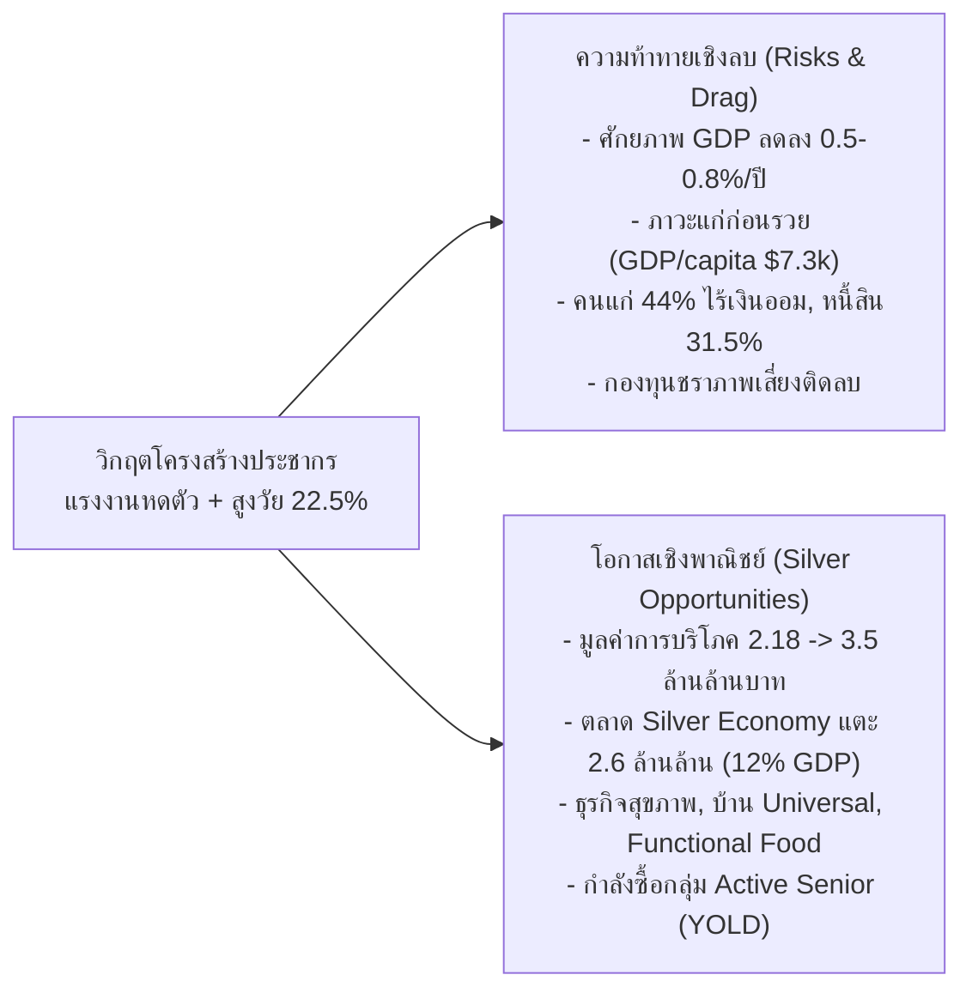
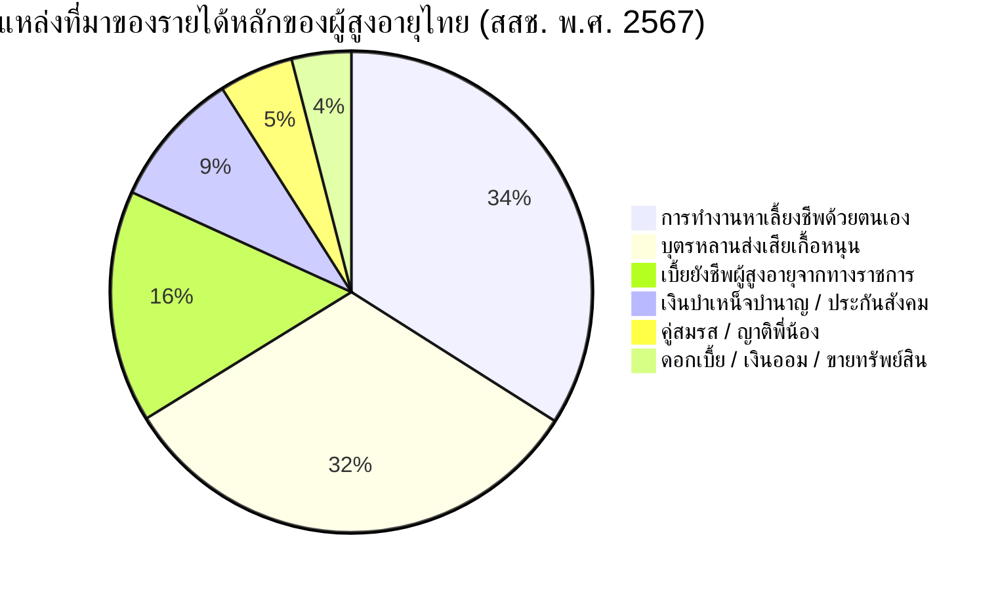
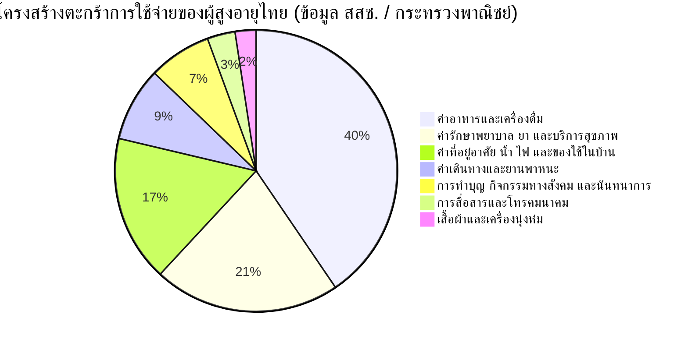
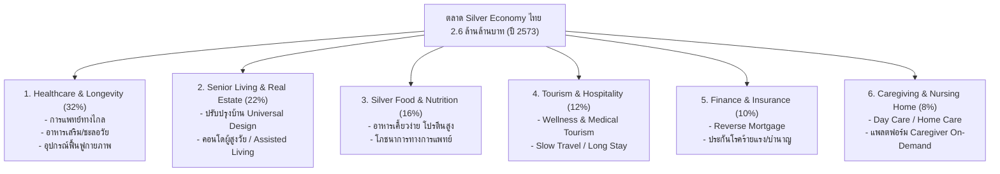

# รายงานสถานการณ์ด้านเศรษฐกิจของผู้สูงอายุ และ Silver Economy ในประเทศไทย (พ.ศ. 2566 – ปัจจุบัน)
## Comprehensive Report on Macroeconomics, Financial Security, Consumption, Silver Economy Markets, and Pension Sustainability in Thailand

---

**จัดทำขึ้นโดย:** ศูนย์วิเคราะห์ข้อมูลเศรษฐกิจและกลยุทธ์สังคมสูงวัย  
**กรอบเวลาข้อมูล:** พ.ศ. 2566 – ปัจจุบัน (ปี 2567–2568/2569)  
**แหล่งข้อมูลและเอกสารอ้างอิงทางวิชาการที่น่าเชื่อถือในประเทศไทย:**
1. **สำนักงานสภาพัฒนาการเศรษฐกิจและสังคมแห่งชาติ (สศช. หรือ สภาพัฒน์ - NESDC):**
   - *รายงานการคาดประมาณประชากรของประเทศไทย พ.ศ. 2553–2583*
   - *รายงานภาวะเศรษฐกิจและสังคมไทย และการประเมินมูลค่าการบริโภคของผู้สูงอายุไทย*
2. **ธนาคารแห่งประเทศไทย (ธปท. - Bank of Thailand):**
   - *Directional Paper: การแก้ปัญหาหนี้ครัวเรือนอย่างยั่งยืน และรายงานวิเคราะห์โครงสร้างประชากรกับผลกระทบต่อเศรษฐกิจมหภาคไทย*
   - *รายงานเศรษฐกิจและการเงินรายปี (2566–2567)*
3. **สำนักงานสถิติแห่งชาติ (สสช. - NSO):**
   - *รายงานการสำรวจประชากรสูงอายุในประเทศไทย พ.ศ. 2567 (ครั้งที่ 8)*
   - *รายงานการสำรวจภาวะเศรษฐกิจและสังคมของครัวเรือน พ.ศ. 2566–2567*
4. **สำนักงานนโยบายและยุทธศาสตร์การค้า (สนค.) กระทรวงพาณิชย์:**
   - *รายงานการศึกษาแนวโน้มและโอกาสทางธุรกิจในตลาดเศรษฐกิจสูงวัย (Silver Economy Thailand)*
5. **ศูนย์วิจัยเศรษฐกิจและธุรกิจ ธนาคารไทยพาณิชย์ (SCB EIC):**
   - *บทวิเคราะห์เจาะลึกเศรษฐกิจสูงวัย (Silver Gen) และโอกาสธุรกิจสินค้า/บริการเพื่อผู้สูงอายุ*
6. **ศูนย์วิจัยกสิกรไทย (KResearch) & Krungthai COMPASS ธนาคารกรุงไทย:**
   - *บทวิเคราะห์มูลค่าตลาด Silver Economy และการปรับตัวของภาคธุรกิจไทยสู่ปี 2573*
7. **สถาบันวิจัยเพื่อการพัฒนาประเทศไทย (TDRI):**
   - *รายงานข้อเสนอเชิงนโยบายการปฏิรูประบบบำนาญ ความยั่งยืนของกองทุนประกันสังคม และเบี้ยยังชีพผู้สูงอายุ*
8. **มูลนิธิสถาบันวิจัยและพัฒนาผู้สูงอายุไทย (มส.ผส. - TGRI):**
   - *รายงานสถานการณ์ผู้สูงอายุไทย พ.ศ. 2566 และ 2567 (มิติด้านเศรษฐกิจและความมั่นคงทางรายได้)*

**ไฟล์ชุดข้อมูลตารางประกอบ:** [`docs/silver-economy-detailed-data.csv`](file:///C:/Users/Piyanut/Desktop/Code_Work/docs/silver-economy-detailed-data.csv)

---

## สารบัญเนื้อหา (Table of Contents)

1. [บทสรุปผู้บริหาร (Executive Summary)](#1-บทสรุปผู้บริหาร-executive-summary)
2. [มิติที่ 1: ผลกระทบต่อเศรษฐกิจมหภาคและการเจริญเติบโตของประเทศ (Macroeconomic Impact)](#2-มิติที่-1-ผลกระทบต่อเศรษฐกิจมหภาคและการเจริญเติบโตของประเทศ)
   - 2.1 ศักยภาพการเติบโตทางเศรษฐกิจ (Potential GDP Drag)
   - 2.2 วิกฤตโครงสร้าง "แก่ก่อนรวย" (Getting Old Before Getting Rich)
   - 2.3 การหดตัวของกำลังแรงงานและผลิตภาพการผลิต (Labor Shrinkage & Productivity)
   - 2.4 ผลกระทบต่อการออมและการลงทุนมวลรวม (National Savings & Capital Accumulation)
3. [มิติที่ 2: สถานะการเงิน รายได้ ความยากจน และหนี้สินของผู้สูงอายุ (Income, Wealth, Poverty & Debt)](#3-มิติที่-2-สถานะการเงิน-รายได้-ความยากจน-และหนี้สินของผู้สูงอายุ)
   - 3.1 สถิติแหล่งที่มาของรายได้ผู้สูงอายุไทย (ข้อมูล สสช. 2567)
   - 3.2 สัดส่วนความยากจน (Poverty Rate) และการกระจายรายได้
   - 3.3 วิกฤตเงินออมและสินทรัพย์หลังเกษียณ (Retirement Savings Gap)
   - 3.4 ภาระหนี้สินผู้สูงอายุและวิกฤตหนี้ครัวเรือนไทย
4. [มิติที่ 3: กำลังซื้อ พฤติกรรมการใช้จ่าย และมูลค่าการบริโภค (Consumption & Purchasing Power)](#4-มิติที่-3-กำลังซื้อ-พฤติกรรมการใช้จ่าย-และมูลค่าการบริโภค)
   - 4.1 การเติบโตของการใช้จ่ายเพื่อการบริโภคของผู้สูงวัย (2.18 สู่ 3.50 ล้านล้านบาท)
   - 4.2 ตะกร้าการใช้จ่ายของผู้สูงอายุ (Elderly Consumption Basket)
   - 4.3 การแบ่งส่วนตลาดตามกำลังซื้อและพฤติกรรม (Market Segmentation: Premium, Middle, Vulnerable)
5. [มิติที่ 4: ขนาดตลาดและโอกาสในอุตสาหกรรม Silver Economy (Market Sizing & 7 Pillars)](#5-มิติที่-4-ขนาดตลาดและโอกาสในอุตสาหกรรม-silver-economy)
   - 5.1 การประเมินมูลค่าตลาด Silver Economy สู่ปี 2573 (2.6 ล้านล้านบาท)
   - 5.2 เจาะลึก 7 อุตสาหกรรมเป้าหมาย (The 7 Pillars of Silver Economy)
6. [มิติที่ 5: ภาระงบประมาณการคลัง และความยั่งยืนของระบบบำนาญ (Fiscal Burden & Pension Sustainability)](#6-มิติที่-5-ภาระงบประมาณการคลัง-และความยั่งยืนของระบบบำนาญ)
   - 6.1 ภาระงบประมาณเบี้ยยังชีพผู้สูงอายุและข้อเสนอปรับเพิ่ม
   - 6.2 ภาระงบประมาณด้านสาธารณสุข (% of GDP)
   - 6.3 วิกฤตความยั่งยืนของกองทุนประกันสังคม (SSO Pension Fund Depletion Risk)
   - 6.4 กองทุนการออมแห่งชาติ (กอช.) และข้อเสนอปฏิรูประบบบำนาญหลายเสาหลัก (Multi-Pillar Reform)
7. [มิติที่ 6: การจ้างงานและผลิตภาพแรงงานผู้สูงอายุ (Elderly Employment & Productivity)](#7-มิติที่-6-การจ้างงานและผลิตภาพแรงงานผู้สูงอายุ)
   - 7.1 อัตราการทำงานและการกระจุกตัวในแรงงานนอกระบบ (Informal Sector)
   - 7.2 มาตรการจูงใจทางภาษีแก่สถานประกอบการ (Tax Incentives)
   - 7.3 การยกระดับทักษะ (Reskilling) และการส่งเสริมผู้ประกอบการสูงวัย (Elderpreneur)
8. [ข้อเสนอแนะเชิงยุทธศาสตร์และนโยบาย (Strategic Recommendations)](#8-ข้อเสนอแนะเชิงยุทธศาสตร์และนโยบาย)
9. [รายการเอกสารอ้างอิงทางวิชาการและสถาบันเศรษฐกิจ (Authoritative References)](#9-รายการเอกสารอ้างอิงทางวิชาการและสถาบันเศรษฐกิจ)

---

## 1. บทสรุปผู้บริหาร (Executive Summary)

ประเทศไทยได้ก้าวเข้าสู่ **"สังคมสูงวัยอย่างสมบูรณ์" (Aged Society)** ตั้งแต่ปี 2566–2567 ด้วยจำนวนประชากรอายุ 60 ปีขึ้นไปมากกว่า **14.0 – 14.8 ล้านคน** (คิดเป็น **21.3% – 22.5%** ของประชากรทั้งหมด) และกำลังมุ่งหน้าสู่ **"สังคมสูงวัยระดับสุดยอด" (Super-Aged Society)** ในปี 2573–2576 ซึ่งจะมีผู้สูงอายุเกิน 28%

ในเชิงเศรษฐศาสตร์ การเปลี่ยนแปลงนี้ก่อให้เกิด **"ผลกระทบสองคม (Dual Economic Realities)"**:



### สรุปตัวเลขสถิติสำคัญด้านเศรษฐกิจ (Key Economic Indicators 2566–ปัจจุบัน):
* **มูลค่าตลาดสินค้าและบริการเพื่อผู้สูงอายุ (Silver Economy):** ปัจจุบันอยู่ที่ประมาณ **1.95 ล้านล้านบาท** และศูนย์วิจัยเศรษฐกิจ (Krungthai COMPASS / SCB EIC) คาดการณ์ว่าจะแตะ **2.6 ล้านล้านบาทในปี 2573** (เติบโตเฉลี่ย CAGR ~4.4% ต่อปี คิดเป็นราว 12% ของ GDP)
* **มูลค่าการใช้จ่ายเพื่อการบริโภคของผู้สูงอายุ (สภาพัฒน์):** ขยายตัวจาก **2.18 ล้านล้านบาท (ปี 2566)** สู่ **3.50 ล้านล้านบาท (ปี 2576)** เติบโตกว่า 60%
* **วิกฤตความมั่นคงทางการเงินส่วนบุคคล (ธปท. / สสช.):**
  * ผู้สูงอายุไทย **ร้อยละ 44.0 ไม่มีเงินออม** และผู้สูงอายุที่มีเงินออมกว่า 40% มีเงินไม่ถึง 50,000 บาท
  * ผู้สูงอายุ **ร้อยละ 22.4 (กว่า 3.14 ล้านคน) มีรายได้ต่ำกว่าเส้นความยากจน** (Poverty line ~2,997 บาท/เดือน)
  * ผู้สูงอายุ **ร้อยละ 31.5 มีหนี้สินค้างชำระ** มูลหนี้เฉลี่ย 125,000 – 180,000 บาท
* **การพึ่งพาการทำงาน:** ผู้สูงอายุถึง **ร้อยละ 37.2 (5.22 ล้านคน) ยังคงต้องทำงาน** โดยในจำนวนนี้กว่า **ร้อยละ 82.5 เป็นแรงงานนอกระบบ**
* **ความเสี่ยงทางการคลัง:** ภาระงบประมาณด้านสุขภาพและเบี้ยยังชีพกำลังขยับแตะ **>5.5% ของ GDP** ขณะที่กองทุนประกันสังคมกรณีชราภาพอาจเข้าสู่ภาวะกระแสเงินสดติดลบในอีก 20–25 ปีข้างหน้าหากไม่มีการปฏิรูปเชิงโครงสร้าง

---

## 2. มิติที่ 1: ผลกระทบต่อเศรษฐกิจมหภาคและการเจริญเติบโตของประเทศ

### 2.1 ศักยภาพการเติบโตทางเศรษฐกิจ (Potential GDP Drag)
ธนาคารแห่งประเทศไทย (ธปท.) และสภาพัฒน์ (NESDC) ได้ทำการประเมินผลกระทบระยะยาวของการเปลี่ยนแปลงโครงสร้างประชากรต่ออัตราการเติบโตของ GDP ศักยภาพ (Potential Output):
* **แรงฉุดทางเศรษฐกิจ (Growth Drag):** กำลังแรงงาน (Labor Supply) ของไทยที่หดตัวลงเฉลี่ยปีละ 300,000 – 400,000 คน กำลังฉุดอัตราการเติบโตของ GDP ลดลงประมาณ **0.5% – 0.8% ต่อปี** ในช่วงปี 2566–2575
* **การเติบโตระยะยาวชะลอตัว:** ทำให้อัตราการเติบโตของ GDP ไทยในระยะปานกลางมีแนวโน้มลดลงจากระดับศักยภาพเดิม 3.5% – 4.0% เหลือเพียง **2.5% – 3.0% ต่อปี**

```
การประเมินการมีส่วนร่วมต่อ GDP ศักยภาพของไทย (Potential GDP Breakdown):
  ช่วงปี 2000–2010:  [แรงงาน +0.8%]  [ทุน +1.8%]  [ผลิตภาพ TFP +1.5%]  = เติบโต ~4.1%
  ช่วงปี 2011–2020:  [แรงงาน +0.1%]  [ทุน +1.5%]  [ผลิตภาพ TFP +1.4%]  = เติบโต ~3.0%
  ช่วงปี 2021–2030:  [แรงงาน -0.6%]  [ทุน +1.4%]  [ผลิตภาพ TFP +1.8%]  = เติบโต ~2.6% (คาดการณ์)
```

### 2.2 วิกฤตโครงสร้าง "แก่ก่อนรวย" (Getting Old Before Getting Rich)
การเข้าสู่สังคมสูงวัยของประเทศไทยแตกต่างจากประเทศพัฒนาแล้วอย่างสิ้นเชิง ซึ่งถือเป็นกับดักโครงสร้างที่รุนแรงที่สุด:

| ประเทศ | ปีที่ก้าวเข้าสู่ Super-Aged Society (> 28% อายุ 60+) | รายได้เฉลี่ยต่อหัว ณ ปีนั้น (GDP per capita in USD) | โครงสร้างระบบบำนาญ | สัดส่วนแรงงานนอกระบบ |
| :--- | :---: | :---: | :---: | :---: |
| **ญี่ปุ่น** | พ.ศ. 2549 (2006) | **~$38,000** | ครอบคลุมประชากร 98% (National Pension) | < 10% |
| **เยอรมนี** | พ.ศ. 2552 (2009) | **~$42,500** | ระบบประกันสังคมบำนาญภาคบังคับ 3 เสาหลัก | < 8% |
| **เกาหลีใต้** | พ.ศ. 2568 (2025) | **~$33,500** | National Pension Service ครอบคลุมสูง | < 15% |
| **สิงคโปร์** | พ.ศ. 2569 (2026) | **~$88,000** | กองทุนสำรองเลี้ยงชีพกลาง (CPF) มีสินทรัพย์มหาศาล | < 8% |
| **ประเทศไทย** | **พ.ศ. 2573–2576 (2030–2033)** | **~$7,200 – $7,500 (ปัจจุบัน)** | **ครอบคลุมเพียง 30–35% ของแรงงานทั้งหมด** | **สูงถึง > 51.5%** |

> **บทวิเคราะห์ ธปท. / TDRI:** ประเทศไทยกำลังเผชิญปรากฏการณ์ "แก่ก่อนรวย" (Get Old Before Rich) ในขณะที่ประเทศพัฒนาแล้วเข้าสู่สังคมสูงวัยในสภาวะ "รวยก่อนแก่" (Get Rich Before Old) การที่ไทยมีรายได้ต่อหัวเพียง 1 ใน 4 ถึง 1 ใน 5 ของประเทศพัฒนาแล้ว ทำให้ความสามารถในการเก็บภาษีของรัฐและความสามารถในการออมของประชาชนอยู่ในระดับต่ำอย่างยิ่ง

### 2.3 การหดตัวของกำลังแรงงานและผลิตภาพการผลิต (Labor Shrinkage & Productivity)
* **สัดส่วนวัยแรงงานลดลง:** ประชากรวัยแรงงาน (15–59 ปี) ลดลงจาก 43.2 ล้านคน (ปี 2553) เหลือประมาณ **40.5 ล้านคน (ปี 2567)** และจะลดลงเหลือ **35.1 ล้านคน ภายในปี 2583**
* **ภาวะขาดแคลนแรงงาน:** ภาคการผลิตที่ใช้แรงงานเข้มข้น (Labor-intensive) เช่น เกษตรกรรม ก่อสร้าง ค้าปลีก และภาคบริการ ต้องพึ่งพาแรงงานข้ามชาติจากประเทศเพื่อนบ้าน (กว่า 3.5 ล้านคน) และต้องเร่งเปลี่ยนผ่านสู่ระบบอัตโนมัติ (Automation/Robotics)

### 2.4 ผลกระทบต่อการออมและการลงทุนมวลรวม (National Savings & Investment)
* ตามทฤษฎี **Life-Cycle Hypothesis**: ประชากรวัยสูงอายุเป็นกลุ่มที่ "ใช้จ่ายเงินออม" (Dissaving) มากกว่าการสะสมเงินออมใหม่
* การที่สัดส่วนผู้สูงอายุเพิ่มขึ้นอย่างรวดเร็ว ทำให้อัตราการออมมวลรวมในประเทศ (Gross Domestic Savings Rate) มีแนวโน้มลดลง ส่งผลให้การสะสมทุนภายในประเทศตึงตัว และจำกัดความสามารถในการลงทุนขนาดใหญ่ของภาคเอกชน

---

## 3. มิติที่ 2: สถานะการเงิน รายได้ ความยากจน และหนี้สินของผู้สูงอายุ

### 3.1 สถิติแหล่งที่มาของรายได้ผู้สูงอายุไทย (ข้อมูล สสช. 2567)
ผลการสำรวจประชากรสูงอายุในประเทศไทย พ.ศ. 2567 โดยสำนักงานสถิติแห่งชาติ สะท้อนการเปลี่ยนแปลงเชิงลึกของแหล่งรายได้:



| แหล่งรายได้หลัก | สัดส่วนปี 2550 (%) | สัดส่วนปี 2557 (%) | สัดส่วนปี 2564 (%) | สัดส่วนปี 2567 (%) | แนวโน้มและข้อสังเกต |
| :--- | :---: | :---: | :---: | :---: | :--- |
| **การทำงานหาได้เอง** | 28.9% | 34.3% | 32.4% | **34.0%** | $\uparrow$ ขยับขึ้นเป็นอันดับ 1 เนื่องจากขาดเงินออม |
| **บุตรหลานส่งเสีย** | **52.3%** | **36.7%** | **34.2%** | **32.2%** | $\downarrow$ **ลดลงอย่างต่อเนื่อง** คนรุ่นลูกมีภาระค่าครองชีพสูง |
| **เบี้ยยังชีพจากรัฐ** | 2.8% | 14.8% | 16.5% | **15.6%** | $\leftrightarrow$ ทรงตัว เป็นตาข่ายรองรับความยากจน |
| **บำเหน็จบำนาญ** | 4.4% | 4.9% | 8.2% | **9.2%** | $\uparrow$ เพิ่มขึ้นเล็กน้อยจากข้าราชการเกษียณ |
| **ดอกเบี้ย/เงินออม** | 4.6% | 3.9% | 3.4% | **4.0%** | $\leftrightarrow$ กระจุกตัวเฉพาะผู้มีรายได้สูง |

### 3.2 สัดส่วนความยากจน (Poverty Rate) และการกระจายรายได้
* **เส้นความยากจน (Poverty Line) ล่าสุด:** สภาพัฒน์กำหนดไว้ที่ **2,997 บาท/คน/เดือน** (หรือประมาณ 35,964 บาท/ปี)
* **ผู้สูงอายุยากจน:** ผู้สูงอายุไทย **ร้อยละ 22.4 (หรือประมาณ 3,140,000 คน) มีรายได้ต่ำกว่าเส้นความยากจน**
* **การกระจายระดับรายได้ต่อปีของผู้สูงอายุ (สสช. 2567):**
  * รายได้น้อยกว่า 30,000 บาท/ปี: **ร้อยละ 31.8** (~4.45 ล้านคน: ตกอยู่ในภาวะยากจนอย่างรุนแรง เฉลี่ย < 83 บาท/วัน)
  * รายได้ 30,001 – 50,000 บาท/ปี: **ร้อยละ 21.4** (~3.00 ล้านคน: อยู่ในระดับก้ำกึ่งเส้นความยากจน)
  * รายได้ 50,001 – 100,000 บาท/ปี: **ร้อยละ 17.0** (~2.38 ล้านคน)
  * รายได้มากกว่า 100,000 บาท/ปี: **ร้อยละ 29.8** (~4.17 ล้านคน: กลุ่มที่มีความมั่นคงทางการเงิน)

### 3.3 วิกฤตเงินออมและสินทรัพย์หลังเกษียณ (Retirement Savings Gap)
* ข้อมูลจากธนาคารแห่งประเทศไทย และสถาบันวิจัยเศรษฐกิจป๋วย อึ๊งภากรณ์ (PIER):
  * คนไทยวัยสูงอายุ **ร้อยละ 44.0 ไม่มีเงินออมในสถาบันการเงิน**
  * ในกลุ่มผู้สูงอายุที่มีเงินออม: กว่า **ร้อยละ 40 มีเงินในบัญชีไม่เกิน 50,000 บาท**
  * มีผู้สูงอายุ **ไม่ถึงร้อยละ 10 ที่มีเงินออมในระดับที่ปลอดภัยสำหรับการเกษียณ (อย่างน้อย 3–4 ล้านบาทขึ้นไป)**
* ปัญหาความพร้อมด้านการเกษียณในกลุ่มแรงงานก่อนสูงวัย (อายุ 45–59 ปี): ผลสำรวจพบว่ากว่าร้อยละ 60 ยังไม่มีการวางแผนทางการเงินหลังเกษียณอย่างเป็นรูปธรรม

### 3.4 ภาระหนี้สินผู้สูงอายุและวิกฤตหนี้ครัวเรือนไทย
* **สัดส่วนผู้สูงอายุที่มีหนี้สิน:** ผู้สูงอายุไทย **ร้อยละ 31.5 มีหนี้สินค้างชำระ**
* **มูลหนี้เฉลี่ยต่อคน:** อยู่ที่ **125,000 – 180,000 บาท**
* **โครงสร้างประเภทหนี้สินของผู้สูงอายุ (ธปท. 2566–2567):**
  1. หนี้เพื่อการอุปโภคบริโภคและบัตรเครดิต/สินเชื่อส่วนบุคคล: **42.0%**
  2. หนี้เพื่อการลงทุนทำเกษตรกรรม/ค้าขาย: **31.5%**
  3. หนี้กู้ยืมเพื่อบุตรหลาน (กู้ กยศ., ซื้อยานพาหนะให้ลูก): **18.2%**
  4. หนี้ค่ารักษาพยาบาลฉุกเฉิน: **8.3%**
* **วิกฤตหนี้ครัวเรือนภาพรวม:** หนี้ครัวเรือนไทยยังอยู่ในระดับสูงแตะ **88% – 90% ของ GDP** โดยลูกหนี้กลุ่มอายุเกิน 60 ปีจำนวนมากตกเป็น "หนี้เรื้อรัง" (Persistent Debt) ที่ไม่สามารถปิดบัญชีได้ตลอดช่วงชีวิตที่เหลือ

---

## 4. มิติที่ 3: กำลังซื้อ พฤติกรรมการใช้จ่าย และมูลค่าการบริโภค (Consumption)

### 4.1 การเติบโตของการใช้จ่ายเพื่อการบริโภคของผู้สูงวัย (สภาพัฒน์)
สำนักงานสภาพัฒนาการเศรษฐกิจและสังคมแห่งชาติ (สศช.) ได้ประเมินมูลค่าการใช้จ่ายเพื่อการบริโภคของประชากรสูงอายุไทย ดังนี้:
* **ปี 2566:** มูลค่าการบริโภคของผู้สูงอายุอยู่ที่ประมาณ **2.18 ล้านล้านบาท**
* **ปี 2567 (ปัจจุบัน):** มูลค่าการบริโภคขยายตัวแตะ **2.45 ล้านล้านบาท**
* **ปี 2576 (คาดการณ์):** มูลค่าการบริโภคจะพุ่งสูงถึง **3.50 ล้านล้านบาท** (เพิ่มขึ้นกว่า 60.5% เมื่อเทียบกับปี 2566)

```
แนวโน้มมูลค่าการบริโภคของผู้สูงอายุไทย (ล้านล้านบาท):
  ปี 2566:  ██████████████████████ 2.18 ล้านล้านบาท
  ปี 2567:  ████████████████████████ 2.45 ล้านล้านบาท
  ปี 2570:  ████████████████████████████ 2.85 ล้านล้านบาท (คาดการณ์)
  ปี 2576:  ███████████████████████████████████ 3.50 ล้านล้านบาท (คาดการณ์)
```

### 4.2 ตะกร้าการใช้จ่ายของผู้สูงอายุ (Elderly Consumption Basket)
โครงสร้างการใช้จ่ายของผู้สูงอายุไทยมีความแตกต่างจากประชากรวัยอื่นอย่างเห็นได้ชัด:



* **ค่าอาหารและเครื่องดื่ม (40.5%):** ยังคงเป็นสัดส่วนหลัก โดยผู้สูงอายุที่มีรายได้น้อยจะใช้จ่ายด้านอาหารสูงถึง 50–55% ของรายได้ทั้งหมด
* **ค่ารักษาพยาบาล ยา และบริการสุขภาพ (21.4%):** สัดส่วนพุ่งสูงขึ้นอย่างก้าวกระโดดตามอายุ (ในกลุ่มอายุ 80 ปีขึ้นไป สัดส่วนค่าใช้จ่ายด้านสุขภาพอาจสูงถึง 30–35%)
* **การทำบุญและกิจกรรมทางสังคม (7.2%):** เป็นเอกลักษณ์ของสังคมไทย ผู้สูงอายุให้ความสำคัญกับการบริจาค ทำบุญ และช่วยเหลืองานในชุมชนเพื่อสร้างความสุขทางใจ

### 4.3 การแบ่งส่วนตลาดตามกำลังซื้อและพฤติกรรม (Market Segmentation)
ศูนย์วิจัยเศรษฐกิจ (SCB EIC และ Krungthai COMPASS) จำแนกกลุ่มผู้บริโภคสูงวัยเป็น 3 กลุ่ม:

1. **กลุ่ม Silver Premium / Active Senior (ร้อยละ 15–20 ของผู้สูงวัย):**
   * *คุณลักษณะ:* มีเงินออม ทรัพย์สิน มีเงินบำนาญ หรือธุรกิจส่วนตัว แข็งแรง ช่วยเหลือตนเองได้
   * *พฤติกรรม:* ยินดีจ่ายเงินเพื่อการดูแลสุขภาพเชิงป้องกัน (Preventive Healthcare), การท่องเที่ยวเชิงสุขภาพ (Wellness Tourism), การปรับปรุงบ้านพักอาศัย, และอาหารเพื่อสุขภาพระดับพรีเมียม
2. **กลุ่ม Middle Silver (ร้อยละ 45–50 ของผู้สูงวัย):**
   * *คุณลักษณะ:* ข้าราชการบำนาญระดับกลาง พนักงานเอกชนเกษียณที่มีเงินกองทุนสำรองเลี้ยงชีพ
   * *พฤติกรรม:* ใช้จ่ายอย่างระมัดระวัง เน้นความคุ้มค่าและความปลอดภัย พึ่งพาระบบสิทธิประโยชน์ของรัฐเป็นหลัก
3. **กลุ่ม Vulnerable Silver (ร้อยละ 30–35 ของผู้สูงวัย):**
   * *คุณลักษณะ:* รายได้น้อย ไม่มีเงินออม พึ่งพาเบี้ยยังชีพและการทำงานรายวัน
   * *พฤติกรรม:* ใช้จ่ายเฉพาะปัจจัยสี่ มีความเปราะบางต่อวิกฤตค่าครองชีพและราคาสินค้าเกษตร

---

## 5. มิติที่ 4: ขนาดตลาดและโอกาสในอุตสาหกรรม Silver Economy (Market Sizing)

### 5.1 การประเมินมูลค่าตลาด Silver Economy สู่ปี 2573
* **มูลค่าตลาดปี 2566:** ประมาณ **1.80 ล้านล้านบาท**
* **มูลค่าตลาดปี 2567 (ปัจจุบัน):** ประมาณ **1.95 ล้านล้านบาท**
* **คาดการณ์ปี 2573 (Krungthai COMPASS & สนค.):** จะแตะระดับ **2.60 ล้านล้านบาท** เติบโตเฉลี่ยปีละ **4.4% (CAGR)** และคิดเป็นสัดส่วนประมาณ **ร้อยละ 12 ของ GDP ประเทศไทย**



### 5.2 เจาะลึก 7 อุตสาหกรรมเป้าหมาย (The 7 Pillars of Silver Economy)

#### 1. การแพทย์ สุขภาพ และเวชศาสตร์ชะลอวัย (Healthcare, Wellness & Longevity)
* **สัดส่วนมูลค่า:** ~32% ของตลาด Silver Economy
* **โอกาสธุรกิจ:** คลินิกเวชศาสตร์ชะลอวัย (Anti-Aging), ศูนย์ดูแลข้อเข่าและการเคลื่อนไหว, อุปกรณ์ตรวจวัดสุขภาพอัจฉริยะ (Tele-health), บริการเจาะเลือดและตรวจสุขภาพถึงบ้าน (Home Lab)

#### 2. อสังหาริมทรัพย์และบ้านเพื่อผู้สูงอายุ (Senior Living & Universal Design)
* **สัดส่วนมูลค่า:** ~22% ของตลาด Silver Economy
* **โอกาสธุรกิจ:**
  * **ตลาดปรับปรุงบ้าน (Home Modification):** ตลาดขนาดใหญ่ที่มีความต้องการสูง ได้แก่ การติดตั้งราวจับในห้องน้ำ, พื้นซับแรงกระแทก (Absorption Floor), ทางลาดสำหรับวีลแชร์, และสวิตช์ไฟ/ปลั๊กไฟระดับเหมาะสม
  * **ที่อยู่อาศัยเฉพาะทาง:** โครงการ Senior Living และ Assisted Living ที่มีบุคลากรทางการแพทย์คอยดูแล 24 ชั่วโมง

#### 3. อาหารและโภชนาการสำหรับผู้สูงวัย (Silver Food & Functional Nutrition)
* **สัดส่วนมูลค่า:** ~16% ของตลาด Silver Economy
* **โอกาสธุรกิจ:** อาหารเนื้อสัมผัสนุ่มบดเคี้ยวง่าย (Soft & Pureed Foods), อาหารเสริมโปรตีนสกัดจากพืชเพื่อชะลอภาวะมวลกล้ามเนื้อลีบ (Sarcopenia), นมเสริมแคลเซียมและสารอาหารบำรุงสมอง, อาหารทางการแพทย์สูตรคุมเบาหวานและโรคไต

#### 4. การท่องเที่ยวและการพักผ่อน (Silver Tourism & Hospitality)
* **สัดส่วนมูลค่า:** ~12% ของตลาด Silver Economy
* **โอกาสธุรกิจ:** การท่องเที่ยวเชิงสุขภาพ (Medical & Wellness Retreat), ทัวร์ผู้สูงอายุแบบ Slow Travel พร้อมบุคลากรปฐมพยาบาล, การดึงดูดชาวต่างชาติเกษียณอายุเข้ามาพำนักระยะยาว (Long-Stay Retirement Visa / LTR Visa)

#### 5. การเงิน การลงทุน และการประกันภัย (Silver Finance & Insurance)
* **สัดส่วนมูลค่า:** ~10% ของตลาด Silver Economy
* **โอกาสธุรกิจ:**
  * **Reverse Mortgage (สินเชื่อที่อยู่อาศัยสำหรับผู้สูงอายุ):** การแปลงบ้านปลอดภาระให้เป็นกระแสเงินสดรายเดือนเพื่อยังชีพ
  * ประกันสุขภาพและโรคร้ายแรงสำหรับผู้สูงอายุ (Guaranteed Issue)
  * กองทุนรวมเพื่อการเกษียณที่เน้นจ่ายผลตอบแทนสม่ำเสมอ (Monthly Dividend Funds)

#### 6. ธุรกิจบริการดูแลผู้สูงอายุ (Elderly Care, Day Care & Nursing Homes)
* **สัดส่วนมูลค่า:** ~8% ของตลาด Silver Economy
* **โอกาสธุรกิจ:** สนค. กระทรวงพาณิชย์ ชี้ว่าธุรกิจดูแลผู้สูงอายุแบ่งเป็น 3 โมเดลหลักที่เติบโตสูง:
  * **Home Care:** บริการส่งผู้ดูแลไปที่บ้านแบบรายวัน/รายเดือน
  * **Day Care:** ศูนย์ดูแลแบบเช้าไปเย็นกลับสำหรับครอบครัวที่ต้องออกไปทำงาน
  * **Long Stay / Nursing Home:** สถานบริบาลระยะยาวสำหรับผู้ป่วยที่มีภาวะพึ่งพิง

#### 7. เทคโนโลยีและนวัตกรรมเพื่อผู้สูงอายุ (AgeTech & Assistive Devices)
* **โอกาสธุรกิจ:** เซนเซอร์เรดาร์ตรวจจับการหกล้มโดยไม่ใช้กล้องเพื่อความเป็นส่วนตัว, เตียงนอนอัจฉริยะปรับระดับอัตโนมัติ, หุ่นยนต์ช่วยดูแล (Companion AI Bots)

---

## 6. มิติที่ 5: ภาระงบประมาณการคลัง และความยั่งยืนของระบบบำนาญ

### 6.1 ภาระงบประมาณเบี้ยยังชีพผู้สูงอายุและข้อเสนอปรับเพิ่ม
* **งบประมาณปัจจุบัน (ปีงบประมาณ 2566–2567):** รัฐบาลจัดสรรงบประมาณเบี้ยยังชีพผู้สูงอายุประมาณ **82,000 – 85,000 ล้านบาทต่อปี**
* **แบบจำลองข้อเสนอปรับเพิ่มเบี้ยยังชีพ (Fiscal Impact Simulation โดย TDRI / สภาพัฒน์):**

| รูปแบบข้อเสนอ | อัตราเบี้ยยังชีพ (บาท/คน/เดือน) | งบประมาณที่ต้องใช้ต่อปี (ประมาณการ) | ผลกระทบทางการคลัง |
| :--- | :---: | :---: | :--- |
| **ระบบปัจจุบัน (ขั้นบันได)** | 600 – 1,000 บาท | **~85,000 ล้านบาท** | คิดเป็น ~2.5% ของงบประมาณรายจ่ายประจำปี |
| **ข้อเสนอปรับเป็น 1,000 บาทถ้วนหน้า** | 1,000 บาท | **~175,000 ล้านบาท** | เพิ่มขึ้นเกือบ 1 แสนล้านบาท/ปี |
| **ข้อเสนอปรับเป็น 2,000 บาท** | 2,000 บาท | **~350,000 ล้านบาท** | คิดเป็น ~10% ของงบประมาณรายจ่ายประจำปี |
| **ข้อเสนอบำนาญแห่งชาติ 3,000 บาท (เท่าเส้นความยากจน)** | 3,000 บาท | **~520,000 ล้านบาท** | คิดเป็น **~15% ของงบประมาณรายจ่ายแผ่นดิน** (ต้องปฏิรูปภาษีขนานใหญ่) |

### 6.2 ภาระงบประมาณด้านสาธารณสุข (% of GDP)
* ค่าใช้จ่ายด้านสุขภาพรวมของประเทศ (National Health Expenditure: NHE) ปัจจุบันอยู่ที่ประมาณ **ร้อยละ 3.9 ของ GDP**
* สภาพัฒน์และกระทรวงสาธารณสุขคาดการณ์ว่า ด้วยจำนวนผู้สูงอายุที่เพิ่มขึ้นและภาระโรคเรื้อรัง (NCDs) ค่าใช้จ่ายด้านสาธารณสุขจะเพิ่มสูงขึ้นเกิน **ร้อยละ 5.5 ของ GDP ภายในปี 2575** โดยเฉพาะงบประมาณกองทุนหลักประกันสุขภาพแห่งชาติ (บัตรทอง 30 บาท) และสิทธิสวัสดิการรักษาพยาบาลข้าราชการ

### 6.3 วิกฤตความยั่งยืนของกองทุนประกันสังคม (SSO Pension Fund Depletion Risk)
รายงานการวิเคราะห์คณิตศาสตร์ประกันภัยของกองทุนประกันสังคม (สำนักงานประกันสังคม ร่วมกับองค์การแรงงานระหว่างประเทศ - ILO) และบทวิเคราะห์ของ TDRI:
* **สัดส่วนผู้จ่ายเงินสมทบต่อผู้รับบำนาญ:** ในอดีตมีแรงงานจ่ายสมทบ 15 คน ต่อผู้รับบำนาญ 1 คน ปัจจุบันลดลงเหลือ **4.5 ต่อ 1** และคาดว่าจะลดลงเหลือ **1.8 ต่อ 1 ในปี 2585**
* **จุดวิกฤตกระแสเงินสด (Cash Flow Deficit):**
  - คาดว่ากองทุนกรณีชราภาพ (มาตรา 33/39) จะเริ่มมี **รายจ่ายมากกว่ารายรับ (Cash Flow Deficit) ในช่วงปี 2580–2585**
  - หากไม่มีการปรับเปลี่ยนโครงสร้าง กองทุนชราภาพอาจ **หมดลงอย่างสมบูรณ์ (Fund Depletion) ภายในปี 2593–2598**
* **ข้อเสนอการปฏิรูปเชิงโครงสร้าง:**
  1. ทยอยขยายเกณฑ์อายุการเกิดสิทธิรับบำนาญชราภาพจาก **55 ปี เป็น 60–62 ปี**
  2. ปรับเพดานค่าจ้างที่ใช้คำนวณเงินสมทบจากเดิม 15,000 บาท เป็น 20,000 – 23,000 บาท
  3. ปรับเพิ่มอัตราผลตอบแทนจากการลงทุนของกองทุนประกันสังคม

### 6.4 กองทุนการออมแห่งชาติ (กอช.) และระบบบำนาญหลายเสาหลัก (Multi-Pillar Pension Model)
* **กองทุนการออมแห่งชาติ (กอช.):** เป็นกลไกการออมเพื่อการเกษียณสำหรับแรงงานนอกระบบ (อายุ 15–60 ปี) โดยรัฐร่วมจ่ายสมทบ ปัจจุบันมีสมาชิกสะสมประมาณ **2.6 ล้านคน** (ยังถือว่าต่ำมากเมื่อเทียบกับแรงงานนอกระบบทั้งหมดกว่า 20 ล้านคน)
* **การปฏิรูปสู่ระบบบำนาญ 3 เสาหลัก (World Bank Multi-Pillar Framework):**
  * *เสาหลักที่ 1 (Pillar 1):* เบี้ยยังชีพพื้นฐานโดยรัฐ (Non-contributory Basic Pension)
  * *เสาหลักที่ 2 (Pillar 2):* ประกันสังคมและกองทุนบำนาญภาคบังคับ (Mandatory Contributory Pension)
  * *เสาหลักที่ 3 (Pillar 3):* การออมภาคสมัครใจ (Voluntary Savings: กองทุนสำรองเลี้ยงชีพ PVD, RMF, กอช.)

---

## 7. มิติที่ 6: การจ้างงานและผลิตภาพแรงงานผู้สูงอายุ (Elderly Employment)

### 7.1 อัตราการทำงานและการกระจุกตัวในแรงงานนอกระบบ
* ข้อมูลสำนักงานสถิติแห่งชาติ พ.ศ. 2567:
  * ผู้สูงอายุไทยที่ยังคงทำงานมีจำนวน **5.22 ล้านคน คิดเป็นร้อยละ 37.2** ของผู้สูงอายุทั้งหมด
  * ร้อยละ **82.5 ของผู้สูงอายุที่ทำงานเป็น "แรงงานนอกระบบ"** ซึ่งไม่มีสวัสดิการประกันสังคม ขาดความคุ้มครองตามกฎหมายคุ้มครองแรงงาน และไม่มีค่าจ้างขั้นต่ำ
  * โครงสร้างอาชีพ: ภาคเกษตรกรรม (58.4%), ค้าขายและบริการ (28.2%), ภาคการผลิต (13.4%)

### 7.2 มาตรการจูงใจทางภาษีแก่สถานประกอบการ (Tax Incentives)
* **พระราชกฤษฎีกาออกตามความในประมวลรัษฎากร (ฉบับที่ 639):**
  * กำหนดให้นิติบุคคลสามารถนำรายจ่ายค่าจ้างผู้สูงอายุ (อายุ 60 ปีขึ้นไป) มา **หักลดหย่อนภาษีเงินได้นิติบุคคลได้ 2 เท่า (200%)**
  * เงื่อนไข: ค่าจ้างผู้สูงอายุไม่เกิน **15,000 บาท/คน/เดือน** และจำนวนลูกจ้างสูงอายุต้องไม่เกินร้อยละ 10 ของลูกจ้างทั้งหมดในสถานประกอบการ

### 7.3 การยกระดับทักษะ (Reskilling) และการส่งเสริมผู้ประกอบการสูงวัย (Elderpreneur)
* สภาพัฒน์และกระทรวงแรงงานผลักดันโครงการ **"Smart Elder Workforce"**:
  * การฝึกอบรมทักษะดิจิทัลเพื่อการค้าออนไลน์ (Digital & E-Commerce Skills)
  * การส่งเสริมเกษตรกรสูงวัยสู่การเป็นเกษตรกรปราดเปรื่อง (Smart Senior Farmer)
  * การสนับสนุนสินเชื่อดอกเบี้ยต่ำเพื่อการประกอบอาชีพผู้สูงอายุผ่าน **กองทุนผู้สูงอายุ (กระทรวง พม.)** วงเงินกู้ยืมรายบุคคลไม่เกิน 30,000 บาท และรายกลุ่มไม่เกิน 100,000 บาท แบบปลอดดอกเบี้ย

---

## 8. ข้อเสนอแนะเชิงยุทธศาสตร์และนโยบาย (Strategic Recommendations)

### 8.1 ข้อเสนอแนะสำหรับภาครัฐบาล (Policy Makers)
1. **การปฏิรูประบบบำนาญแห่งชาติแบบบูรณาการ (National Pension Integration):**
   - รวมฐานข้อมูลของระบบประกันสังคม กบข. กองทุนสำรองเลี้ยงชีพ และ กอช. เข้าด้วยกัน เพื่อให้เห็นภาพเงินออมรวมของประชาชนแต่ละบุคคล
   - ปรับเกณฑ์อายุเกษียณราชการและเอกชนจาก 60 ปี เป็น **62–65 ปี แบบทยอยปรับ (Gradual Phasing)**
2. **การปฏิรูปภาษีเพื่อรองรับสังคมสูงวัย (Tax Reforms for Super-Aged Era):**
   - ปรับโครงสร้างภาษีมูลค่าเพิ่ม (VAT) หรือจัดเก็บภาษีทรัพย์สิน (Property Tax) และภาษีมรดก (Inheritance Tax) อย่างมีประสิทธิภาพ เพื่อนำรายได้มาจัดตั้งกองทุนสวัสดิการบำนาญพื้นฐาน
3. **การจัดตั้ง "Silver Economy Sandbox":**
   - กำหนดพื้นที่นำร่องในการทดสอบเทคโนโลยีการแพทย์และที่อยู่อาศัยผู้สูงอายุ ให้สิทธิประโยชน์ทางภาษีแก่สตาร์ทอัพด้าน AgeTech

### 8.2 ข้อเสนอแนะสำหรับภาคเอกชนและธุรกิจ (Private Sector Strategy)
1. **การออกแบบและสื่อสารที่ไม่ตีตรา (Ageless & Inclusive Branding):**
   - ผู้บริโภคสูงวัยไม่ต้องการสินค้าที่แปะป้ายว่า "สำหรับคนแก่" แต่ต้องการสินค้าที่สื่อถึง "ความสะดวกสบาย", "ความปลอดภัย", และ "การใช้ชีวิตอย่างอิสระและดูดี"
2. **การสร้างระบบนิเวศความร่วมมือข้ามอุตสาหกรรม (Cross-Sector Partnerships):**
   - ธุรกิจอสังหาริมทรัพย์ควรจับมือกับโรงพยาบาลและบริษัทเทคโนโลยี เพื่อนำเสนอโครงการที่อยู่อาศัยที่มีบริการตรวจสุขภาพและระบบฉุกเฉินแบบเบ็ดเสร็จ
3. **การออกแบบผลิตภัณฑ์ทางการเงินที่ยืดหยุ่น:**
   - พัฒนาผลิตภัณฑ์ประกันสุขภาพและเงินบำนาญที่เข้าใจโครงสร้างรายได้ของผู้สูงอายุไทย พร้อมทั้งขยายตลาด Reverse Mortgage ร่วมกับสถาบันการเงินของรัฐ

---

## 9. รายการเอกสารอ้างอิงทางวิชาการและสถาบันเศรษฐกิจ (Authoritative References)

1. **สำนักงานสภาพัฒนาการเศรษฐกิจและสังคมแห่งชาติ (สศช. / สภาพัฒน์):**
   - *รายงานการคาดประมาณประชากรของประเทศไทย พ.ศ. 2553–2583 (ฉบับปรับปรุง พ.ศ. 2562)*, สศช., กรุงเทพฯ. URL: [https://www.nesdc.go.th](https://www.nesdc.go.th)
   - *รายงานภาวะสังคมไทย ไตรมาส 4/2566 และการประเมินมูลค่าการบริโภคของผู้สูงอายุไทย พ.ศ. 2566–2576*, สศช.
2. **ธนาคารแห่งประเทศไทย (ธปท.):**
   - *Directional Paper: แนวทางการแก้ปัญหาหนี้ครัวเรือนอย่างยั่งยืน*, ธปท. (2566). URL: [https://www.bot.or.th](https://www.bot.or.th)
   - สถาบันวิจัยเศรษฐกิจป๋วย อึ๊งภากรณ์ (PIER), *เจาะลึกพฤติกรรมการออมและภาระหนี้สินของคนไทยในวัยใกล้เกษียณและผู้สูงอายุ*.
3. **สำนักงานสถิติแห่งชาติ (สสช.):**
   - *รายงานผลการสำรวจประชากรสูงอายุในประเทศไทย พ.ศ. 2567 (การสำรวจครั้งที่ 8)*, กระทรวงดิจิทัลเพื่อเศรษฐกิจและสังคม. URL: [https://www.nso.go.th](https://www.nso.go.th)
   - *รายงานการสำรวจภาวะเศรษฐกิจและสังคมของครัวเรือน พ.ศ. 2566*, สำนักงานสถิติแห่งชาติ.
4. **สำนักงานนโยบายและยุทธศาสตร์การค้า (สนค.) กระทรวงพาณิชย์:**
   - *รายงานแนวโน้มและโอกาสทางธุรกิจในตลาดเศรษฐกิจสูงวัย (Silver Economy)*, สนค. (2566–2567). URL: [https://tpso.go.th](https://tpso.go.th)
5. **ศูนย์วิจัยเศรษฐกิจและธุรกิจ ธนาคารไทยพาณิชย์ (SCB EIC):**
   - *บทวิเคราะห์ SCB EIC: เจาะลึกตลาด Silver Economy ขุมทรัพย์ใหม่ทางธุรกิจในสังคมสูงวัย* (2566–2567). URL: [https://www.scbeic.com](https://www.scbeic.com)
6. **Krungthai COMPASS ธนาคารกรุงไทย:**
   - *บทวิเคราะห์ Krungthai COMPASS: จับตาตลาด Silver Gen ขุมพลังขับเคลื่อนเศรษฐกิจไทยสู่ปี 2573*. URL: [https://krungthai.com/compass](https://krungthai.com/compass)
7. **สถาบันวิจัยเพื่อการพัฒนาประเทศไทย (TDRI):**
   - วรวรรณ ชาญด้วยวิทย์ (2566), *ความมั่นคงทางรายได้ของผู้สูงอายุไทยและการปฏิรูประบบบำนาญเพื่อความยั่งยืนทางการคลัง*, ทีดีอาร์ไอ. URL: [https://tdri.or.th](https://tdri.or.th)
   - *การวิเคราะห์ความยั่งยืนของกองทุนประกันสังคมกรณีชราภาพ*, TDRI Research Report.
8. **มูลนิธิสถาบันวิจัยและพัฒนาผู้สูงอายุไทย (มส.ผส.):**
   - *รายงานสถานการณ์ผู้สูงอายุไทย พ.ศ. 2566 และ 2567 (ฉบับสมบูรณ์)*, มส.ผส., กรุงเทพฯ. URL: [https://thaitgri.org](https://thaitgri.org)
