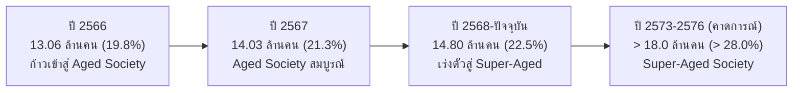
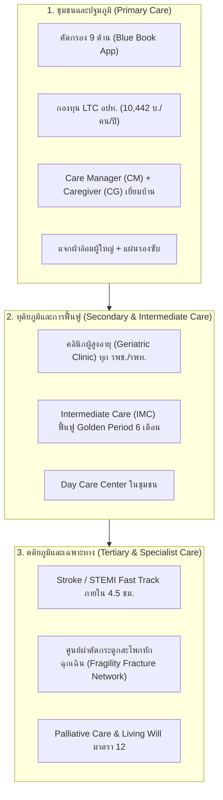

# รายงานสถานการณ์สุขภาพและภาวะพึ่งพิงของผู้สูงอายุไทยฉบับสมบูรณ์ (พ.ศ. 2566 – ปัจจุบัน)
## Comprehensive Situation Report on Health Status, Morbidity, Mortality, and Dependency Among Older Persons in Thailand

---

**จัดทำขึ้นโดย:** ศูนย์วิเคราะห์ข้อมูลยุทธศาสตร์สาธารณสุข  
**กรอบเวลาการวิเคราะห์:** พ.ศ. 2566 – ปัจจุบัน (ปี 2567–2568/2569)  
**แหล่งข้อมูลและเอกสารอ้างอิงทางการ:** กระทรวงสาธารณสุข (MOPH) และหน่วยงานในกำกับ:
1. **กองยุทธศาสตร์และแผนงาน สำนักงานปลัดกระทรวงสาธารณสุข:** รายงานสถิติสาธารณสุข (Public Health Statistics Thailand) ประจำปี พ.ศ. 2566 และ 2567  
2. **คลังข้อมูลสุขภาพ Health Data Center (HDC) กระทรวงสาธารณสุข:** ระบบสารสนเทศการบริการสุขภาพและตัวชี้วัดสุขภาพกลุ่มวัยผู้สูงอายุ  
3. **กองโรคไม่ติดต่อ กรมควบคุมโรค กระทรวงสาธารณสุข:** ระบบแดชบอร์ดเฝ้าระวังโรคไม่ติดต่อเรื้อรัง (NCD Dashboard)  
4. **สำนักอนามัยผู้สูงอายุ กรมอนามัย กระทรวงสาธารณสุข:** ระบบคัดกรองสุขภาพผู้สูงอายุ 9 ด้าน (Blue Book) และฐานข้อมูลการดูแลระยะยาว (Long-Term Care: LTC)  
5. **สถาบันเวชศาสตร์สมเด็จพระสังฆราชญาณสังวรเพื่อผู้สูงอายุ กรมการแพทย์ กระทรวงสาธารณสุข:** สถิติคลินิกผู้สูงอายุและคู่มือเวชศาสตร์ผู้สูงอายุ  
6. **สำนักงานพัฒนาระบบข้อมูลข่าวสารสุขภาพ (HISO / ThaiHealthStat):** สถิติผลลัพธ์สุขภาพและสาเหตุการตายจำแนกตามกลุ่มอายุ  
7. **สำนักงานหลักประกันสุขภาพแห่งชาติ (สปสช.):** รายงานการใช้บริการผู้ป่วยนอก (OPD) ผู้ป่วยใน (IPD) และกองทุน LTC ภายใต้ระบบหลักประกันสุขภาพถ้วนหน้า  

**ไฟล์ชุดข้อมูลตารางประกอบ:** [`docs/elderly-health-moph-data.csv`](file:///C:/Users/Piyanut/Desktop/Code_Work/docs/elderly-health-moph-data.csv)

---

## สารบัญเนื้อหา (Table of Contents)

1. [ส่วนที่ 1: สถานการณ์และข้อมูลด้านประชากรสูงอายุ (Demographic Profiles 2566 – ปัจจุบัน)](#ส่วนที่-1-สถานการณ์และข้อมูลด้านประชากรสูงอายุ)
   - 1.1 จำนวนและสัดส่วนประชากรสูงอายุ
   - 1.2 โครงสร้างประชากรจำแนกตามกลุ่มช่วงวัยและเพศ
   - 1.3 อัตราส่วนพึ่งพิง (Dependency Ratio) และดัชนีการสูงอายุ (Aging Index)
   - 1.4 อายุขัยเฉลี่ย (Life Expectancy) และปีสุขภาวะ (HALE)
2. [ส่วนที่ 2: ปัญหาสุขภาพและกลุ่มอาการผู้สูงอายุ (Health Problems & Geriatric Syndromes)](#ส่วนที่-2-ปัญหาสุขภาพและกลุ่มอาการผู้สูงอายุ)
   - 2.1 ผลการคัดกรองสุขภาพ 9 ด้านตามเกณฑ์กระทรวงสาธารณสุข (Blue Book)
   - 2.2 ภาวะการเจ็บป่วยหลายโรคร่วม (Multimorbidity)
   - 2.3 ปัญหากลุ่มอาการผู้สูงอายุ (Geriatric Syndromes 6 ประเด็นวิกฤต)
   - 2.4 ปัญหาการใช้ยาหลายขนาน (Polypharmacy)
3. [ส่วนที่ 3: 10 อันดับโรคที่ป่วยในผู้สูงอายุ และอัตราป่วย (Top 10 Morbidities)](#ส่วนที่-3-10-อันดับโรคที่ป่วยในผู้สูงอายุ-และอัตราป่วย)
   - 3.1 ตารางเปรียบเทียบ 10 อันดับโรคเรื้อรังที่พบบ่อย (ปี 2566 – ปัจจุบัน)
   - 3.2 สถิติการเข้ารับบริการผู้ป่วยนอก (OPD) 10 อันดับแรก
   - 3.3 สถิติการเข้ารับบริการผู้ป่วยใน (IPD) 10 อันดับแรก
   - 3.4 พยาธิสภาพ อาการ และผลกระทบต่อระบบสาธารณสุข
4. [ส่วนที่ 4: 10 อันดับสาเหตุการเสียชีวิต และอัตราตาย (Top 10 Causes of Death & Mortality Rates)](#ส่วนที่-4-10-อันดับสาเหตุการเสียชีวิต-และอัตราตาย)
   - 4.1 ตารางอัตราตายต่อแสนประชากร 10 อันดับแรก (พ.ศ. 2566 – ปัจจุบัน)
   - 4.2 การเปรียบเทียบอัตราตายระหว่างเพศชายและเพศหญิง
   - 4.3 การวิเคราะห์สาเหตุการตายอันดับต้น (มะเร็ง, สโตรก, ปอดอักเสบ)
5. [ส่วนที่ 5: ปัญหาผู้สูงอายุที่มีภาวะพึ่งพิง และระบบการดูแลระยะยาว (Dependency & LTC System)](#ส่วนที่-5-ปัญหาผู้สูงอายุที่มีภาวะพึ่งพิง-และระบบการดูแลระยะยาว)
   - 5.1 การประเมิน Barthel ADL (ติดสังคม, ติดบ้าน, ติดเตียง)
   - 5.2 เกณฑ์การจำแนกผู้สูงอายุที่มีภาวะพึ่งพิง 4 กลุ่ม (ตามเกณฑ์ สธ. / สปสช.)
   - 5.3 กลไกการขับเคลื่อน: Care Plan, Care Manager (CM), และ Caregiver (CG)
   - 5.4 การสนับสนุนงบประมาณกองทุน LTC และการปรับเกณฑ์ปี 2567
   - 5.5 ปัญหาสังคม: ครอบครัวแหว่งกลาง และผู้สูงอายุที่อาศัยอยู่ตามลำพัง
6. [ส่วนที่ 6: การตอบสนองเชิงยุทธศาสตร์และระบบบริการสุขภาพ (Health System Strategy)](#ส่วนที่-6-การตอบสนองเชิงยุทธศาสตร์และระบบบริการสุขภาพ)
7. [ส่วนที่ 7: แหล่งข้อมูลอ้างอิงทางการของกระทรวงสาธารณสุข (Authoritative References)](#ส่วนที่-7-แหล่งข้อมูลอ้างอิงทางการของกระทรวงสาธารณสุข)

---

## ส่วนที่ 1: สถานการณ์และข้อมูลด้านประชากรสูงอายุ

### 1.1 จำนวนและสัดส่วนประชากรสูงอายุ (พ.ศ. 2566 – ปัจจุบัน)
ประเทศไทยได้เปลี่ยนผ่านเข้าสู่ **"สังคมสูงวัยอย่างสมบูรณ์" (Aged Society)** ตามเกณฑ์สากลขององค์การสหประชาชาติ (ประชากรอายุ 60 ปีขึ้นไป เกินร้อยละ 20 ของประชากรทั้งหมด) อย่างเป็นทางการ โดยมีข้อมูลสถิติตามทะเบียนราษฎร กรมการปกครอง และการประมวลผลของกองยุทธศาสตร์และแผนงาน กระทรวงสาธารณสุข ดังนี้:

* **ปี พ.ศ. 2566:**
  * จำนวนประชากรทั้งหมด: 66,052,615 คน
  * จำนวนประชากรสูงอายุ (60 ปีขึ้นไป): **13,064,929 คน**
  * สัดส่วนประชากรสูงอายุ: **ร้อยละ 19.78** (หากนับรวมประชากรแฝงและสำมะโนประชากร สำนักงานสถิติแห่งชาติระบุสัดส่วนแตะร้อยละ 20.0)
* **ปี พ.ศ. 2567:**
  * จำนวนประชากรทั้งหมด: 65,950,000 คน
  * จำนวนประชากรสูงอายุ (60 ปีขึ้นไป): **14,032,000 คน**
  * สัดส่วนประชากรสูงอายุ: **ร้อยละ 21.28**
* **ปี พ.ศ. 2568 – ปัจจุบัน (ปี 2569):**
  * จำนวนประชากรทั้งหมด: ประมาณ 65,800,000 คน
  * จำนวนประชากรสูงอายุ (60 ปีขึ้นไป): **14,800,000 คน**
  * สัดส่วนประชากรสูงอายุ: **ร้อยละ 22.49**



### 1.2 โครงสร้างประชากรจำแนกตามกลุ่มช่วงวัยและเพศ (ปี 2567–ปัจจุบัน)

#### ก. การจำแนกตามช่วงวัย (Age Cohort Breakdown):
1. **ผู้สูงอายุตอนต้น (Young-Old: อายุ 60–69 ปี):**
   * จำนวน: **8,170,000 คน** (คิดเป็น **ร้อยละ 55.20** ของผู้สูงอายุทั้งหมด)
   * คุณลักษณะ: เป็นกลุ่ม Active Senior สุขภาพแข็งแรง ช่วยเหลือตนเองได้ ยังทำงานหรือมีบทบาทในชุมชน
2. **ผู้สูงอายุตอนกลาง (Middle-Old: อายุ 70–79 ปี):**
   * จำนวน: **4,410,000 คน** (คิดเป็น **ร้อยละ 29.80** ของผู้สูงอายุทั้งหมด)
   * คุณลักษณะ: สุขภาพเริ่มถดถอย ตรวจพบโรคเรื้อรังมากกว่า 1 โรคขึ้นไป เริ่มมีข้อจำกัดด้านการมองเห็นและข้อเข่า
3. **ผู้สูงอายุตอนปลาย (Old-Old: อายุ 80 ปีขึ้นไป):**
   * จำนวน: **2,220,000 คน** (คิดเป็น **ร้อยละ 15.00** ของผู้สูงอายุทั้งหมด)
   * คุณลักษณะ: กลุ่มที่มีความเปราะบางสูงสุด (Frailty) อัตราความชุกของภาวะสมองเสื่อมสูง และมีสัดส่วนติดบ้านติดเตียงมากที่สุด

#### ข. การจำแนกตามเพศ (Gender Disparity):
* **เพศหญิง:** ประมาณ **8,290,000 คน** (คิดเป็น **ร้อยละ 56.0** ของผู้สูงอายุทั้งหมด)
* **เพศชาย:** ประมาณ **6,510,000 คน** (คิดเป็น **ร้อยละ 44.0** ของผู้สูงอายุทั้งหมด)
* **สัดส่วนเพศ (Sex Ratio):** ในกลุ่มอายุ 80 ปีขึ้นไป มีสัดส่วนผู้หญิงต่อผู้ชายสูงถึง **1.6 ต่อ 1** เนื่องจากเพศหญิงมีอายุขัยยืนยาวกว่า

### 1.3 อัตราส่วนพึ่งพิง (Dependency Ratio) และดัชนีการสูงอายุ (Aging Index)
ข้อมูลจากกองยุทธศาสตร์และแผนงาน กระทรวงสาธารณสุข และสภาพัฒน์ (NESDC):
* **อัตราส่วนการพึ่งพิงวัยสูงอายุ (Old-Age Dependency Ratio):** 
  * คำนวณจาก: $(\text{ประชากรอายุ } 60 \text{ ปีขึ้นไป} / \text{ประชากรวัยแรงงานอายุ } 15–59 \text{ ปี}) \times 100$
  * **ปี 2566:** เท่ากับ **30.2** (วัยทำงาน 100 คน รับภาระผู้สูงอายุ 30.2 คน หรือประมาณ 3.3 : 1)
  * **ปี 2567:** เท่ากับ **31.1** (วัยทำงาน 100 คน รับภาระผู้สูงอายุ 31.1 คน หรือประมาณ 3.2 : 1)
  * **ปี 2568–ปัจจุบัน:** เท่ากับ **~32.5** (วัยทำงานประมาณ 3.1 คน ดูแลผู้สูงอายุ 1 คน)
* **ดัชนีการสูงอายุ (Aging Index):**
  * คำนวณจาก: $(\text{ประชากรอายุ } 60 \text{ ปีขึ้นไป} / \text{เด็กอายุ } 0–14 \text{ ปี}) \times 100$
  * **ปี 2566:** เท่ากับ **124.6** (ผู้สูงอายุมากกว่าเด็ก 24.6%)
  * **ปี 2567–ปัจจุบัน:** เท่ากับ **127.4 – 130.2** (มีผู้สูงอายุประมาณ 130 คน ต่อเด็ก 100 คน)

### 1.4 อายุขัยเฉลี่ย (Life Expectancy) และปีสุขภาวะ (HALE)
* **อายุขัยเฉลี่ยเมื่อแรกเกิด (Life Expectancy at Birth: LE):**
  * เพศชาย: **75.3 ปี** | เพศหญิง: **81.2 ปี** | ค่าเฉลี่ยรวม: **78.2 ปี**
* **อายุขัยเฉลี่ยของการมีสุขภาวะ (Healthy Life Expectancy: HALE):**
  * เพศชาย: **66.8 ปี** | เพศหญิง: **70.1 ปี** | ค่าเฉลี่ยรวม: **68.4 ปี**
* **ช่องว่างระยะเวลาเจ็บป่วย (Unhealthy Life Years):**
  * เพศชาย: ต้องใช้ชีวิตอยู่กับความเจ็บป่วยหรือความพิการเฉลี่ย **8.5 ปี** ก่อนเสียชีวิต
  * เพศหญิง: ต้องใช้ชีวิตอยู่กับความเจ็บป่วยหรือความพิการเฉลี่ย **11.1 ปี** ก่อนเสียชีวิต

---

## ส่วนที่ 2: ปัญหาสุขภาพและกลุ่มอาการผู้สูงอายุ

### 2.1 ผลการคัดกรองสุขภาพผู้สูงอายุ 9 ด้านตามเกณฑ์กระทรวงสาธารณสุข (Blue Book)
สำนักอนามัยผู้สูงอายุ กรมอนามัย ได้ดำเนินนโยบายตรวจคัดกรองสุขภาพผู้สูงอายุทั่วประเทศผ่านระบบดิจิทัล (Blue Book Application) โดยสรุปผลการคัดกรองประชากรสูงอายุที่ได้รับการประเมินกว่า 8.5 ล้านคน ดังนี้:

| ด้านที่ประเมิน (Domain) | เครื่องมือ/เกณฑ์การคัดกรอง | สัดส่วนความผิดปกติที่พบ (%) | จำนวนผู้สูงอายุที่พบความผิดปกติ (ประมาณการ) | แนวทางการดูแลรักษาตามนโยบาย สธ. |
| :--- | :--- | :---: | :---: | :--- |
| **1. สุขภาพช่องปากและฟัน** | ตรวจจำนวนฟันแท้ที่เคี้ยวได้ ($\ge$ 20 ซี่) | **38.2%** | ~5,650,000 คน | บรรจุฟันเทียมและรากฟันเทียมในชุดสิทธิประโยชน์บัตรทอง |
| **2. การมองเห็น (สายตา)** | ตรวจ Snellen chart / แผ่นตรวจสายตา | **24.1%** | ~3,560,000 คน | ผ่าตัดต้อกระจกและใส่เลนส์แก้วตาเทียม, แว่นสายตาผู้สูงอายุ |
| **3. ปัญหาการนอนหลับ** | แบบประเมินคุณภาพการนอนหลับ | **18.7%** | ~2,760,000 คน | สุขอนามัยการนอนหลับ (Sleep Hygiene) และปรับยา |
| **4. การได้ยิน (หูตึง/หนวก)** | Whisper test / Finger rub test | **14.5%** | ~2,140,000 คน | คลินิกหู คัดกรองและส่งต่อเพื่อรับเครื่องช่วยฟัง |
| **5. การทรงตัวและความเสี่ยงหกล้ม** | Time Up and Go Test (TUG $\ge$ 12 วินาที) | **11.3%** | ~1,670,000 คน | กายภาพบำบัด ฝึกกล้ามเนื้อขา ปรับสิ่งแวดล้อมในบ้าน |
| **6. ภาวะโภชนาการ** | Mini Nutritional Assessment (MNA) | **6.1%** | ~900,000 คน | โภชนาการคลินิก เสริมโปรตีนและวิตามิน ป้องกันกล้ามเนื้อลีบ |
| **7. ภาวะสมองเสื่อม** | แบบประเมิน Mini-Cog / AMT (< 8 คะแนน) | **5.2%** | ~770,000 คน | ส่งต่อคลินิกความจำ (Memory Clinic) ตรวจยืนยันสมอง |
| **8. การกลั้นปัสสาวะ** | ประเมินอาการปัสสาวะเล็ด ราด ขัด | **4.6%** | ~680,000 คน | บริหารกล้ามเนื้ออุ้งเชิงกราน (Kegel), ผ้าอ้อมผู้ใหญ่ สปสช. |
| **9. สุขภาพจิตและภาวะซึมเศร้า** | แบบคัดกรอง 2Q และ 9Q ($\ge$ 7 คะแนน) | **3.8%** | ~560,000 คน | ส่งต่อจิตแพทย์/คลินิกสุขภาพจิต ให้การปรึกษาและการรักษา |

### 2.2 ภาวะการเจ็บป่วยหลายโรคร่วม (Multimorbidity)
ข้อมูลจาก Health Data Center (HDC) ชี้ชัดว่า รูปแบบการเจ็บป่วยของผู้สูงอายุไทยไม่ได้เกิดขึ้นแบบโรคเดี่ยว:
* **มีโรคเรื้อรังอย่างน้อย 1 โรค:** คิดเป็น **ร้อยละ 75.4** ของผู้สูงอายุในระบบ
* **มีโรคเรื้อรังร่วมตั้งแต่ 2 โรคขึ้นไป (Comorbidity):** คิดเป็น **ร้อยละ 52.8**
* **มีโรคเรื้อรังร่วมตั้งแต่ 3 โรคขึ้นไป:** คิดเป็น **ร้อยละ 28.5**
* **รูปแบบโรคคู่/โรคสามสหายที่พบบ่อยที่สุด (Most Common Dyads/Triads):**
  1. *ความดันโลหิตสูง + ไขมันในเลือดสูง* (พบ 41.2%)
  2. *ความดันโลหิตสูง + เบาหวาน + ไขมันในเลือดสูง* (Metabolic Triad พบ 21.6%)
  3. *ความดันโลหิตสูง + โรคไตเรื้อรัง* (พบ 8.1%)
  4. *เบาหวาน + ความดันโลหิตสูง + โรคหลอดเลือดหัวใจหรือสมอง* (พบ 6.4%)

### 2.3 ปัญหากลุ่มอาการผู้สูงอายุ (Geriatric Syndromes: 6 ประเด็นวิกฤต)
สถาบันเวชศาสตร์สมเด็จพระสังฆราชญาณสังวรเพื่อผู้สูงอายุ กรมการแพทย์ ระบุกลุ่มอาการที่ส่งผลกระทบต่ออัตราการสูญเสียสุขภาวะสูงสุด:

1. **การพลัดตกหกล้ม (Falls Crisis):**
   * กรมควบคุมโรครายงานว่า ผู้สูงอายุไทยหกล้มเฉลี่ย **ปีละกว่า 3.2 ล้านครั้ง** (1 ใน 3 ของผู้สูงอายุหกล้มอย่างน้อย 1 ครั้งต่อปี)
   * ร้อยละ 20 ของการหกล้มทำให้เกิดการบาดเจ็บรุนแรง เช่น กระดูกสะโพกหัก (Hip fracture) หรือเลือดออกใต้เยื่อหุ้มสมอง (Subdural hemorrhage)
   * ผู้สูงอายุที่กระดูกสะโพกหักมีอัตราการเสียชีวิตภายใน 1 ปีสูงถึง **ร้อยละ 20–25** และอีกร้อยละ 50 กลายเป็นผู้ป่วยติดบ้านหรือติดเตียง
2. **ภาวะสมองเสื่อมและอัลไซเมอร์ (Dementia Burden):**
   * ปัจจุบันพบผู้ป่วยสมองเสื่อมในไทยสะสม **~780,000 คน**
   * ความชุกสัมพันธ์กับอายุ: อายุ 60–64 ปี พบร้อยละ 1–2, อายุ 75–79 ปี พบร้อยละ 10, และอายุ 85 ปีขึ้นไป พบสูงถึง **ร้อยละ 30–35**
   * ก่อให้เกิดปัญหาพฤติกรรมและจิตประสาท (BPSD) เช่น หวาดระแวง หลงลืมทางกลับบ้าน ก้าวร้าว กลืนไม่ได้
3. **ภาวะมวลกล้ามเนื้อน้อย (Sarcopenia) และภาวะเปราะบาง (Frailty):**
   * พบในผู้สูงอายุไทยร้อยละ **30.5** มวลกล้ามเนื้อลดลงเฉลี่ย 1–2% ต่อปีหลังอายุ 50 ปี
   * ส่งผลให้แรงบีบมือ (Grip strength) ต่ำ เดินช้า ทรงตัวไม่มั่นคง และเหนื่อยง่าย
4. **ภาวะทุโภชนาการ (Malnutrition):**
   * เกิดจากการสูญเสียฟัน ต่อมรับรสเสื่อม ระบบย่อยอาหารทำงานช้าลง และปัญหาความเหงา/รับประทานอาหารคนเดียว
5. **ปัญหาการขับถ่ายและกลั้นปัสสาวะไม่อยู่ (Incontinence):**
   * ต่อมลูกหมากโตในผู้ชาย (BPH) และกล้ามเนื้ออุ้งเชิงกรานหย่อนในผู้หญิง ทำให้เกิดแผลกดทับ ติดเชื้อทางเดินปัสสาวะซ้ำซาก
6. **ภาวะซึมเศร้าและความโดดเดี่ยว (Late-Life Depression & Social Isolation):**
   * เพิ่มความเสี่ยงต่อการเสียชีวิตก่อนวัยอันควร และสัมพันธ์กับอัตราการฆ่าตัวตายสำเร็จในผู้สูงอายุชายสูงที่สุดเมื่อเทียบกับทุกกลุ่มวัย

### 2.4 ปัญหาการใช้ยาหลายขนาน (Polypharmacy)
* กรมการแพทย์พบว่า ผู้สูงอายุที่มีโรคร่วมรับประทานยาประจำเฉลี่ย **5.4 – 7.8 ชนิดต่อวัน**
* **อันตรายที่ตรวจพบบ่อยในเวชปฏิบัติ:**
  * การใช้ยาแก้ปวดกลุ่ม NSAIDs ต่อเนื่อง ทำให้เกิดโรคไตวายเรื้อรัง (CKD) และเลือดออกในทางเดินอาหาร
  * การใช้ยานอนหลับหรือยาต้านฮิสตามีน ทำให้ความดันเลือดตกเวลายืน (Orthostatic hypotension) และเวียนศีรษะหกล้ม
  * ปฏิกิริยาระหว่างยา (Drug Interactions) ทำให้เกิดภาวะโพแทสเซียมในเลือดสูง หรือน้ำตาลในเลือดต่ำรุนแรง

---

## ส่วนที่ 3: 10 อันดับโรคที่ป่วยในผู้สูงอายุ และอัตราป่วย (Top 10 Morbidities)

### 3.1 ตารางเปรียบเทียบ 10 อันดับโรคเรื้อรังที่พบบ่อย (พ.ศ. 2566 – ปัจจุบัน)
*(แหล่งข้อมูล: คลังข้อมูลสุขภาพ HDC กระทรวงสาธารณสุข และกองโรคไม่ติดต่อ กรมควบคุมโรค)*

| อันดับ | ชื่อโรค (ภาษาไทย / สากล) | รหัส ICD-10 | ความชุกในผู้สูงอายุ (%) | ผู้ป่วยสะสมปี 2566 (คน) | ผู้ป่วยสะสมปี 2567 (คน) | ผู้ป่วยสะสมปัจจุบัน (คน) | อัตราป่วยต่อประชากรแสนคน (ปี 2567) |
| :---: | :--- | :---: | :---: | :---: | :---: | :---: | :---: |
| **1** | **โรคความดันโลหิตสูง**<br/>(Essential Hypertension) | `I10` | **46.91%** | 4,610,000 | 4,780,000 | **>4,850,000** | **34,065.0** |
| **2** | **โรคเบาหวาน (ชนิดที่ 2)**<br/>(Type 2 Diabetes Mellitus) | `E11` | **21.79%** | 2,850,000* | 2,980,000* | **>3,100,000\*** | **21,237.0** |
| **3** | **โรคไขมันในเลือดผิดปกติ**<br/>(Dyslipidaemia) | `E78` | **20.50%** | 2,680,000 | 2,810,000 | **>2,950,000** | **20,025.0** |
| **4** | **โรคข้อเข่าเสื่อม / ข้อเสื่อม**<br/>(Osteoarthritis / Arthrosis) | `M15–M19` | **15.20%** | 2,150,000 | 2,210,000 | **>2,280,000** | **15,750.0** |
| **5** | **โรคไตเรื้อรัง (CKD ทุกระยะ)**<br/>(Chronic Kidney Disease) | `N18` | **8.40%** | 1,050,000 | 1,120,000 | **>1,180,000** | **7,980.0** |
| **6** | **โรคต้อกระจกและโรคตา**<br/>(Cataract & Eye Disorders) | `H25–H28` | **7.80%** | 980,000 | 1,020,000 | **>1,050,000** | **7,268.0** |
| **7** | **โรคหัวใจขาดเลือด**<br/>(Ischaemic Heart Diseases) | `I20–I25` | **2.80%** | 355,000 | 370,000 | **>390,000** | **2,636.0** |
| **8** | **โรคหลอดเลือดสมอง (สโตรก)**<br/>(Cerebrovascular Disease) | `I60–I69` | **2.51%** | 345,000 | 358,000 | **>365,000** | **2,551.0** |
| **9** | **โรคปอดอุดกั้นเรื้อรัง (COPD)**<br/>(Chronic Obstructive Pulm.) | `J44` | **2.10%** | 225,000 | 232,000 | **>240,000** | **1,653.0** |
| **10** | **ภาวะสมองเสื่อม / อัลไซเมอร์**<br/>(Dementia & Alzheimer's) | `F00–F03, G30`| **1.90%** | 720,000 | 750,000 | **>780,000** | **5,345.0** |

*\*หมายเหตุ: ตัวเลขโรคเบาหวานในตารางนับเฉพาะกลุ่มผู้สูงอายุที่มีการบันทึกในระบบ HDC (หากนับรวมทุกกลุ่มวัยทั่วประเทศจะมีผู้ป่วยสะสม 5.18 ล้านคนในปี 2567)*

### 3.2 สถิติการเข้ารับบริการผู้ป่วยนอก (OPD) 10 อันดับแรก
*(รายงานสถิติบริการผู้ป่วยนอก สปสช. และ HDC กระทรวงสาธารณสุข ปีงบประมาณ 2567)*

1. **โรคความดันโลหิตสูงไม่ทราบสาเหตุ (I10):** เข้ารับบริการ **23.05 ล้านครั้ง**
2. **เบาหวานชนิดไม่พึ่งอินซูลิน (E11):** เข้ารับบริการ **12.87 ล้านครั้ง**
3. **ความผิดปกติของเมตาบอลิซึมของไขมันในเลือด (E78):** เข้ารับบริการ **12.25 ล้านครั้ง**
4. **คอหอยและทางเดินหายใจส่วนบนอักเสบเฉียบพลัน (J02/J06):** เข้ารับบริการ **7.71 ล้านครั้ง**
5. **ไตวายเรื้อรัง (N18):** เข้ารับบริการ **6.23 ล้านครั้ง**
6. **ความผิดปกติของเนื้อเยื่ออ่อนและกล้ามเนื้อ (M79):** เข้ารับบริการ **3.89 ล้านครั้ง**
7. **ฟันผุและโรคในช่องปาก (K02):** เข้ารับบริการ **3.88 ล้านครั้ง**
8. **ความผิดปกติของกล้ามเนื้อและกระดูกสันหลัง (M62/M54):** เข้ารับบริการ **3.31 ล้านครั้ง**
9. **อาหารไม่ย่อยและโรคกระเพาะอาหาร (K30/K29):** เข้ารับบริการ **3.05 ล้านครั้ง**
10. **เหงือกอักเสบและโรคปริทันต์ (K05):** เข้ารับบริการ **2.32 ล้านครั้ง**

### 3.3 สถิติการเข้ารับบริการผู้ป่วยใน (IPD) 10 อันดับแรก
*(รายงานสถิติบริการผู้ป่วยใน สปสช. และ HDC กระทรวงสาธารณสุข ปีงบประมาณ 2567 - เฉพาะกลุ่มโรคที่พบบ่อยในผู้สูงอายุ)*

1. **โรคกระเพาะอาหารและลำไส้อักเสบจากการติดเชื้อ (A09):** **256,407 ครั้ง**
2. **ปอดบวม/ปอดอักเสบไม่ระบุเชื้อ (J18):** **205,739 ครั้ง**
3. **ต้อกระจกในวัยชรา (H25):** **200,487 ครั้ง** (เข้ารับการผ่าตัดเปลี่ยนเลนส์ตา)
4. **เบาหวานชนิดไม่พึ่งอินซูลินที่มีภาวะแทรกซ้อน (E11):** **140,239 ครั้ง**
5. **ปอดอุดกั้นเรื้อรังกำเริบเฉียบพลัน (J44):** **136,188 ครั้ง**
6. **ไตวายเรื้อรังระยะสุดท้าย (N18.5):** **134,076 ครั้ง**
7. **ภาวะหัวใจล้มเหลว (I50):** **126,312 ครั้ง**
8. **เนื้อสมองตายเพราะขาดเลือด/สโตรก (I63):** **123,588 ครั้ง**
9. **การติดเชื้อในระบบทางเดินปัสสาวะ (N39.0):** **118,450 ครั้ง**
10. **กระดูกสะโพกและกระดูกต้นขาหักจากอุบัติเหตุ (S72):** **52,140 ครั้ง**

---

## ส่วนที่ 4: 10 อันดับสาเหตุการเสียชีวิต และอัตราตาย (Top 10 Causes of Death & Mortality Rates)

### 4.1 ตารางอัตราตายต่อแสนประชากร 10 อันดับแรก (พ.ศ. 2566 – ปัจจุบัน)
*(อ้างอิง: กองยุทธศาสตร์และแผนงาน สำนักงานปลัดกระทรวงสาธารณสุข, รายงานสถิติสาธารณสุข พ.ศ. 2566–2567 และ ThaiHealthStat/HISO)*

*หน่วย: อัตราตายต่อประชากร 100,000 คน (Crude Mortality Rate per 100,000 Population)*

| อันดับ | สาเหตุการเสียชีวิต (Causes of Death) | รหัส ICD-10 | อัตราตายปี 2566 | อัตราตายปี 2567 | แนวโน้มปัจจุบัน | จำนวนผู้เสียชีวิตต่อปี (คน) | ร้อยละของการเสียชีวิตทั้งหมด |
| :---: | :--- | :---: | :---: | :---: | :---: | :---: | :---: |
| **1** | **โรคมะเร็งและเนื้องอกร้ายทุกชนิด** | `C00–C97` | **114.9** | **116.2** | $\uparrow$ เพิ่มขึ้นเล็กน้อย | ~84,200 | **21.8%** |
| **2** | **โรคหลอดเลือดในสมอง (Stroke)** | `I60–I69` | **63.8** | **65.0** | $\uparrow$ เพิ่มขึ้น | ~46,500 | **12.1%** |
| **3** | **โรคปอดอักเสบและปอดบวม (Pneumonia)**| `J12–J18` | **50.7** | **51.5** | $\leftrightarrow$ ทรงตัวสูง | ~36,800 | **9.6%** |
| **4** | **โรคหัวใจขาดเลือด (Ischaemic Heart)** | `I20–I25` | **31.5** | **32.4** | $\uparrow$ เพิ่มขึ้น | ~23,100 | **6.0%** |
| **5** | **โรคเบาหวานและภาวะแทรกซ้อน** | `E10–E14` | **25.6** | **26.0** | $\leftrightarrow$ ทรงตัว | ~18,500 | **4.8%** |
| **6** | **โรคไตวายและกลุ่มโรคไต** | `N17–N19` | **19.4** | **20.1** | $\uparrow$ เพิ่มขึ้น | ~14,200 | **3.7%** |
| **7** | **ภาวะติดเชื้อในกระแสเลือด (Sepsis)** | `A40–A41` | **17.2** | **17.8** | $\uparrow$ เพิ่มขึ้น | ~12,600 | **3.3%** |
| **8** | **โรคทางเดินหายใจส่วนล่างเรื้อรัง (COPD)**| `J40–J47` | **14.8** | **14.9** | $\leftrightarrow$ ทรงตัว | ~10,600 | **2.8%** |
| **9** | **โรคตับและตับแข็ง** | `K70–K77` | **11.8** | **12.0** | $\leftrightarrow$ ทรงตัว | ~8,500 | **2.2%** |
| **10** | **การพลัดตกหกล้มและอุบัติเหตุ** | `W00–W19` | **10.5** | **11.0** | $\uparrow$ เพิ่มขึ้น | ~7,800 | **2.0%** |

```
สัดส่วนสาเหตุการเสียชีวิต 5 อันดับแรก:
  [1] มะเร็งทุกชนิด:          ████████████████████ 21.8% (116.2 / แสน)
  [2] หลอดเลือดสมอง:          ███████████ 12.1% (65.0 / แสน)
  [3] ปอดอักเสบ:              █████████ 9.6% (51.5 / แสน)
  [4] โรคหัวใจขาดเลือด:       ██████ 6.0% (32.4 / แสน)
  [5] เบาหวาน:                ████ 4.8% (26.0 / แสน)
```

### 4.2 การเปรียบเทียบอัตราตายระหว่างเพศชายและเพศหญิง (ปี 2567)
*(ข้อมูลจากฐานข้อมูล ThaiHealthStat / HISO กระทรวงสาธารณสุข)*

| สาเหตุการเสียชีวิต | อัตราตายเพศชาย (ต่อแสน) | อัตราตายเพศหญิง (ต่อแสน) | อัตราส่วนชาย : หญิง | บทวิเคราะห์ทางระบาดวิทยา |
| :--- | :---: | :---: | :---: | :--- |
| **โรคมะเร็งและเนื้องอกร้าย** | **138.4** | **94.8** | **1.46 : 1** | ชายเสียชีวิตจากมะเร็งตับและปอดสูงมาก สัมพันธ์กับแอลกอฮอล์และบุหรี่ |
| **โรคหลอดเลือดในสมอง** | **74.2** | **56.1** | **1.32 : 1** | ชายมีความดันโลหิตสูงที่ไม่ได้รับการควบคุมและสูบบุหรี่มากกว่า |
| **โรคปอดอักเสบ** | **59.6** | **43.7** | **1.36 : 1** | ชายมีประวัติถุงลมโป่งพองและโครงสร้างปอดเสื่อมโทรมมากกว่า |
| **โรคหัวใจขาดเลือด** | **38.8** | **26.3** | **1.47 : 1** | ฮอร์โมนเพศหญิงช่วยปกป้องหลอดเลือดจนถึงวัยหมดประจำเดือน |
| **โรคปอดอุดกั้นเรื้อรัง (COPD)** | **22.5** | **7.5** | **3.00 : 1** | เพศชายมีประวัติสูบบุหรี่สะสมมากกว่าเพศหญิง 3 เท่า |
| **โรคเบาหวาน** | **23.1** | **28.7** | **0.80 : 1** | **เพศหญิงมีอัตราตายสูงกว่าชาย** สัมพันธ์กับภาวะอ้วนและอายุขัยที่ยืนยาวกว่า |

---

## ส่วนที่ 5: ปัญหาผู้สูงอายุที่มีภาวะพึ่งพิง และระบบการดูแลระยะยาว

### 5.1 การประเมิน Barthel ADL Index (ติดสังคม, ติดบ้าน, ติดเตียง)
กระทรวงสาธารณสุขและสำนักงานสถิติแห่งชาติ ใช้เกณฑ์ Barthel Index of Activities of Daily Living (100 คะแนนเต็ม หรือแปลงเป็น 20 คะแนน) จำแนกผู้สูงอายุออกเป็น 3 กลุ่ม:

```
+---------------------------------------------------------------------------------------+
| ประชากรสูงอายุไทยทั้งหมด: ประมาณ 14.8 ล้านคน                                           |
+---------------------------------------------------------------------------------------+
| 1. กลุ่มติดสังคม (Social-Bound, ADL 12-20) : ร้อยละ 97.6 (~14,440,000 คน)               |
|    - ช่วยเหลือตนเองได้ดี ไม่มีภาวะพึ่งพิง เข้าร่วมกิจกรรมในชุมชนได้ตามปกติ              |
+---------------------------------------------------------------------------------------+
| 2. กลุ่มติดบ้าน (Home-Bound, ADL 5-11)    : ร้อยละ 1.3 (~192,000 คน)                   |
|    - ช่วยเหลือตนเองได้บางส่วน ไม่สามารถออกจากบ้านได้ตามลำพัง ต้องการผู้ดูแลช่วยพยุง     |
+---------------------------------------------------------------------------------------+
| 3. กลุ่มติดเตียง (Bed-Bound, ADL 0-4)     : ร้อยละ 1.1 (~163,000 คน)                   |
|    - ช่วยเหลือตนเองไม่ได้ ภาวะพึ่งพิงสมบูรณ์ ป่วยเรื้อรังรุนแรง ต้องการการดูแล 24 ชม.  |
+---------------------------------------------------------------------------------------+
```

> **ข้อสังเกต:** แม้สัดส่วนกลุ่มติดบ้านและติดเตียงรวมกันจะอยู่ที่ **ร้อยละ 2.4** แต่เมื่อคิดเป็นจำนวนคนจริง มีผู้สูงอายุที่มีภาวะพึ่งพิงสูงถึง **~355,000 – 400,000 คน** ทั่วประเทศ และคาดว่าจะเพิ่มเป็น **> 600,000 คน ภายในปี 2573**

### 5.2 เกณฑ์การจำแนกผู้สูงอายุที่มีภาวะพึ่งพิง 4 กลุ่ม (ตามเกณฑ์ สธ. / สปสช.)
สำนักงานหลักประกันสุขภาพแห่งชาติ (สปสช.) ร่วมกับกรมอนามัย ใช้เกณฑ์การจัดกลุ่มความต้องการบริการดูแลระยะยาว (Long-Term Care: LTC) แบ่งเป็น 4 กลุ่ม:

| กลุ่มภาวะพึ่งพิง | นิยามและเกณฑ์ทางคลินิก (ADL & Cognitive Status) | สัดส่วนในกลุ่มพึ่งพิง | ความถี่ในการดูแล (Care Frequency) | ชุดสิทธิประโยชน์และบริการที่ได้รับ |
| :---: | :--- | :---: | :--- | :--- |
| **กลุ่มที่ 1** | เคลื่อนไหวได้บ้าง มีปัญหาการกินหรือขับถ่าย **แต่ไม่มี** ภาวะสับสนทางสมอง (ADL 5–11) | **42.5%** | CG เข้าเยี่ยม 1–2 ครั้ง/สัปดาห์ | กายภาพบำบัดพื้นฐาน, แนะนำโภชนาการ, จัดยา |
| **กลุ่มที่ 2** | เคลื่อนไหวได้บ้าง มีปัญหาการกินหรือขับถ่าย **และมี** ภาวะสับสนทางสมอง/สมองเสื่อม | **24.1%** | CG เข้าเยี่ยม 2–3 ครั้ง/สัปดาห์ | กระตุ้นการรู้คิด, ป้องกันการพลัดหลง, ดูแลพฤติกรรม |
| **กลุ่มที่ 3** | **กลุ่มติดเตียง** ช่วยเหลือตนเองไม่ได้ (ADL 0–4) แต่อาการคงที่ ไม่มีอาการเจ็บป่วยรุนแรง | **21.8%** | CG เข้าเยี่ยม 3–5 ครั้ง/สัปดาห์ | พลิกตัวป้องกันแผลกดทับ, เช็ดตัว, ทำความสะอาดสายสวน |
| **กลุ่มที่ 4** | **กลุ่มติดเตียง** (ADL 0–4) **และมีอาการเจ็บป่วยรุนแรง หรืออยู่ในระยะท้ายของชีวิต** | **11.6%** | CM/พยาบาล และ CG ดูแลใกล้ชิดทุกวัน | การดูแลแบบประคับประคอง (Palliative Care), ระงับปวด |

### 5.3 กลไกการขับเคลื่อน: Care Plan, Care Manager (CM), และ Caregiver (CG)
* **ผู้จัดการระบบการดูแลผู้สูงอายุ (Care Manager: CM):** พยาบาลวิชาชีพหรือนักวิชาการสาธารณสุขที่ผ่านการอบรม 70 ชั่วโมง ทำหน้าที่ประเมินสุขภาพและจัดทำ **"แผนการดูแลรายบุคคล" (Care Plan)** เชื่อมโยงทีมแพทย์กับชุมชน
* **ผู้ช่วยเหลือดูแลผู้สูงอายุ (Caregiver: CG):** จิตอาสาหรือคนในชุมชนที่ผ่านการอบรม 70 ชั่วโมง ทำหน้าที่ลงไปดูแลผู้สูงอายุที่บ้านตาม Care Plan (อัตราส่วน CG 1 คน ดูแลผู้สูงอายุ 4–6 คน)
* **การขึ้นทะเบียนในระบบ LTC (ปี 2567):** มีผู้สูงอายุที่มีภาวะพึ่งพิงได้รับการดูแลตาม Care Plan สะสมมากกว่า **420,000 คน** ในพื้นที่องค์กรปกครองส่วนท้องถิ่น (อปท.) กว่า 6,500 แห่ง

### 5.4 การสนับสนุนงบประมาณกองทุน LTC และการปรับเกณฑ์ปี 2567
* **การปรับเพิ่มงบประมาณ:** ในปี 2567 บอร์ด สปสช. ได้มีมติปรับเพิ่มงบประมาณสนับสนุนบริการดูแลระยะยาวด้านสาธารณสุขสำหรับผู้สูงอายุที่มีภาวะพึ่งพิง จากเดิม 6,000 บาท/คน/ปี เพิ่มขึ้นเป็น **10,442 บาท/คน/ปี**
* **การขยายสิทธิประโยชน์:**
  1. เพิ่มสิทธิการสนับสนุน **ผ้าอ้อมผู้ใหญ่ แผ่นรองซับการขับถ่าย และแผ่นเสริมซึมซับ** วันละไม่เกิน 3 ชิ้น (ฟรี 100%)
  2. ขยายความคุ้มครองให้ครอบคลุม **ผู้ป่วยสมองเสื่อมระยะปานกลาง** และ **ผู้ป่วยระยะท้าย (Palliative Care)** ทุกช่วงอายุที่มีภาวะพึ่งพิง

### 5.5 ปัญหาสังคม: ครอบครัวแหว่งกลาง และผู้สูงอายุที่อยู่ตามลำพัง
ข้อมูลจากสำนักงานสถิติแห่งชาติและกรมกิจการผู้สูงอายุ:
* **ผู้สูงอายุที่อาศัยอยู่คนเดียวตามลำพัง (Living Alone):** เพิ่มขึ้นจากร้อยละ 6.3 (ปี 2545) เป็น **ร้อยละ 12.0 (ปี 2567)** หรือมากกว่า **1.77 ล้านคน**
* **ผู้สูงอายุที่อยู่ตามลำพังกับคู่สมรส (Elderly Couple):** เพิ่มขึ้นเป็น **ร้อยละ 23.5** (~3.47 ล้านคน)
* **ครัวเรือนแหว่งกลาง (Skipped-Generation Households):** ครัวเรือนที่มีเฉพาะ "ปู่ย่าตายาย" อยู่กับ "หลานวัยเด็ก" โดยไม่มีพ่อแม่วัยแรงงานอยู่ด้วย มีสัดส่วนสูงถึง **ร้อยละ 8.2** ของครัวเรือนไทย (ส่วนใหญ่อยู่ในภาคตะวันออกเฉียงเหนือและภาคเหนือ) ส่งผลให้ผู้สูงอายุต้องแบกรับภาระเลี้ยงดูหลานทั้งที่สุขภาพตนเองถดถอย

---

## ส่วนที่ 6: การตอบสนองเชิงยุทธศาสตร์และระบบบริการสุขภาพ



1. **การบูรณาการคลินิกผู้สูงอายุ (Geriatric Clinic):** กรมการแพทย์ผลักดันให้โรงพยาบาลศูนย์และโรงพยาบาลทั่วไปเปิดคลินิกผู้สูงอายุครบ 100% เพื่อประเมินสุขภาพแบบองค์รวม (CGA) แทนการแยกตรวจตามรายโรค
2. **ระบบดูแลระยะกลาง (Intermediate Care: IMC):** มุ่งเน้น 4 กลุ่มโรคสำคัญ (Stroke, Traumatic Brain Injury, Spinal Cord Injury, Hip Fracture) โดยจัดเตียงฟื้นฟูสมรรถภาพทางกายภาพบำบัดอย่างเข้มข้น 6 เดือน เพื่อเปลี่ยนผู้ป่วยติดเตียงให้กลับมาเป็นกลุ่มติดบ้านหรือติดสังคม
3. **การเข้าถึงอุปกรณ์ฟื้นฟูและเทคโนโลยี:** สนับสนุนกายอุปกรณ์ เตียงลม รถเข็นวีลแชร์ และระบบการแพทย์ทางไกล (Tele-geriatrics)

---

## ส่วนที่ 7: แหล่งข้อมูลอ้างอิงทางการของกระทรวงสาธารณสุข (Authoritative References)

1. **กองยุทธศาสตร์และแผนงาน สำนักงานปลัดกระทรวงสาธารณสุข (BPS / SPD)**
   - *รายงานสถิติสาธารณสุข พ.ศ. 2565 (Public Health Statistics 2022)*, เผยแพร่ พฤศจิกายน 2566. URL: [https://spd.moph.go.th/wp-content/uploads/2023/11/Hstatistic65.pdf](https://spd.moph.go.th/wp-content/uploads/2023/11/Hstatistic65.pdf)
   - *คลังข้อมูลสถิติสาธารณสุข พ.ศ. 2566 – 2567*, URL: [https://spd.moph.go.th/public-health-statistics/](https://spd.moph.go.th/public-health-statistics/)
2. **คลังข้อมูลสุขภาพ Health Data Center (HDC) กระทรวงสาธารณสุข**
   - *ระบบสารสนเทศสนับสนุนการบริหารจัดการด้านสุขภาพ (รายงานตัวชี้วัดกลุ่มวัยผู้สูงอายุ และกลุ่มโรค NCDs)*, URL: [https://hdcservice.moph.go.th](https://hdcservice.moph.go.th)
3. **กองโรคไม่ติดต่อ กรมควบคุมโรค กระทรวงสาธารณสุข**
   - *ระบบสารสนเทศเฝ้าระวังโรคไม่ติดต่อ (NCD Dashboard)*, URL: [https://itepincd.ddc.moph.go.th](https://itepincd.ddc.moph.go.th)
   - *รายงานสถานการณ์โรคเบาหวาน ความดันโลหิตสูง และปัจจัยเสี่ยงในประเทศไทย พ.ศ. 2566–2567*, URL: [https://ddc.moph.go.th/noncommunicable-disease](https://ddc.moph.go.th/noncommunicable-disease)
4. **สำนักอนามัยผู้สูงอายุ กรมอนามัย กระทรวงสาธารณสุข**
   - *ระบบเฝ้าระวังและคัดกรองสุขภาพผู้สูงอายุ 9 ด้าน (Blue Book Program)*, URL: [https://eh.anamai.moph.go.th](https://eh.anamai.moph.go.th)
   - *คู่มือการดำเนินงานระบบการดูแลระยะยาวด้านสาธารณสุขสำหรับผู้สูงอายุที่มีภาวะพึ่งพิง (LTC)*
5. **สถาบันเวชศาสตร์สมเด็จพระสังฆราชญาณสังวรเพื่อผู้สูงอายุ กรมการแพทย์ กระทรวงสาธารณสุข**
   - *คู่มือแนวทางการประเมินและคัดกรองสุขภาพผู้สูงอายุแบบองค์รวม (Comprehensive Geriatric Assessment)*, URL: [https://dms.go.th](https://dms.go.th)
6. **สำนักงานพัฒนาระบบข้อมูลข่าวสารสุขภาพ (HISO)**
   - *Dashboard สถิติผลลัพธ์สุขภาพ (ThaiHealthStat) ฐานข้อมูลสาเหตุการตายจำแนกเพศและกลุ่มอายุ พ.ศ. 2566–2567*, URL: [https://hiso.or.th/thaihealthstat](https://hiso.or.th/thaihealthstat)
7. **สำนักงานหลักประกันสุขภาพแห่งชาติ (สปสช.)**
   - *รายงานผลการดำเนินงานระบบหลักประกันสุขภาพแห่งชาติ ปีงบประมาณ 2566 และ 2567 (ข้อมูลบริการผู้ป่วยนอก OPD ผู้ป่วยใน IPD และกองทุน LTC)*, URL: [https://www.nhso.go.th](https://www.nhso.go.th)
