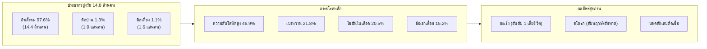
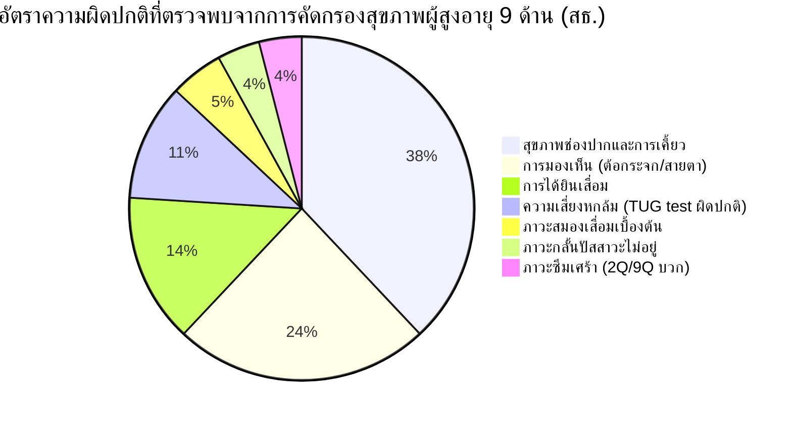
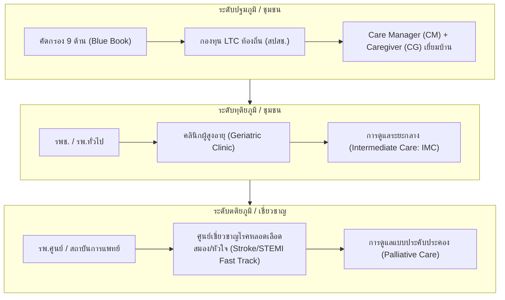

# รายงานสถานการณ์ด้านสุขภาพของผู้สูงอายุไทย
## THAILAND ELDERLY HEALTH SITUATION REPORT (พ.ศ. 2565 – ปัจจุบัน)

---

**จัดทำขึ้นเพื่อ:** การวิเคราะห์เชิงยุทธศาสตร์ นโยบายสุขภาพ และการวางแผนระบบสาธารณสุขรองรับสังคมสูงวัยระดับสุดยอด  
**หน่วยงานอ้างอิงหลัก:** กระทรวงสาธารณสุข (Ministry of Public Health)  
**แหล่งข้อมูลและฐานข้อมูลสถิติ:**
1. กองยุทธศาสตร์และแผนงาน สำนักงานปลัดกระทรวงสาธารณสุข (*รายงานสถิติสาธารณสุข พ.ศ. 2565, 2566, 2567*)
2. คลังข้อมูลสุขภาพ Health Data Center (HDC), กระทรวงสาธารณสุข
3. กองโรคไม่ติดต่อ กรมควบคุมโรค กระทรวงสาธารณสุข
4. สถาบันเวชศาสตร์สมเด็จพระสังฆราชญาณสังวรเพื่อผู้สูงอายุ กรมการแพทย์ กระทรวงสาธารณสุข
5. สำนักอนามัยผู้สูงอายุ กรมอนามัย กระทรวงสาธารณสุข
6. สำนักงานพัฒนาระบบข้อมูลข่าวสารสุขภาพ (HISO / ThaiHealthStat)

**ไฟล์ข้อมูลประกอบ:** [`docs/elderly-health-moph-data.csv`](file:///C:/Users/Piyanut/Desktop/Code_Work/docs/elderly-health-moph-data.csv)

---

## สารบัญ (Table of Contents)

1. [บทสรุปผู้บริหาร (Executive Summary)](#1-บทสรุปผู้บริหาร-executive-summary)
2. [บริบททางประชากรศาสตร์และอายุขัยเฉลี่ย (Demographics & Life Expectancy)](#2-บริบททางประชากรศาสตร์และอายุขัยเฉลี่ย)
3. [สถานะสุขภาวะและการคัดกรอง 9 ด้าน (Functional Status & 9-Domain Screening)](#3-สถานะสุขภาวะและการคัดกรอง-9-ด้าน)
4. [สถานการณ์การเจ็บป่วยและ 10 อันดับโรคที่พบบ่อย (Morbidity Situation & Top 10 Diseases)](#4-สถานการณ์การเจ็บป่วยและ-10-อันดับโรคที่พบบ่อย)
5. [สถานการณ์การเสียชีวิตและ 10 อันดับสาเหตุการตาย (Mortality Situation & Causes of Death)](#5-สถานการณ์การเสียชีวิตและ-10-อันดับสาเหตุการตาย)
6. [กลุ่มอาการผู้สูงอายุและประเด็นวิกฤตสุขภาพ (Geriatric Syndromes & Critical Health Issues)](#6-กลุ่มอาการผู้สูงอายุและประเด็นวิกฤตสุขภาพ)
7. [ระบบบริการสุขภาพและการขับเคลื่อนของกระทรวงสาธารณสุข (Health System Response)](#7-ระบบบริการสุขภาพและการขับเคลื่อนของกระทรวงสาธารณสุข)
8. [ข้อเสนอแนะเชิงยุทธศาสตร์และนโยบาย (Strategic Recommendations)](#8-ข้อเสนอแนะเชิงยุทธศาสตร์และนโยบาย)
9. [เอกสารอ้างอิงและแหล่งข้อมูลทางการ (References & Data Sources)](#9-เอกสารอ้างอิงและแหล่งข้อมูลทางการ)

---

## 1. บทสรุปผู้บริหาร (Executive Summary)

ประเทศไทยได้ก้าวเข้าสู่ **"สังคมสูงวัยอย่างสมบูรณ์" (Aged Society)** อย่างเต็มตัวตั้งแต่ปี 2566–2567 และกำลังมุ่งสู่วิกฤต **"สังคมสูงวัยระดับสุดยอด" (Super-Aged Society)** ภายในปี 2573–2576 ซึ่งจะมีประชากรอายุ 60 ปีขึ้นไปมากกว่า 28% ของประชากรทั้งหมด

### ตัวชี้วัดสำคัญด้านสุขภาพ (Key Health Indicators):
* **จำนวนประชากรสูงอายุ (ปี 2567–ปัจจุบัน):** ประมาณ **14.8 ล้านคน** คิดเป็น **22.5%** ของประชากรไทยทั้งประเทศ (66.05 ล้านคน)
* **ภาวะป่วยด้วยโรคเรื้อรัง (Chronic Disease Burden):** มากกว่า **75%** ของผู้สูงอายุในระบบสุขภาพมีโรคไม่ติดต่อเรื้อรัง (NCDs) ประจำตัวอย่างน้อย 1 โรค และกว่า **50% มีโรคร่วมตั้งแต่ 2 โรคขึ้นไป (Multimorbidity)**
* **โรคที่มีอัตราป่วยสูงสุด (Top Morbidity):**
  1. **โรคความดันโลหิตสูง** (ความชุก 46.91%, ผู้ป่วยสะสมในระบบ >4.85 ล้านคน)
  2. **โรคเบาหวาน ชนิดที่ 2** (ความชุก 21.79%, ผู้ป่วยสะสมทั่วประเทศ >5.18 ล้านคน โดยกว่า 50% เป็นผู้สูงอายุ)
  3. **โรคไขมันในเลือดผิดปกติ** (ความชุก ~20.50%, >4.40 ล้านคน)
* **สาเหตุการเสียชีวิตสูงสุด (Top Mortality):**
  1. **โรคมะเร็งและเนื้องอกทุกชนิด** (อัตราตาย 114.9 ต่อแสนประชากร)
  2. **โรคหลอดเลือดในสมอง (Stroke)** (อัตราตาย 63.8 ต่อแสนประชากร)
  3. **โรคปอดอักเสบและปอดบวม** (อัตราตาย 50.7 ต่อแสนประชากร)
* **ช่องว่างระหว่างอายุขัย (Life Expectancy Gap):** แม้คนไทยจะมีอายุขัยเฉลี่ยแรกเกิด (LE) อยู่ที่ 75.3 ปีในชาย และ 81.2 ปีในหญิง แต่ **ปีสุขภาวะที่ปราศจากโรคและความพิการ (Healthy Life Expectancy: HALE)** อยู่ที่เพียง 67–68 ปี หมายความว่า **คนไทยต้องใช้ชีวิตอยู่กับความเจ็บป่วยหรือความพิการเฉลี่ย 8–13 ปีก่อนเสียชีวิต**



---

## 2. บริบททางประชากรศาสตร์และอายุขัยเฉลี่ย

### 2.1 โครงสร้างประชากรสูงอายุจำแนกตามกลุ่มช่วงวัย
กระทรวงสาธารณสุขจำแนกผู้สูงอายุตามระยะพัฒนาการทางชีวภาพและสมรรถนะทางร่างกายออกเป็น 3 ช่วง:
1. **ผู้สูงอายุตอนต้น (Young-Old: 60–69 ปี):** มีสัดส่วนประมาณ **55.2%** (~8.17 ล้านคน) ส่วนใหญ่ยังมีความกระฉับกระเฉง (Active Ageing) มีบทบาทในครอบครัวและชุมชน
2. **ผู้สูงอายุตอนกลาง (Middle-Old: 70–79 ปี):** มีสัดส่วนประมาณ **29.8%** (~4.41 ล้านคน) เริ่มมีโรคเรื้อรังกำเริบ สมรรถนะร่างกายเริ่มถดถอย
3. **ผู้สูงอายุตอนปลาย (Old-Old: 80 ปีขึ้นไป):** มีสัดส่วนประมาณ **15.0%** (~2.22 ล้านคน) มีภาวะเปราะบางสูง มีอัตราการเกิดภาวะสมองเสื่อมและข้อจำกัดในการเคลื่อนไหวสูงที่สุด

### 2.2 อายุขัยเฉลี่ยและปีสุขภาวะ (Life Expectancy vs HALE)
ข้อมูลจากการคาดประมาณประชากรของสำนักงานสภาพัฒนาการเศรษฐกิจและสังคมแห่งชาติ และรายงานสุขภาพคนไทย:

| ตัวชี้วัด | เพศชาย | เพศหญิง | ภาพรวม |
| :--- | :---: | :---: | :---: |
| **อายุขัยเฉลี่ยแรกเกิด (Life Expectancy: LE)** | 75.3 ปี | 81.2 ปี | 78.2 ปี |
| **ปีสุขภาวะ (Healthy Life Expectancy: HALE)** | 66.8 ปี | 70.1 ปี | 68.4 ปี |
| **ระยะเวลาที่มีภาวะเจ็บป่วย/ทุพพลภาพ (Unhealthy Years)** | **8.5 ปี** | **11.1 ปี** | **9.8 ปี** |
| **อายุขัยเฉลี่ยที่อายุ 60 ปี (Remaining LE at 60)** | อยู่ต่อได้อีก 21.2 ปี | อยู่ต่อได้อีก 25.4 ปี | 23.3 ปี |

> **ข้อสังเกตเชิงระบบ:** แม้ผู้หญิงจะมีอายุยืนยาวกว่าผู้ชายเกือบ 6 ปี แต่ผู้หญิงกลับมีช่วงเวลาที่ต้องใช้ชีวิตอยู่กับความทุกข์ทรมานจากโรคเรื้อรังและความพิการยาวนานกว่าผู้ชายถึง 2.6 ปี

---

## 3. สถานะสุขภาวะและการคัดกรอง 9 ด้าน (Functional Status & 9-Domain Screening)

กรมอนามัย กระทรวงสาธารณสุข ขับเคลื่อนการประเมินคัดกรองสุขภาพผู้สูงอายุผ่าน **สมุดบันทึกสุขภาพผู้สูงอายุ (Blue Book Application)** โดยสรุปผลการคัดกรองระดับประเทศได้ดังนี้:

### 3.1 ความสามารถในการทำกิจวัตรประจำวัน (Barthel Index of ADL)
- **กลุ่มติดสังคม (Social-Bound, ADL 12–20):** **97.6%** สามารถเดินไปไหนมาไหนได้ด้วยตนเอง กิจวัตรพื้นฐานไม่ต้องการความช่วยเหลือ
- **กลุ่มติดบ้าน (Home-Bound, ADL 5–11):** **1.3%** เดินในบ้านได้แต่ไม่สามารถออกจากบ้านได้ตามลำพัง หรือต้องใช้อุปกรณ์ช่วยพยุง
- **กลุ่มติดเตียง (Bed-Bound, ADL 0–4):** **1.1%** นอนบนเตียงเป็นหลัก ขับถ่าย อาบน้ำ รับประทานอาหารต้องมีคนทำให้ทั้งหมด

```
สัดส่วนกลุ่มศักยภาพผู้สูงอายุไทย:
  [ติดสังคม: 97.6%] ========================================================> 14,440,000 คน
  [ติดบ้าน:    1.3%] => 192,000 คน
  [ติดเตียง:   1.1%] => 163,000 คน
```

### 3.2 ผลการคัดกรองสุขภาพ 9 ด้านสำคัญ (9 Geriatric Assessment Domains)



1. **สุขภาพช่องปากและฟัน (38.2% ผิดปกติ):** มีฟันแท้ใช้งานได้ไม่ถึง 20 ซี่ ส่งผลต่อการบดเคี้ยวอาหารและภาวะทุโภชนาการ
2. **การมองเห็น (24.1% ผิดปกติ):** พบต้อกระจกมากที่สุด ตามด้วยภาวะสายตายาว และต้อหิน
3. **การได้ยิน (14.5% ผิดปกติ):** หูตึง หูหนวกตามวัย (Presbycusis) ส่งผลให้ผู้สูงอายุแยกตัวจากสังคม เกิดภาวะซึมเศร้า
4. **ความเสี่ยงการหกล้มและการทรงตัว (11.3% ผิดปกติ):** ทดสอบ Time Up and Go (TUG) ใช้เวลาเกิน 12 วินาที มีความเสี่ยงหกล้มสูง
5. **ภาวะสมองเสื่อม (5.2% มีความเสี่ยง):** คัดกรองด้วยแบบประเมิน Mini-Cog หรือ AMT พบผลบวกที่ต้องส่งตรวจยืนยัน
6. **ภาวะกลั้นปัสสาวะไม่อยู่ (4.6%):** มีปัญหากลั้นปัสสาวะไม่ได้เวลาไอ จาม หรือเข้าห้องน้ำไม่ทัน
7. **สุขภาพจิตและภาวะซึมเศร้า (3.8% พบความเสี่ยง):** คัดกรอง 2Q/9Q มีอาการเศร้า เบื่อหน่าย ท้อแท้
8. **ภาวะโภชนาการ (6.1% เสี่ยงทุโภชนาการ):** น้ำหนักลดผิดปกติ ดัชนีมวลกายต่ำกว่า 18.5 หรือขาดสารอาหาร
9. **ปัญหาการนอนหลับ (18.7%):** นอนไม่หลับ ตื่นกลางดึก หลับไม่ลึก

---

## 4. สถานการณ์การเจ็บป่วยและ 10 อันดับโรคที่พบบ่อย (Morbidity Situation)

จากคลังข้อมูลสุขภาพ **Health Data Center (HDC)** และ **กองโรคไม่ติดต่อ กรมควบคุมโรค** กระทรวงสาธารณสุข:

### ตารางที่ 1: รายละเอียด 10 อันดับโรคที่ป่วยมากที่สุดในผู้สูงอายุไทย (2565 – 2567/ปัจจุบัน)

| อันดับ | ชื่อโรคและภาวะเจ็บป่วย | รหัส ICD-10 | ความชุกในผู้สูงวัย | จำนวนผู้ป่วยสะสมปี 2565 | จำนวนผู้ป่วยสะสมปี 2566 | จำนวนผู้ป่วยสะสมปี 2567–ปัจจุบัน | ผลกระทบและการดำเนินของโรค |
| :---: | :--- | :---: | :---: | :---: | :---: | :---: | :--- |
| **1** | **โรคความดันโลหิตสูง**<br/>(Essential Hypertension) | `I10` | **46.91%** | 4,300,000 คน | 4,610,000 คน | **>4,850,000 คน** | ตรวจพบในผู้สูงอายุเกือบครึ่งหนึ่ง หากคุมไม่ได้จะทำลายหลอดเลือดสมอง หลอดเลือดหัวใจ และหน่วยกรองไต |
| **2** | **โรคเบาหวาน ชนิดที่ 2**<br/>(Type 2 Diabetes Mellitus) | `E11` | **21.79%** | 4,430,000 คน* | 4,830,000 คน* | **5,180,000 คน\***<br/>*(>50% เป็นผู้สูงวัย)* | ก่อให้เกิด Microvascular & Macrovascular Complications (เบาหวานขึ้นตา, ไตวาย, แผลขาดเลือดตัดนิ้ว/ขา) |
| **3** | **โรคไขมันในเลือดผิดปกติ**<br/>(Dyslipidaemia) | `E78` | **20.50%** | 3,800,000 คน | 4,100,000 คน | **>4,400,000 คน** | โคเลสเตอรอลและไตรกลีเซอไรด์สูง นำไปสู่คราบไขมันเกาะผนังหลอดเลือดแดง (Atherosclerosis) |
| **4** | **โรคข้อเข่าเสื่อมและข้อเสื่อม**<br/>(Osteoarthritis / Arthrosis) | `M15–M19` | **15.20%** | 2,000,000 คน | 2,150,000 คน | **>2,280,000 คน** | พบในเพศหญิงมากกว่าเพศชายอย่างเด่นชัด ทำให้มีอาการปวด เข่าโก่ง เคลื่อนไหวลำบาก สูญเสียความสามารถในการเดิน |
| **5** | **โรคไตเรื้อรัง (CKD)**<br/>(Chronic Kidney Disease) | `N18` | **8.40%** | 950,000 คน | 1,050,000 คน | **>1,180,000 คน** | อัตราผู้ป่วย CKD ระยะ 3–5 เพิ่มขึ้นอย่างมีนัยสำคัญ ส่งผลให้มีความต้องการบริการบำบัดทดแทนไต (ล้างไต/ฟอกเลือด) สูงขึ้น |
| **6** | **โรคต้อกระจกและความผิดปกติสายตา**<br/>(Cataract & Eye Disorders) | `H25–H28` | **7.80%** | 900,000 คน | 980,000 คน | **>1,050,000 คน** | เลนส์ตาขุ่นมัว มองเห็นภาพเบลอ เป็นสาเหตุสำคัญที่สุดที่ทำให้ผู้สูงอายุหกล้มและสูญเสียการพึ่งพาตนเอง |
| **7** | **โรคหลอดเลือดสมอง (Stroke)**<br/>(Cerebrovascular Disease) | `I60–I69` | **2.51%** | 320,000 คน | 345,000 คน | **>365,000 คน** | อัตราอุบัติการณ์ใหม่ 350–380 ต่อแสน ผู้รอดชีวิตมักหลงเหลือความพิการ อัมพฤกษ์ครึ่งซีก กลืนลำบาก หรือพูดไม่ได้ |
| **8** | **โรคหัวใจขาดเลือด**<br/>(Ischaemic Heart Diseases) | `I20–I25` | **2.80%** | 240,000 คน | 255,000 คน | **>270,000 คน** | กล้ามเนื้อหัวใจขาดเลือดเฉียบพลัน และภาวะหัวใจล้มเหลวเรื้อรัง (Heart Failure) เป็นโรคที่มีอัตราการกลับเข้ารักษาซ้ำ (Readmission) สูง |
| **9** | **โรคปอดอุดกั้นเรื้อรัง (COPD)**<br/>(Chronic Obstructive Pulm. Dis.) | `J44` | **2.10%** | 210,000 คน | 225,000 คน | **>240,000 คน** | เนื้อปอดถูกทำลายจากควันบุหรี่หรือมลพิษฝุ่น PM2.5 เรื้อรัง ทำให้เหนื่อยง่าย หายใจมีเสียงหวีด และติดเชื้อปอดอักเสบได้ง่าย |
| **10** | **ภาวะสมองเสื่อม / อัลไซเมอร์**<br/>(Dementia / Alzheimer's) | `F00–F03, G30` | **1.90%** | 650,000 คน | 720,000 คน | **>780,000 คน** | ความเสื่อมของเซลล์ประสาทสมอง กระทบต่อความจำ ความคิด พฤติกรรม และการควบคุมอารมณ์ ต้องการการบริบาล 24 ชม. |

*\*หมายเหตุ: สถิติผู้ป่วยโรคเบาหวานรายงานในระบบรวมทุกกลุ่มอายุ โดยผู้ป่วยเกินกว่าร้อยละ 50 เป็นกลุ่มประชากรอายุ 60 ปีขึ้นไป*

---

## 5. สถานการณ์การเสียชีวิตและ 10 อันดับสาเหตุการตาย (Mortality Situation)

อ้างอิงจาก **กองยุทธศาสตร์และแผนงาน สำนักงานปลัดกระทรวงสาธารณสุข** และ **ThaiHealthStat (HISO)** โดยใช้ฐานข้อมูลมรณบัตรและระบบสถิติสาธารณสุข พ.ศ. 2565–2567:

### ตารางที่ 2: 10 อันดับสาเหตุการเสียชีวิตของผู้สูงอายุไทย (อัตราตายต่อประชากร 100,000 คน)

| อันดับ | สาเหตุการเสียชีวิต (Causes of Death) | รหัส ICD-10 | อัตราตายปี 2565 | อัตราตายปี 2566 | อัตราตายปี 2567 (แนวโน้ม) | ลักษณะทางคลินิกและพยาธิสภาพที่นำไปสู่การเสียชีวิต |
| :---: | :--- | :---: | :---: | :---: | :---: | :--- |
| **1** | **โรคมะเร็งและเนื้องอกร้ายทุกชนิด** | `C00–C97` | **114.5** | **114.9** | **~116.2** | ครองแชมป์อันดับ 1 ตลอดทศวรรษ มะเร็งที่พบสูงสุด: 1. มะเร็งตับและท่อน้ำดี 2. มะเร็งปอด 3. มะเร็งลำไส้ใหญ่และทวารหนัก |
| **2** | **โรคหลอดเลือดในสมอง (Stroke)** | `I60–I69` | **61.2** | **63.8** | **~65.0** | ทั้งชนิดหลอดเลือดสมองตีบ/อุดตัน (Ischemic) และแตก (Hemorrhagic) เสียชีวิตจากสมองบวมและสมองขาดเลือดรุนแรง |
| **3** | **โรคปอดอักเสบและปอดบวม (Pneumonia)** | `J12–J18` | **67.2** | **50.7** | **~51.5** | สาเหตุการเสียชีวิตจากโรคติดเชื้ออันดับ 1 ในผู้สูงวัย มักเกิดจากการสำลักอาหาร/น้ำลาย (Aspiration) ภูมิคุ้มกันต่ำ |
| **4** | **โรคหัวใจขาดเลือด (Ischaemic Heart)** | `I20–I25` | **29.3** | **31.5** | **~32.4** | กล้ามเนื้อหัวใจตายเฉียบพลัน หลอดเลือดโคโรนารีอุดตัน ภาวะหัวใจหยุดเต้นกะทันหัน |
| **5** | **โรคเบาหวานและภาวะแทรกซ้อน** | `E10–E14` | **24.8** | **25.6** | **~26.0** | เสียชีวิตจากภาวะน้ำตาลในเลือดสูงวิกฤต (HHS/DKA), หลอดเลือดส่วนปลายขาดเลือด และการติดเชื้อรุนแรงแทรกซ้อน |
| **6** | **โรคไตวายและกลุ่มโรคไต (Renal Failure)** | `N17–N19` | **18.7** | **19.4** | **~20.1** | ไตวายระยะสุดท้าย สมดุลเกลือแร่และน้ำล้มเหลว ภาวะโปแตสเซียมในเลือดสูงวิกฤต หรือภาวะน้ำท่วมปอด |
| **7** | **ภาวะติดเชื้อในกระแสเลือด (Sepsis)** | `A40–A41` | **16.5** | **17.2** | **~17.8** | การติดเชื้อในระบบทางเดินปัสสาวะ (CAUTI), แผลกดทับติดเชื้อ หรือการติดเชื้อในปอดที่ลุกลามเข้าสู่กระแสเลือด |
| **8** | **โรคทางเดินหายใจส่วนล่างเรื้อรัง (COPD)** | `J40–J47` | **15.2** | **14.8** | **~14.9** | ภาวะระบบทางเดินหายใจล้มเหลว (Respiratory Failure) และการติดเชื้อซ้ำซ้อนในเนื้อปอด |
| **9** | **โรคตับและตับแข็ง (Liver Cirrhosis)** | `K70–K77` | **11.4** | **11.8** | **~12.0** | ตับวายระยะสุดท้าย ภาวะตกเลือดในทางเดินอาหารส่วนต้นจากเส้นเลือดขอดในหลอดอาหารแตก (Esophageal Varices) |
| **10** | **อุบัติเหตุการพลัดตกหกล้ม (Falls)** | `W00–W19` | **9.8** | **10.5** | **~11.0** | หกล้มกระดูกสะโพกหัก ทำให้ต้องนอนติดเตียง เกิดลิ่มเลือดอุดกั้นในปอด ปอดบวม และแผลกดทับ นำไปสู่การเสียชีวิตใน 1 ปี |

```
เปรียบเทียบสัดส่วนสาเหตุการเสียชีวิต 10 อันดับแรก (ต่อ 100,000 ประชากร):
 1. มะเร็งทุกชนิด:          ████████████████████████████ 114.9
 2. หลอดเลือดสมอง:          ███████████████ 63.8
 3. ปอดอักเสบ:              ████████████ 50.7
 4. โรคหัวใจขาดเลือด:       ███████ 31.5
 5. โรคเบาหวาน:             ██████ 25.6
 6. ไตวาย:                  ████ 19.4
 7. ติดเชื้อในกระแสเลือด:   ████ 17.2
 8. ปอดอุดกั้นเรื้อรัง:     ███ 14.8
 9. โรคตับแข็ง:             ███ 11.8
10. การพลัดตกหกล้ม:         ██ 10.5
```

---

## 6. กลุ่มอาการผู้สูงอายุและประเด็นวิกฤตสุขภาพ (Geriatric Syndromes & Critical Issues)

นอกจากโรคเรื้อรังตามรหัส ICD-10 สถาบันเวชศาสตร์สมเด็จพระสังฆราชญาณสังวรเพื่อผู้สูงอายุ กรมการแพทย์ ระบุว่ามีกลุ่มอาการเฉพาะที่ส่งผลกระทบต่อคุณภาพชีวิตผู้สูงอายุอย่างรุนแรง:

### 6.1 วิกฤตการพลัดตกหกล้ม (Falls Burden)
* ในแต่ละปี ผู้สูงอายุไทยหกล้มมากกว่า **3 ล้านครั้ง** (เฉลี่ย 1 ใน 3 ของผู้สูงอายุหกล้มอย่างน้อยปีละ 1 ครั้ง)
* อุบัติเหตุการหกล้มทำให้เกิด **กระดูกสะโพกหัก (Hip Fracture)** มากกว่า 50,000 รายต่อปี
* ผู้สูงอายุที่กระดูกสะโพกหัก **ร้อยละ 20 เสียชีวิตภายใน 1 ปี** และอีก **ร้อยละ 50 ไม่สามารถกลับมาเดินได้ด้วยตนเองอีก**

### 6.2 ภาวะสมองเสื่อม (Dementia & Cognitive Decline)
* ปัจจุบันไทยมีผู้ป่วยสมองเสื่อมสะสมประมาณ **700,000 – 800,000 คน** และคาดว่าจะแตะ **1.1 ล้านคนในปี 2573**
* เป็นโรคที่สร้างภาระค่าใช้จ่ายในการดูแลเฉลี่ยสูงถึง **150,000 – 300,000 บาท/คน/ปี** และผู้ดูแล (Caregiver) มักเผชิญภาวะเครียดซึมเศร้า (Caregiver Burnout)

### 6.3 ภาวะมวลกล้ามเนื้อน้อย (Sarcopenia) และภาวะเปราะบาง (Frailty)
* พบในผู้สูงอายุไทยมากกว่า **ร้อยละ 30** เกิดจากการขาดโปรตีน การไม่ออกกำลังกาย และฟันไม่พร้อมบดเคี้ยว
* ทำให้การทรงตัวไม่ดี กล้ามเนื้อขาลีบ แรงบีบมือลดลง เสี่ยงต่อการหกล้มและเปลี่ยนสภาพเป็นผู้ป่วยติดเตียงอย่างรวดเร็ว

### 6.4 การใช้ยาหลายขนาน (Polypharmacy)
* ผู้สูงอายุไทยที่มีโรคร่วมเฉลี่ยได้รับยา **5 – 8 ขนานต่อวัน**
* ร้อยละ 25 ของผู้สูงอายุเคยได้รับผลข้างเคียงจากยา เช่น ยาขับปัสสาวะทำให้ความดันตกวูบเวลายืน, ยานอนหลับทำให้ง่วงซึมหกล้ม, หรือยาแก้ปวดกลุ่ม NSAIDs ทำให้ไตวายเฉียบพลันและเลือดออกในกระเพาะอาหาร

---

## 7. ระบบบริการสุขภาพและการขับเคลื่อนของกระทรวงสาธารณสุข (Health System Response)

กระทรวงสาธารณสุขได้วางระบบและกลไกเพื่อรองรับสังคมสูงวัยอย่างสมบูรณ์ ดังนี้:



1. **คลินิกผู้สูงอายุคุณภาพ (Geriatric Clinic):** จัดตั้งในโรงพยาบาลศูนย์และโรงพยาบาลทั่วไปครอบคลุม 100% เพื่อประเมินภาวะสุขภาพแบบองค์รวม (Comprehensive Geriatric Assessment) โดยแพทย์เวชศาสตร์ผู้สูงอายุ
2. **ระบบการดูแลระยะกลาง (Intermediate Care: IMC):** ฟื้นฟูสมรรถภาพผู้ป่วยโรคหลอดเลือดสมอง กระดูกสะโพกหัก และการบาดเจ็บทางสมอง ภายใน 6 เดือนทอง (Golden Period) เพื่อลดโอกาสกลายเป็นผู้ป่วยติดเตียง
3. **ระบบการบริบาลระยะยาว (Long-Term Care: LTC) และกองทุน สปสช.:**
   - มีการผลิตผู้จัดการการดูแลผู้สูงอายุ (Care Manager: CM) และผู้ดูแลผู้สูงอายุ (Caregiver: CG) ลงไปดูแลผู้สูงอายุติดบ้านและติดเตียงในระดับตำบล
   - สนับสนุนงบประมาณรายบุคคลแก่ผู้สูงอายุที่มีภาวะพึ่งพิง (LTC Fund)
4. **โครงการ "ฟันเทียม รากฟันเทียมพระราชทาน" และ "ผ่าตัดต้อกระจก":** กรมอนามัยและ สปสช. ให้บริการใส่ฟันเทียมและผ่าตัดเปลี่ยนเลนส์ตาต้อกระจกฟรี เพื่อคืนความสามารถในการบดเคี้ยวและการมองเห็น

---

## 8. ข้อเสนอแนะเชิงยุทธศาสตร์และนโยบาย (Strategic Recommendations)

### 8.1 ระดับนโยบายและการคลังสุขภาพ (Macro & Policy Level)
* **ปรับเพิ่มงบประมาณกองทุน LTC:** เพิ่มเพดานค่าใช้จ่ายต่อหัวสำหรับผู้ป่วยติดเตียงที่มีความซับซ้อนสูง และขยายสิทธิประโยชน์ด้านอุปกรณ์พยุงกาย (Assistive Devices)
* **บูรณาการสิทธิประโยชน์การรักษาพยาบาล:** สร้างมาตรฐานเดียวกันระหว่างสิทธิบัตรทอง ประกันสังคม และสวัสดิการข้าราชการ ในการเบิกจ่ายการฟื้นฟูที่บ้านและการดูแลระยะยาว
* **สนับสนุนมาตรการภาษีสำหรับการปรับปรุงบ้าน (Home Modification):** สนับสนุนเงินอุดหนุนหรือลดหย่อนภาษีให้ครอบครัวที่ปรับปรุงห้องน้ำ ติดราวจับ และทำทางลาดเพื่อป้องกันการหกล้ม

### 8.2 ระดับระบบบริการสาธารณสุข (Health Service Delivery)
* **ขยายผลระบบ Tele-Geriatric & Home Monitoring:** นำเทคโนโลยีแพทย์ทางไกลมาใช้ติดตามอาการผู้สูงอายุติดบ้าน เพื่อลดภาระการเดินทางมาโรงพยาบาล
* **ระบบจัดการยาแบบบูรณาการ (Deprescribing Protocol):** จัดตั้งคลินิกทบทวนการใช้ยาโดยเภสัชกร เพื่อตัดยาลดความเสี่ยงที่ไม่จำเป็นในผู้สูงอายุที่มีโรคร่วม
* **ขยายการดูแลแบบประคับประคองที่บ้าน (Home-Based Palliative Care):** ส่งเสริมการทำหนังสือแสดงเจตนาล่วงหน้า (Living Will) ตามมาตรา 12 แห่ง พ.ร.บ. สุขภาพแห่งชาติ เพื่อให้ผู้สูงอายุระยะท้ายได้รับการดูแลอย่างสมศักดิ์ศรีและลดค่าใช้จ่ายการรักษาที่ไม่จำเป็นใน ICU

---

## 9. เอกสารอ้างอิงและแหล่งข้อมูลทางการ (References & Data Sources)

1. **กองยุทธศาสตร์และแผนงาน สำนักงานปลัดกระทรวงสาธารณสุข**
   - *รายงานสถิติสาธารณสุข พ.ศ. 2565 (Public Health Statistics 2022)*, URL: [https://spd.moph.go.th/wp-content/uploads/2023/11/Hstatistic65.pdf](https://spd.moph.go.th/wp-content/uploads/2023/11/Hstatistic65.pdf)
   - *คลังข้อมูลสถิติสาธารณสุข พ.ศ. 2566 – 2567*, URL: [https://spd.moph.go.th/public-health-statistics/](https://spd.moph.go.th/public-health-statistics/)
2. **คลังข้อมูลสุขภาพ Health Data Center (HDC) กระทรวงสาธารณสุข**
   - *ระบบสารสนเทศสนับสนุนการบริหารจัดการด้านสุขภาพ ข้อมูลกลุ่มวัยผู้สูงอายุ*, URL: [https://hdcservice.moph.go.th](https://hdcservice.moph.go.th)
3. **กองโรคไม่ติดต่อ กรมควบคุมโรค กระทรวงสาธารณสุข**
   - *ระบบแดชบอร์ดเฝ้าระวังโรคไม่ติดต่อเรื้อรัง (NCD Dashboard)*, URL: [https://itepincd.ddc.moph.go.th](https://itepincd.ddc.moph.go.th)
   - *รายงานสถานการณ์โรคเบาหวาน ความดันโลหิตสูง และปัจจัยเสี่ยงในประเทศไทย*, URL: [https://ddc.moph.go.th/noncommunicable-disease](https://ddc.moph.go.th/noncommunicable-disease)
4. **สถาบันเวชศาสตร์สมเด็จพระสังฆราชญาณสังวรเพื่อผู้สูงอายุ กรมการแพทย์ กระทรวงสาธารณสุข**
   - *แนวทางการดำเนินงานคลินิกผู้สูงอายุและคู่มือเวชศาสตร์ผู้สูงอายุสำหรับบุคลากรสาธารณสุข*, URL: [https://dms.go.th](https://dms.go.th)
5. **สำนักอนามัยผู้สูงอายุ กรมอนามัย กระทรวงสาธารณสุข**
   - *รายงานผลการคัดกรองสุขภาพผู้สูงอายุ 9 ด้าน ผ่าน Blue Book Application*, URL: [https://eh.anamai.moph.go.th](https://eh.anamai.moph.go.th)
6. **สำนักงานพัฒนาระบบข้อมูลข่าวสารสุขภาพ (HISO)**
   - *ระบบสถิติผลลัพธ์สุขภาพ (ThaiHealthStat) ฐานข้อมูลสาเหตุการตายจำแนกเพศและกลุ่มอายุ*, URL: [https://hiso.or.th/thaihealthstat](https://hiso.or.th/thaihealthstat)
