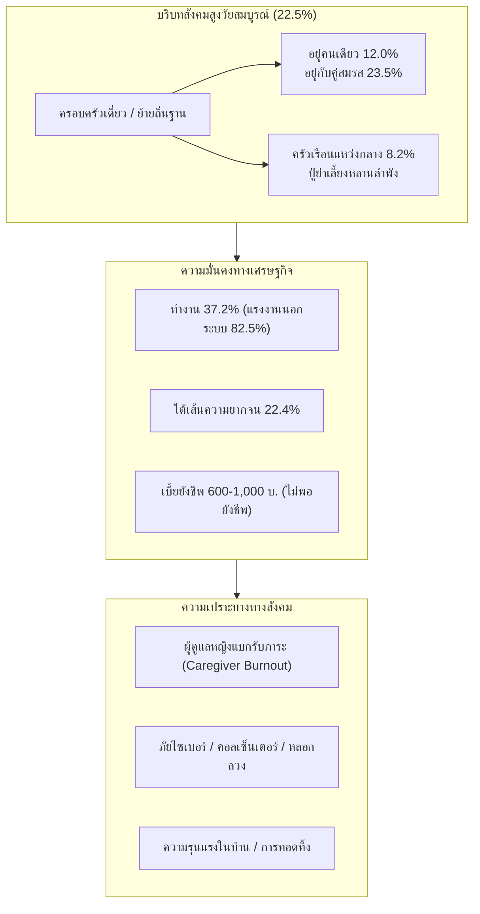
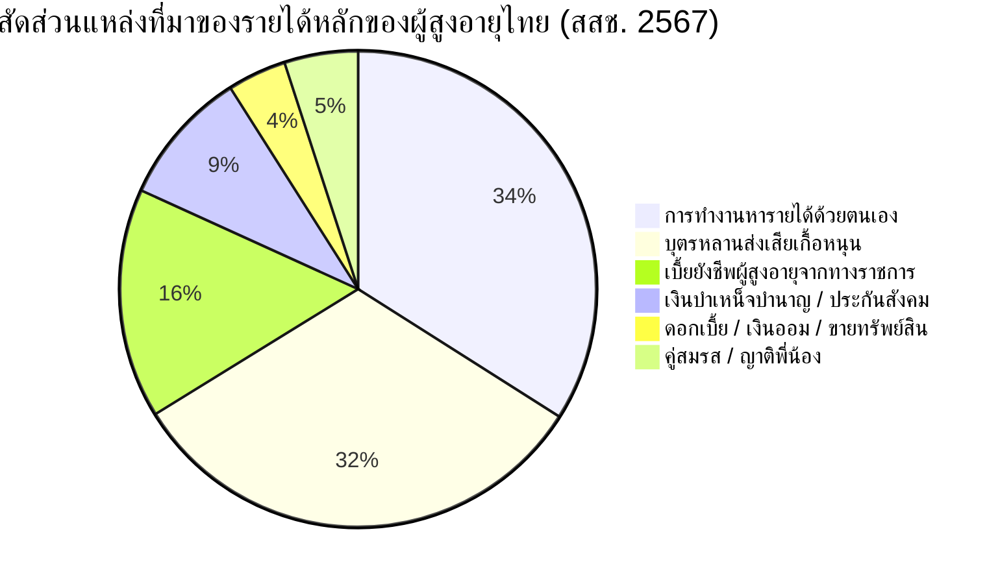
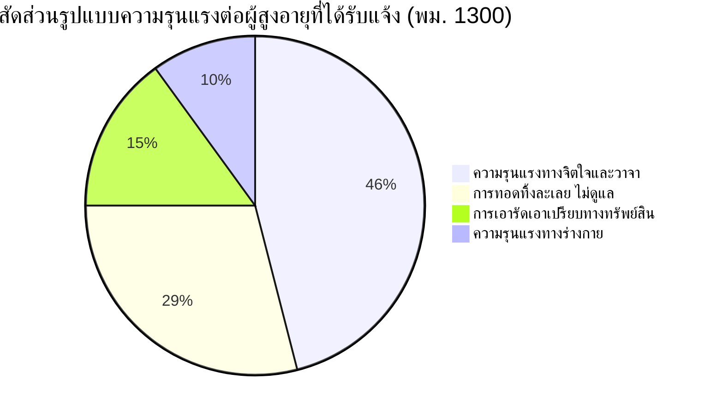

# รายงานสถานการณ์ด้านสังคมของผู้สูงอายุไทย (พ.ศ. 2566 – ปัจจุบัน)
## Comprehensive Report on the Social Situation, Living Arrangements, Economic Security, and Welfare of Older Persons in Thailand

---

**จัดทำขึ้นโดย:** ศูนย์วิเคราะห์ข้อมูลและวิจัยนโยบายสังคมผู้สูงอายุ  
**กรอบเวลาข้อมูล:** พ.ศ. 2566 – ปัจจุบัน (ปี 2567–2568/2569)  
**แหล่งข้อมูลและเอกสารอ้างอิงทางวิชาการที่น่าเชื่อถือในประเทศไทย:**
1. **มูลนิธิสถาบันวิจัยและพัฒนาผู้สูงอายุไทย (มส.ผส. - TGRI):**
   - *รายงานสถานการณ์ผู้สูงอายุไทย พ.ศ. 2566: สถานการณ์สังคมสูงวัยสมบูรณ์ (Complete-Aged Society)*
   - *รายงานสถานการณ์ผู้สูงอายุไทย พ.ศ. 2567: การสูงวัยในถิ่นที่อยู่ (Ageing in Place)*
2. **สำนักงานสถิติแห่งชาติ (สสช. - NSO):**
   - *รายงานการสำรวจประชากรสูงอายุในประเทศไทย พ.ศ. 2567 (การสำรวจครั้งที่ 8)*
   - *รายงานผลการสำรวจการมีการใช้เทคโนโลยีสารสนเทศและการสื่อสารในครัวเรือน พ.ศ. 2566 – 2567*
3. **วิทยาลัยประชากรศาสตร์ จุฬาลงกรณ์มหาวิทยาลัย (College of Population Studies, Chulalongkorn University):**
   - งานวิจัยชุดโครงการติดตามโครงสร้างครอบครัวและคุณภาพชีวิตผู้สูงอายุไทย
4. **สถาบันวิจัยประชากรและสังคม มหาวิทยาลัยมหิดล (IPSR, Mahidol University):**
   - รายงานสุขภาพคนไทย (ปี 2566, 2567) และชุดข้อมูล "The Prachakorn"
5. **กรมกิจการผู้สูงอายุ (ผส.) กระทรวงการพัฒนาสังคมและความมั่นคงของมนุษย์ (พม.):**
   - สถิติผู้สูงอายุตามทะเบียนราษฎร กองทุนผู้สูงอายุ และสถิติศูนย์ช่วยเหลือสังคม 1300
6. **สถาบันวิจัยเพื่อการพัฒนาประเทศไทย (TDRI):**
   - บทวิเคราะห์นโยบายระบบบำนาญ สวัสดิการ และการคุ้มครองทางสังคมของผู้สูงอายุไทย

---

## สารบัญ (Table of Contents)

1. [บทสรุปผู้บริหาร (Executive Summary)](#1-บทสรุปผู้บริหาร-executive-summary)
2. [มิติที่ 1: โครงสร้างครัวเรือนและรูปแบบการอยู่อาศัย (Living Arrangements)](#2-มิติที่-1-โครงสร้างครัวเรือนและรูปแบบการอยู่อาศัย)
   - 2.1 สัดส่วนการอยู่อาศัยตามลำพัง (Living Alone) และอยู่กับคู่สมรส
   - 2.2 ปรากฏการณ์ "ครัวเรือนข้ามรุ่น / ครัวเรือนแหว่งกลาง" (Skipped-Generation Households)
   - 2.3 การลดลงของการอยู่อาศัยร่วมกับบุตร (Co-residence with Children)
   - 2.4 แนวคิดและนโยบาย "การสูงวัยในถิ่นที่อยู่" (Ageing in Place)
3. [มิติที่ 2: ความมั่นคงทางรายได้ ความยากจน และหนี้สิน (Economic Security & Poverty)](#3-มิติที่-2-ความมั่นคงทางรายได้-ความยากจน-และหนี้สิน)
   - 3.1 แหล่งที่มาของรายได้ผู้สูงอายุไทย
   - 3.2 สัดส่วนผู้สูงอายุที่อยู่ใต้เส้นความยากจน (Poverty Rate)
   - 3.3 ภาวะหนี้สินและภาระผูกพันทางการเงิน
   - 3.4 ระบบบำนาญ เบี้ยยังชีพ และกองทุนผู้สูงอายุ
4. [มิติที่ 3: การทำงานและการมีส่วนร่วมในตลาดแรงงาน (Employment & Productive Ageing)](#4-มิติที่-3-การทำงานและการมีส่วนร่วมในตลาดแรงงาน)
   - 4.1 อัตราการทำงานของผู้สูงอายุ (Labor Force Participation)
   - 4.2 ลักษณะอาชีพและการกระจุกตัวในแรงงานนอกระบบ (Informal Sector)
   - 4.3 แรงจูงใจในการทำงาน: ความจำเป็นทางเศรษฐกิจ vs ความต้องการทำงาน
5. [มิติที่ 4: การมีส่วนร่วมทางสังคม ทุนทางสังคม และการเรียนรู้ตลอดชีวิต (Social Participation)](#5-มิติที่-4-การมีส่วนร่วมทางสังคม-ทุนทางสังคม-และการเรียนรู้ตลอดชีวิต)
   - 5.1 โรงเรียนผู้สูงอายุและชมรมผู้สูงอายุ
   - 5.2 การเป็นจิตอาสาและกิจกรรมทางศาสนา/ชุมชน
6. [มิติที่ 5: การปรับตัวสู่สังคมดิจิทัลและความเสี่ยงทางไซเบอร์ (Digital Inclusion & Scams)](#6-มิติที่-5-การปรับตัวสู่สังคมดิจิทัลและความเสี่ยงทางไซเบอร์)
   - 6.1 การเข้าถึงสมาร์ทโฟนและอินเทอร์เน็ต
   - 6.2 พฤติกรรมการใช้สื่อสังคมออนไลน์
   - 6.3 ภัยคุกคามทางไซเบอร์ มิจฉาชีพคอลเซ็นเตอร์ และข่าวปลอม
7. [มิติที่ 6: ความรุนแรง การถูกทอดทิ้ง และการคุ้มครองพิทักษ์สิทธิ (Elder Abuse & Rights Protection)](#7-มิติที่-6-ความรุนแรง-การถูกทอดทิ้ง-และการคุ้มครองพิทักษ์สิทธิ)
   - 7.1 สถานการณ์ความรุนแรงต่อผู้สูงอายุและสถิติสายด่วน 1300
   - 7.2 รูปแบบความรุนแรง: จิตใจ วาจา ร่างกาย และการเอารัดเอาเปรียบทางทรัพย์สิน
   - 7.3 กลไกการคุ้มครองตาม พ.ร.บ. ผู้สูงอายุ พ.ศ. 2546
8. [มิติที่ 7: ภาระของผู้ดูแลในครอบครัวและความเหงา (Caregiver Burden & Loneliness)](#8-มิติที่-7-ภาระของผู้ดูแลในครอบครัวและความเหงา)
9. [ข้อเสนอแนะเชิงนโยบายทางสังคม (Policy Recommendations)](#9-ข้อเสนอแนะเชิงนโยบายทางสังคม)
10. [รายการเอกสารอ้างอิงทางวิชาการ (Academic References)](#10-รายการเอกสารอ้างอิงทางวิชาการ)

---

## 1. บทสรุปผู้บริหาร (Executive Summary)

สถานการณ์ด้านสังคมของผู้สูงอายุไทยในช่วงปี พ.ศ. 2566 ถึงปัจจุบัน สะท้อนภาพการเปลี่ยนแปลงเชิงโครงสร้างที่รวดเร็วและลึกซึ้ง ประเทศไทยมีประชากรอายุ 60 ปีขึ้นไปมากกว่า **14.0 – 14.8 ล้านคน** (คิดเป็น **21.3% – 22.5%** ของประชากรทั้งหมด) ซึ่งไม่ได้ส่งผลกระทบเฉพาะมิติด้านสาธารณสุข แต่กำลังสั่นคลอนสถาบันครอบครัว ตลาดแรงงาน และความมั่นคงทางสังคมของประเทศ:

1. **โครงสร้างครอบครัวเปลี่ยนทิศ:** สัดส่วนผู้สูงอายุที่อยู่อาศัยกับบุตรลดลงอย่างต่อเนื่องเหลือเพียง **ร้อยละ 52.8** ในขณะที่ผู้สูงอายุที่ **"อยู่คนเดียวตามลำพัง" (Living Alone) พุ่งสูงขึ้นเป็นร้อยละ 12.0 (~1.77 ล้านคน)** และเกิดปัญหา **"ครัวเรือนแหว่งกลาง" (ร้อยละ 8.2)** ปู่ย่าตายายต้องเลี้ยงดูหลานลำพังในชนบท
2. **ความเปราะบางทางเศรษฐกิจและการพึ่งพาตนเอง:** แม้จะมีสัดส่วนผู้สูงอายุที่ยังทำงานสูงถึง **ร้อยละ 37.2 (กว่า 5.2 ล้านคน)** แต่กว่า **ร้อยละ 82.5 เป็นแรงงานนอกระบบ** ที่ไม่มีความมั่นคงทางรายได้ และผู้สูงอายุไทยกว่า **ร้อยละ 22.4 ยังมีรายได้ต่ำกว่าเส้นความยากจน**
3. **การเปลี่ยนผ่านสู่ดิจิทัลและภัยคุกคามใหม่:** ผู้สูงอายุเข้าถึงอินเทอร์เน็ตเพิ่มขึ้นเป็น **ร้อยละ 59.9 – 69.3** และเป็นเจ้าของสมาร์ทโฟนถึง **ร้อยละ 82.8** แต่กลายเป็นเป้าหมายหลักของอาชญากรรมทางไซเบอร์ เช่น แก๊งคอลเซ็นเตอร์ และการหลอกลงทุน
4. **ความรุนแรงและการละเมิดสิทธิ:** มีการแจ้งเหตุความรุนแรงและการทอดทิ้งผู้สูงอายุผ่านศูนย์ช่วยเหลือสังคม 1300 เพิ่มขึ้น โดยความรุนแรงทางจิตใจและการเอารัดเอาเปรียบทางทรัพย์สินเป็นรูปแบบที่พบบ่อยที่สุด



---

## 2. มิติที่ 1: โครงสร้างครัวเรือนและรูปแบบการอยู่อาศัย (Living Arrangements)

ข้อมูลจากการสำรวจประชากรสูงอายุในประเทศไทย พ.ศ. 2567 โดยสำนักงานสถิติแห่งชาติ ร่วมกับรายงานสถานการณ์ผู้สูงอายุไทย มส.ผส. ฉายภาพการเปลี่ยนแปลงรูปแบบการอยู่อาศัยอย่างชัดเจน:

### 2.1 สัดส่วนรูปแบบการอยู่อาศัยของผู้สูงอายุไทย (ปี 2566 – 2567)

| รูปแบบการอยู่อาศัย (Living Arrangement) | ปี 2545 (%) | ปี 2557 (%) | ปี 2564 (%) | ปี 2567 (%) | จำนวนประชากรปี 2567 (คน) | แนวโน้มทางสังคม |
| :--- | :---: | :---: | :---: | :---: | :---: | :--- |
| **อยู่ร่วมกับบุตร (Co-residence with children)** | 70.8% | 59.4% | 54.3% | **52.8%** | ~7,410,000 | $\downarrow$ ลดลงอย่างมีนัยสำคัญ |
| **อยู่ตามลำพังกับคู่สมรส (Spouse only)** | 16.0% | 19.3% | 22.4% | **23.5%** | ~3,300,000 | $\uparrow$ เพิ่มขึ้นต่อเนื่อง |
| **อยู่คนเดียวตามลำพัง (Living alone)** | **6.3%** | **8.6%** | **10.8%** | **12.0%** | **~1,680,000** | $\uparrow$ **พุ่งสูงขึ้นเกือบเท่าตัว** |
| **ครัวเรือนข้ามรุ่น/แหว่งกลาง (Skipped generation)** | 4.8% | 7.1% | 7.8% | **8.2%** | ~1,150,000 | $\uparrow$ เพิ่มขึ้นในเขตชนบท |
| **อยู่อาศัยกับบุคคลอื่นที่มิใช่ญาติ / สถาบัน** | 2.1% | 5.6% | 4.7% | **3.5%** | ~490,000 | $\leftrightarrow$ ทรงตัว |

```
การกระจายตัวของรูปแบบการอยู่อาศัยของผู้สูงอายุไทย (พ.ศ. 2567):
  อยู่กับบุตร:             ██████████████████████████ 52.8%
  อยู่กับคู่สมรสเท่านั้น:   ████████████ 23.5%
  อยู่คนเดียวตามลำพัง:     ██████ 12.0%
  ครัวเรือนแหว่งกลาง:      ████ 8.2%
  อื่นๆ:                   ██ 3.5%
```

### 2.2 ปรากฏการณ์ "ครัวเรือนข้ามรุ่น / ครัวเรือนแหว่งกลาง" (Skipped-Generation Households)
* **ความหมาย:** ครัวเรือนที่ประกอบด้วยคนรุ่นปู่ย่าตายายอาศัยอยู่ร่วมกับหลานวัยเด็ก โดยไม่มีคนรุ่นพ่อแม่ (วัยแรงงาน) อาศัยอยู่ด้วย
* **สาเหตุ:** การย้ายถิ่นฐานของวัยแรงงานเข้าไปทำงานในเขตอุตสาหกรรม/กรุงเทพฯ, ปัญหาการหย่าร้าง, และภาวะเปราะบางทางเศรษฐกิจ
* **การกระจายทางภูมิศาสตร์:** พบสูงสุดใน **ภาคตะวันออกเฉียงเหนือ (ร้อยละ 11.4)** และ **ภาคเหนือ (ร้อยละ 8.7)**
* **ผลกระทบเชิงลบ:**
  - ผู้สูงอายุต้องแบกรับภาระการเลี้ยงดูหลานทั้งที่ตนเองสุขภาพเสื่อมถอย
  - เงินส่งเสียจากบุตรหลานไม่สม่ำเสมอ ก่อให้เกิดความเครียดและการบริโภคอาหารที่ไม่เพียงพอทั้งผู้สูงอายุและเด็ก

### 2.3 ผู้สูงอายุที่อาศัยอยู่คนเดียว (Living Alone)
* สถิติล่าสุดปี 2567 พบว่าผู้สูงอายุไทย **อยู่คนเดียวถึงร้อยละ 12.0 หรือประมาณ 1.68 – 1.77 ล้านคน** (เพิ่มขึ้นจากปี 2545 ที่มีเพียง 6.3%)
* **ความแตกต่างทางเพศ:** ผู้สูงอายุหญิงอยู่คนเดียวมากกว่าเพศชายถึง **2.2 เท่า** (หญิงร้อยละ 14.1 เทียบกับชายร้อยละ 9.3) เนื่องจากผู้หญิงอายุยืนกว่าและมีสถานะเป็นม่ายมากกว่า
* **ความเสี่ยง:** เสี่ยงต่อการหกล้มโดยไม่มีผู้พบเห็น, ภาวะซึมเศร้าจากการขาดปฏิสัมพันธ์ และการเสียชีวิตตามลำพัง (Dying alone)

### 2.4 แนวคิดและนโยบาย "การสูงวัยในถิ่นที่อยู่" (Ageing in Place)
รายงานสถานการณ์ผู้สูงอายุไทย พ.ศ. 2567 ของ มส.ผส. ได้หยิบยกแนวคิด **"Ageing in Place"** เป็นประเด็นขับเคลื่อนระดับชาติ:
* ผู้สูงอายุไทยมากกว่า **ร้อยละ 90 มีความปรารถนาที่จะอยู่อาศัยในบ้านเดิมและชุมชนเดิมของตนจนถึงวาระสุดท้ายของชีวิต** มากกว่าการย้ายไปอยู่สถานสงเคราะห์หรือบ้านพักคนชรา
* รัฐบาลจึงมุ่งเน้นนโยบายสนับสนุนการปรับปรุงสภาพแวดล้อมที่อยู่อาศัย (Home Modification) และระบบบริการสุขภาพในระดับตำบล/เทศบาล

---

## 3. มิติที่ 2: ความมั่นคงทางรายได้ ความยากจน และหนี้สิน (Economic Security)

### 3.1 แหล่งที่มาของรายได้หลักของผู้สูงอายุไทย (ข้อมูล สสช. ปี 2567)



1. **การทำงานของตนเอง (34.0%):** ขยับขึ้นมาเป็นแหล่งรายได้หลักอันดับหนึ่ง สะท้อนว่าผู้สูงอายุต้องพึ่งพาตนเองมากขึ้น
2. **บุตรหลานส่งเสีย (32.2%):** มีสัดส่วนลดลงอย่างต่อเนื่อง (ในอดีตปี 2550 อยู่ที่ร้อยละ 52.3) สะท้อนการหดตัวของขนาดครอบครัวและภาระค่าครองชีพของคนรุ่นลูก
3. **เบี้ยยังชีพผู้สูงอายุจากรัฐ (15.6%):** เป็นแหล่งรายได้หลักสำหรับกลุ่มยากจนและผู้สูงอายุในชนบท
4. **บำเหน็จบำนาญข้าราชการ/ประกันสังคม (9.2%):** เข้าถึงเฉพาะอดีตข้าราชการและแรงงานในระบบประกันสังคมมาตรา 33
5. **ดอกเบี้ย เงินออม และทรัพย์สิน (4.0%):** กระจุกตัวเฉพาะในเขตเทศบาลและกลุ่มผู้มีฐานะทางเศรษฐกิจสูง

### 3.2 สัดส่วนผู้สูงอายุที่อยู่ใต้เส้นความยากจน (Poverty Rate)
* **เกณฑ์เส้นความยากจน (Poverty Line) ของสภาพัฒน์ (NESDC):** ปัจจุบันอยู่ที่ประมาณ **2,997 บาท/คน/เดือน**
* **สถานการณ์ความยากจน:** สำนักงานสถิติแห่งชาติและสภาพัฒน์ระบุว่า มีผู้สูงอายุไทยประมาณ **ร้อยละ 22.4 (หรือกว่า 3.14 ล้านคน) ที่มีรายได้ต่ำกว่าเส้นความยากจน**
* **รายได้เฉลี่ยต่อปี:**
  * ผู้สูงอายุร้อยละ 31.8 มีรายได้ไม่เกิน 30,000 บาท/ปี (เฉลี่ยไม่ถึง 2,500 บาท/เดือน)
  * ผู้สูงอายุร้อยละ 38.4 มีรายได้ระหว่าง 30,001 – 100,000 บาท/ปี
  * ผู้สูงอายุเพียงร้อยละ 29.8 มีรายได้มากกว่า 100,000 บาท/ปี

### 3.3 ภาวะหนี้สินของผู้สูงอายุ
* ข้อมูล มส.ผส. และ สสช. พบว่า ผู้สูงอายุไทย **ร้อยละ 31.5 มีหนี้สินค้างชำระ**
* **มูลหนี้เฉลี่ย:** อยู่ที่ประมาณ **125,000 – 180,000 บาทต่อคน**
* **วัตถุประสงค์ของการก่อหนี้:**
  1. หนี้เพื่อการอุปโภคบริโภคในชีวิตประจำวัน (42.0%)
  2. หนี้เพื่อการลงทุนทางการเกษตร/ค้าขาย (31.5%)
  3. หนี้ที่กู้ยืมมาเพื่อช่วยเหลือบุตรหลาน เช่น ค่าเล่าเรียน ซื้อรถ (18.2%)
  4. หนี้ค่ารักษาพยาบาล (8.3%)

### 3.4 ระบบบำนาญและเบี้ยยังชีพผู้สูงอายุ
* **เบี้ยยังชีพผู้สูงอายุ (แบบขั้นบันได):**
  - อายุ 60–69 ปี: 600 บาท/เดือน (20 บาท/วัน)
  - อายุ 70–79 ปี: 700 บาท/เดือน (23 บาท/วัน)
  - อายุ 80–89 ปี: 800 บาท/เดือน (26 บาท/วัน)
  - อายุ 90 ปีขึ้นไป: 1,000 บาท/เดือน (33 บาท/วัน)
* **ข้อจำกัดเชิงโครงสร้าง:** เบี้ยยังชีพในปัจจุบันคิดเป็นเพียง **ร้อยละ 20 – 33 ของเส้นความยากจน** ทำให้ไม่สามารถรองรับค่าครองชีพพื้นฐานได้จริง จึงมีข้อเสนอจากภาคประชาสังคมและสภาผู้บริโภคให้ปรับเป็น "บำนาญประชาชนพื้นฐาน 3,000 บาท/เดือน"

---

## 4. มิติที่ 3: การทำงานและการมีส่วนร่วมในตลาดแรงงาน (Employment)

### 4.1 อัตราการทำงานของผู้สูงอายุ (Labor Force Participation)
จากการสำรวจของสำนักงานสถิติแห่งชาติ พ.ศ. 2567:
* ผู้สูงอายุไทยที่ยังคงทำงานมีจำนวน **~5.22 ล้านคน คิดเป็นร้อยละ 37.2** ของผู้สูงอายุทั้งหมด
* **จำแนกตามช่วงวัย:**
  * กลุ่มอายุ 60–69 ปี: ทำงาน **ร้อยละ 52.4** (เกินครึ่งหนึ่งยังทำงาน)
  * กลุ่มอายุ 70–79 ปี: ทำงาน **ร้อยละ 21.8**
  * กลุ่มอายุ 80 ปีขึ้นไป: ทำงาน **ร้อยละ 4.6**
* **จำแนกตามเพศ:** เพศชายทำงานร้อยละ **46.8** ขณะที่เพศหญิงทำงานร้อยละ **29.7**

### 4.2 ลักษณะอาชีพและการกระจุกตัวในแรงงานนอกระบบ
* **ร้อยละ 82.5 ของผู้สูงอายุที่ทำงาน เป็น "แรงงานนอกระบบ" (Informal Workers)**
* **ภาคเศรษฐกิจที่ผู้สูงอายุทำงาน:**
  1. **ภาคเกษตรกรรม ป่าไม้ และประมง:** **ร้อยละ 58.4** (ทำนา ทำสวน เลี้ยงสัตว์)
  2. **ภาคการค้าส่ง ค้าปลีก และบริการ:** **ร้อยละ 28.2** (ร้านขายของชำ ขายอาหาร รับจ้างทั่วไป)
  3. **ภาคการผลิตและอุตสาหกรรม:** **ร้อยละ 13.4**
* **สถานภาพการทำงาน:** ส่วนใหญ่เป็น "ผู้ประกอบธุรกิจส่วนตัวโดยไม่มีลูกจ้าง" (56.8%) และ "ช่วยธุรกิจในครัวเรือนโดยไม่ได้รับค่าจ้าง" (28.4%)

### 4.3 เหตุผลและความจำเป็นในการทำงาน
* **ร้อยละ 51.5:** ทำงานเพราะ "ยังมีสุขภาพแข็งแรง อยากทำงาน และรู้สึกว่าตนเองยังมีคุณค่า"
* **ร้อยละ 43.5:** ทำงานเพราะ **"ความจำเป็นทางเศรษฐกิจ"** ไม่มีเงินออม บุตรหลานไม่ส่งเสีย หรือยังมีภาระหนี้สิน
* **ร้อยละ 5.0:** อื่นๆ เช่น ทำงานตามฤดูกาล หรือสืบทอดกิจการครอบครัว

---

## 5. มิติที่ 4: การมีส่วนร่วมทางสังคมและทุนทางสังคม (Social Participation)

### 5.1 โรงเรียนผู้สูงอายุและชมรมผู้สูงอายุ
กรมกิจการผู้สูงอายุ (ผส.) และสมาคมสภาผู้สูงอายุแห่งประเทศไทยฯ ได้สนับสนุนกลไกทางสังคมในระดับท้องถิ่น:
* **โรงเรียนผู้สูงอายุ (Older Persons School):**
  - มีการจัดตั้งและขึ้นทะเบียนทั่วประเทศแล้วมากกว่า **2,650 แห่ง**
  - รูปแบบ: จัดการเรียนการสอนสัปดาห์ละ 1–2 วัน โดยเน้น 4 มิติ (สุขภาพ, สังคม, เศรษฐกิจ/อาชีพ, และสิ่งแวดล้อม)
  - ประโยชน์: ช่วยลดภาวะซึมเศร้า เพิ่มความภาคภูมิใจ และสร้างเครือข่ายเพื่อนวัยเดียวกัน
* **ชมรมผู้สูงอายุ (Elderly Clubs):**
  - จัดตั้งขึ้นในระดับหมู่บ้าน/ตำบล มากกว่า **32,000 ชมรมทั่วประเทศ**
  - กิจกรรมหลัก: การออกกำลังกาย (ไทเก๊ก, โยคะ, ไม้พลอง), งานบุญประเพณี, และการเยี่ยมเยียนเพื่อนสมาชิกที่เจ็บป่วย

### 5.2 การเป็นจิตอาสาและการมีส่วนร่วมในกิจกรรมชุมชน
* ผู้สูงอายุไทย **ร้อยละ 74.2 เข้าร่วมกิจกรรมทางศาสนาเป็นประจำ** (สวดมนต์ ฟังธรรม ทำบุญ)
* ผู้สูงอายุ **ร้อยละ 28.6 มีส่วนร่วมในกิจกรรมจิตอาสาและงานพัฒนาชุมชน** เช่น อาสาสมัครสาธารณสุขประจำหมู่บ้าน (อสม.), กรรมการหมู่บ้าน, หรือถ่ายทอดภูมิปัญญาท้องถิ่น

---

## 6. มิติที่ 5: การปรับตัวสู่สังคมดิจิทัลและความเสี่ยงทางไซเบอร์ (Digital Inclusion)

### 6.1 การเข้าถึงสมาร์ทโฟนและอินเทอร์เน็ต (พ.ศ. 2564 – 2567)
*(ข้อมูลจากสำนักงานสถิติแห่งชาติ)*

| ตัวชี้วัดทางดิจิทัล | ปี 2564 (%) | ปี 2566 (%) | ปี 2567 (%) | การเปลี่ยนแปลง |
| :--- | :---: | :---: | :---: | :---: |
| **การเป็นเจ้าของสมาร์ทโฟน** | 68.3% | 77.5% | **82.8%** | $\uparrow$ เพิ่มขึ้น +14.5% |
| **การเข้าถึงและใช้งานอินเทอร์เน็ต** | 44.3% | 53.2% | **59.9% – 69.3%** | $\uparrow$ เพิ่มขึ้นก้าวกระโดด |
| **การใช้คอมพิวเตอร์/แท็บเล็ต** | 8.2% | 9.4% | **10.1%** | $\leftrightarrow$ ทรงตัวในระดับต่ำ |

### 6.2 พฤติกรรมการใช้สื่อสังคมออนไลน์
* **แพลตฟอร์มยอดนิยม:**
  1. **LINE Application (92.4%):** ใช้สื่อสารกับครอบครัว กลุ่มเพื่อน และส่งภาพ "สวัสดีวันจันทร์"
  2. **YouTube (74.1%):** รับชมคลิปธรรมะ รายการสุขภาพ เพลงเก่า และข่าวสาร
  3. **Facebook (68.5%):** ติดตามข่าวสาร ชุมชน และครอบครัว
  4. **TikTok (31.2%):** เติบโตอย่างรวดเร็วในกลุ่ม Young-Old เพื่อความบันเทิง
* **การทำธุรกรรมการเงิน (Mobile Banking):** ผู้สูงอายุร้อยละ **38.5** เริ่มใช้งานโอนเงินและสแกน QR Code ผ่านแอปธนาคาร

### 6.3 ภัยคุกคามทางไซเบอร์และมิจฉาชีพ (Cyber Vulnerability)
สถิติจากกองบัญชาการตำรวจสืบสวนสอบสวนอาชญากรรมทางเทคโนโลยี (บช.สอท.) และศูนย์ต่อต้านข่าวปลอม (Anti-Fake News Center):
* **ผู้สูงอายุตกเป็นเหยื่อคดีอาชญากรรมทางเทคโนโลยีสูงเป็นอันดับต้นๆ:**
  1. **แก๊งคอลเซ็นเตอร์ (Call Center Scams):** แอบอ้างเป็นเจ้าหน้าที่รัฐ (ตำรวจ, DSI, ไปรษณีย์) ข่มขู่ให้โอนเงิน
  2. **การหลอกลวงลงทุน (Hybrid Scams / Ponzi Scheme):** ชักชวนนำเงินเกษียณ/เงินก้อนสุดท้ายมาลงทุนผลตอบแทนสูง
  3. **หลอกรักออนไลน์ (Romance Scams):** สร้างโปรไฟล์ชาวต่างชาติเข้ามาตีสนิทและหลอกให้โอนเงิน
  4. **ข่าวปลอมด้านสุขภาพ (Fake Health News):** ยาสมุนไพรครอบจักรวาล, อาหารเสริมรักษาต้อกระจกและมะเร็ง ทำให้ผู้สูงอายุหยุดยาแผนปัจจุบัน

---

## 7. มิติที่ 6: ความรุนแรง การถูกทอดทิ้ง และการคุ้มครองสิทธิ (Elder Abuse)

### 7.1 สถานการณ์ความรุนแรงและสถิติการแจ้งเหตุ
ข้อมูลจาก **ศูนย์ช่วยเหลือสังคม สายด่วน 1300 กระทรวงการพัฒนาสังคมและความมั่นคงของมนุษย์ (พม.)** และงานวิจัยของ มส.ผส.:



1. **ความรุนแรงทางวาจาและจิตใจ (46.0%):** การด่าทอ ใช้คำพูดดูถูก เหยียดหยาม การตะคอก หรือการนิ่งเงียบไม่พูดคุยด้วย (Silent treatment) ทำให้ผู้สูงอายุรู้สึกไร้ค่า
2. **การทอดทิ้งและละเลย (Neglect: 29.0%):** การไม่ให้อาหาร ไม่พาไปหาหมอ ทอดทิ้งให้อยู่ในสภาพแวดล้อมที่สกปรก หรือปล่อยทิ้งไว้ในบ้าน/โรงพยาบาลตามลำพัง
3. **การเอารัดเอาเปรียบทางทรัพย์สิน (Financial Exploitation: 15.0%):** บุตรหลานหรือบุคคลใกล้ชิดหลอกลวงหรือบังคับให้โอนที่ดิน ถอนเงินในบัญชี ยึดบัตร ATM/บัตรสวัสดิการแห่งรัฐ
4. **ความรุนแรงทางร่างกาย (Physical Abuse: 10.0%):** การทำร้าย ทุบตี กักขัง หรือการผูกมัดผู้สูงอายุที่มีภาวะสมองเสื่อมไว้กับเตียง

### 7.2 ผู้กระทำความรุนแรง (Perpetrators)
* ร้อยละ **78.4 ของผู้กระทำความรุนแรง คือ "สมาชิกในครอบครัว"** (บุตรชาย บุตรสาว คู่สมรส หรือลูกเขย/ลูกสะใภ้)
* ปัจจัยกระตุ้นหลัก: ปัญหาการเสพติดแอลกอฮอล์/ยาเสพติด, ความเครียดจากภาระหนี้สิน, และภาวะหมดไฟในการดูแล (Caregiver Burnout)

---

## 8. มิติที่ 7: ภาระของผู้ดูแลในครอบครัวและความเหงา (Caregiver Burden & Loneliness)

### 8.1 ลักษณะของผู้ดูแลหลักในครอบครัว (Primary Informal Caregivers)
ข้อมูลจากสถาบันวิจัยประชากรและสังคม ม.มหิดล:
* ร้อยละ **72.5 ของผู้ดูแลหลักในครอบครัวเป็น "เพศหญิง"** (บุตรสาว ภรรยา หรือลูกสะใภ้)
* อายุเฉลี่ยของผู้ดูแลอยู่ที่ **51.4 ปี** (หลายกรณีเป็นผู้สูงอายุตอนต้นดูแลผู้สูงอายุตอนปลาย เช่น ลูกสาวอายุ 62 ปี ดูแลแม่อายุ 86 ปี: "Older Caring Old")
* **ผลกระทบต่อผู้ดูแล:**
  - ร้อยละ 42.0 ต้องลาออกจากงานประจำหรือลดชั่วโมงทำงาน ทำให้สูญเสียรายได้
  - ร้อยละ 35.8 มีภาวะเครียดเรื้อรัง วิตกกังวล และเสี่ยงต่อโรคซึมเศร้า
  - ร้อยละ 28.4 มีปัญหาสุขภาพทางกายจากการยก/พยุงผู้ป่วย (ปวดหลังเรื้อรัง หมอนรองกระดูกทับเส้นประสาท)

### 8.2 ภาวะความเหงาและการแยกตัวทางสังคม (Loneliness & Social Isolation)
* งานวิจัยของวิทยาลัยประชากรศาสตร์ จุฬาลงกรณ์มหาวิทยาลัย พบว่า ผู้สูงอายุไทย **ร้อยละ 28.2 เผชิญภาวะ "ความเหงาในระดับปานกลางถึงรุนแรง"**
* กลุ่มที่มีความเหงาสูงสุดคือ: ผู้สูงอายุที่อยู่คนเดียว, ผู้สูงอายุที่เป็นม่าย, และผู้สูงอายุที่มีข้อจำกัดในการเคลื่อนไหว (ติดบ้าน)
* ความเหงาเรื้อรังเพิ่มความเสี่ยงต่อการเกิดโรคอัลไซเมอร์สูงขึ้น 1.5 เท่า และเพิ่มความเสี่ยงต่อภาวะหัวใจล้มเหลว

---

## 9. ข้อเสนอแนะเชิงนโยบายทางสังคม (Policy Recommendations)

1. **การปฏิรูประบบความมั่นคงทางรายได้:**
   - ทบทวนและปรับเพิ่มเบี้ยยังชีพผู้สูงอายุให้สอดคล้องกับเส้นความยากจน (เป้าหมายขั้นต่ำ 1,500 – 3,000 บาท/เดือน)
   - ขยายระบบบำนาญภาคบังคับสำหรับแรงงานนอกระบบผ่านกองทุนการออมแห่งชาติ (กอช.)
2. **การสนับสนุนผู้ดูแลในครอบครัว (Support for Family Caregivers):**
   - ออกกฎหมายอนุญาตให้ผู้ดูแลสามารถลาหยุดงานเพื่อดูแลผู้สูงอายุในครอบครัวได้ (Paid Family Leave)
   - จัดตั้งระบบบริการพักดูแลชั่วคราว (Respite Care) ในชุมชน เพื่อลดความเครียดและป้องกันภาวะหมดไฟของผู้ดูแล
3. **การสร้างสภาพแวดล้อมที่เอื้อต่อการสูงวัยในถิ่นที่อยู่ (Ageing in Place Infrastructure):**
   - จัดสรรงบประมาณอุดหนุนการปรับปรุงบ้าน (ทางลาด ราวจับ ห้องน้ำ) ผ่านองค์กรปกครองส่วนท้องถิ่น (อปท.)
   - พัฒนาระบบขนส่งสาธารณะและทางเท้าที่รองรับเก้าอี้รถเข็นวีลแชร์ (Universal Design)
4. **การเสริมสร้างความรอบรู้ทางดิจิทัลและความปลอดภัย (Digital Literacy & Cyber Safety):**
   - อบรมทักษะการรู้เท่าทันภัยไซเบอร์และการตรวจสอบข่าวปลอมผ่านโรงเรียนผู้สูงอายุและ อสม.
   - บังคับใช้มาตรการทางกฎหมายที่เข้มงวดในการระงับบัญชีม้าและเบอร์โทรศัพท์ของแก๊งคอลเซ็นเตอร์

---

## 10. รายการเอกสารอ้างอิงทางวิชาการ (Academic References)

1. **มูลนิธิสถาบันวิจัยและพัฒนาผู้สูงอายุไทย (มส.ผส.):**
   - *รายงานสถานการณ์ผู้สูงอายุไทย พ.ศ. 2566: สถานการณ์สังคมสูงวัยสมบูรณ์*, มส.ผส., กรุงเทพฯ. URL: [https://thaitgri.org](https://thaitgri.org)
   - *รายงานสถานการณ์ผู้สูงอายุไทย พ.ศ. 2567: การสูงวัยในถิ่นที่อยู่ (Ageing in Place)*, มส.ผส., กรุงเทพฯ.
2. **สำนักงานสถิติแห่งชาติ (สสช.):**
   - *รายงานการสำรวจประชากรสูงอายุในประเทศไทย พ.ศ. 2567*, กระทรวงดิจิทัลเพื่อเศรษฐกิจและสังคม. URL: [https://www.nso.go.th](https://www.nso.go.th)
   - *การสำรวจการมีการใช้เทคโนโลยีสารสนเทศและการสื่อสารในครัวเรือน พ.ศ. 2567*, สำนักงานสถิติแห่งชาติ.
3. **วิทยาลัยประชากรศาสตร์ จุฬาลงกรณ์มหาวิทยาลัย:**
   - ภัสสร ผลิตผลการพิมพ์ และคณะ (2566), *โครงสร้างครอบครัวข้ามรุ่นและคุณภาพชีวิตผู้สูงอายุไทยในบริบทสังคมเปลี่ยนผ่าน*, จุฬาลงกรณ์มหาวิทยาลัย.
4. **สถาบันวิจัยประชากรและสังคม มหาวิทยาลัยมหิดล (IPSR):**
   - ชื่นฤทัย กาญจนะจิตรา และคณะ (2567), *รายงานสุขภาพคนไทย 2567: ครอบครัวไทยในยุคสังคมสูงวัยระดับสุดยอด*, สำนักพิมพ์อมรินทร์พริ้นติ้ง. URL: [https://ipsr.mahidol.ac.th](https://ipsr.mahidol.ac.th)
   - แพลตฟอร์มคลังข้อมูลประชากรไทย *The Prachakorn*: [https://theprachakorn.com](https://theprachakorn.com)
5. **กรมกิจการผู้สูงอายุ (ผส.) กระทรวงการพัฒนาสังคมและความมั่นคงของมนุษย์ (พม.):**
   - *สถิติข้อมูลผู้สูงอายุและรายงานผลการดำเนินงานด้านการพิทักษ์สิทธิผู้สูงอายุ พ.ศ. 2566–2567*, URL: [https://www.dop.go.th](https://www.dop.go.th)
   - *รายงานสถิติการรับแจ้งเหตุความรุนแรงในครอบครัว ศูนย์ช่วยเหลือสังคม สายด่วน 1300*.
6. **สถาบันวิจัยเพื่อการพัฒนาประเทศไทย (TDRI):**
   - วรวรรณ ชาญด้วยวิทย์ (2566), *ความมั่นคงทางรายได้ของผู้สูงอายุไทย: นโยบายและข้อเสนอแนะเพื่อความยั่งยืนทางการคลัง*, ทีดีอาร์ไอ. URL: [https://tdri.or.th](https://tdri.or.th)
